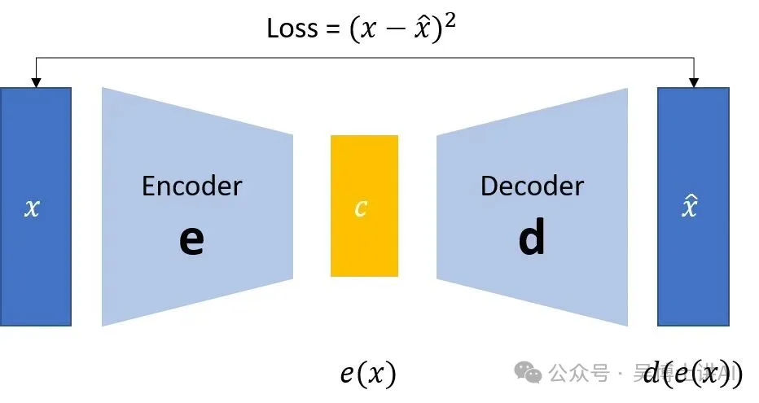
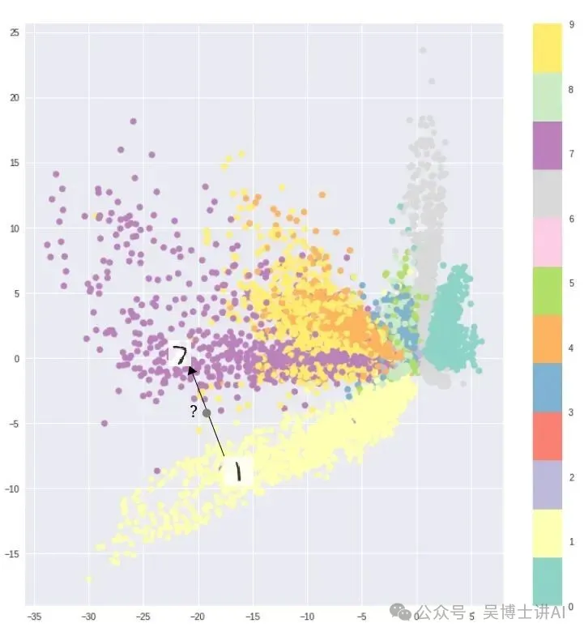
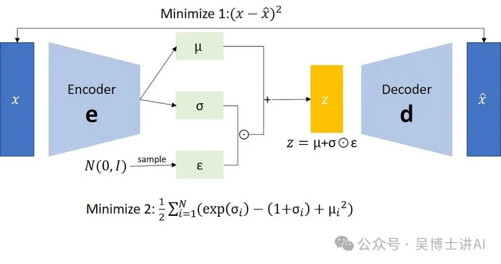
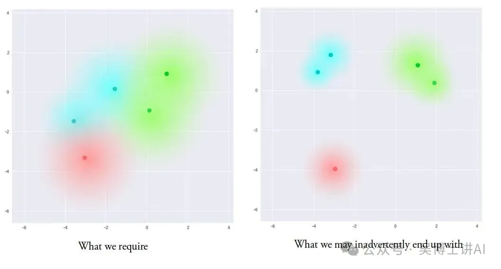
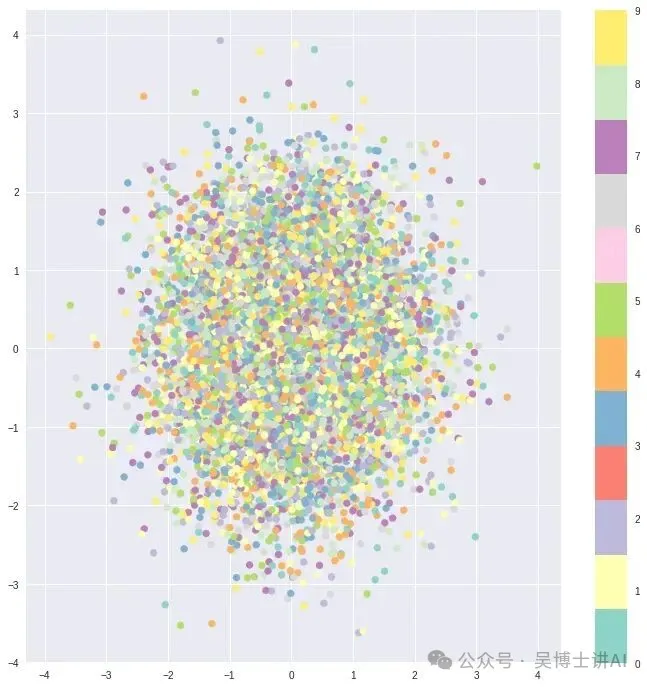
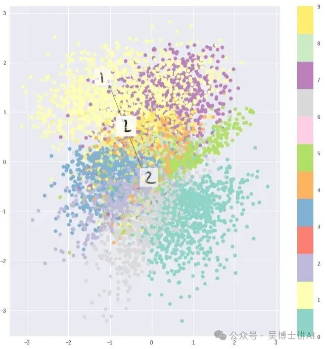

# 变分自编码器 VAE

本文全文摘自 [12 年前的 VAE 变分自编码器，为何成为 2025 生成式 AI 的隐形核心？——微信公众号“吴博士讲AI”](https://mp.weixin.qq.com/s/R2IMo2cIjGgU0ORRCJAT_Q)

---

与神经网络更常见的用途——回归或分类任务——不同，变分自编码器（Variational Autoencoder，VAE）从一开始就被设计为一类**生成模型**。它的目标并非仅仅“预测”或“判别”，而是**学习数据本身的分布结构，并从中生成全新的样本**。从合成逼真的人脸图像，到生成具有结构与风格的音乐内容，均已展现出令人瞩目的效果。

这一思想最早可以追溯到 2013 年。Kingma 和 Welling 提出了 VAE，其核心创新在于：**将自动编码器的潜在表示空间进行概率化与正则化**。在 VAE 中，编码器不再输出一个确定性的隐变量，而是学习一个接近高斯分布的潜在变量分布；解码器则从这一连续、结构化的潜在空间中采样并重建数据。正是这种“受约束但可采样”的潜在空间，使模型既能忠实表示数据，又具备稳定生成与插值的能力。

在深入技术细节之前，有一个更为根本的问题：为什么要使用 VAE？

在生成建模任务中，一个最直接的目标是生成与训练数据“相似”的全新样本——这一点，VAE 确实可以胜任。然而，在许多实际场景中，我们的需求并不止于此。

更常见的情况是：我们希望从已有样本出发，对数据进行有方向、有结构的修改与探索。这种变化并非纯随机扰动，而是沿着某些语义一致、连续可解释的方向进行，例如逐步改变图像的姿态、风格或属性。

正是在这一点上，VAE 展现出了相较于现有多数生成方法的独特优势：它不仅能够生成新样本，更能够为数据提供一个连续、结构化、可操作的潜在表示空间，从而使得对数据变体的探索成为可能且高效。

## 标准自编码器

标准自编码器（Autoencoder）本质上由两个首尾相连的神经网络组成：**编码器**（Encoder）和**解码器**（Decoder）。编码器负责将高维输入数据映射到一个维度更低、信息更为紧凑的表示空间中；解码器则利用这一低维表示，尽可能准确地重建原始输入。二者协同工作，使整个网络在“压缩—重建”的过程中学习到数据的有效表示。

{.img-center width=50%}

从功能上看，编码器并不是一个陌生的概念。以卷积神经网络（CNN）为例，其前端的卷积层同样承担着类似的角色：它们将尺寸较大的图像输入（例如 299×299×3 的张量）逐层压缩，最终形成一个低维、稠密的特征向量，用于后续的分类任务。在这种场景下，编码器学习到的表示是为分类目标量身定制的。

自编码器在此基础上对目标进行了“反转”：编码器生成的低维表示不再是为了分类，而是为了尽可能完整地重建自身的输入。

因此，整个网络通常是端到端联合训练，优化目标是输出与输入之间的重构误差，常见的损失函数包括均方误差（MSE）或交叉熵。这一损失通常被称为重构损失（reconstruction loss），用于惩罚解码结果与原始输入之间的偏差。

由于中间的潜在表示（即编码）维度显著小于输入维度，编码器必须在信息表达上做出取舍：它需要保留对重构最为关键的信息，同时尽可能丢弃冗余或无关的细节。解码器则学习如何从这一受限的信息表示中恢复出完整的数据结构。编码器与解码器相互配合，共同构成了标准自编码器的核心机制。

标准自编码器在表示压缩与重构任务上表现良好，但除了少数应用（如去噪自编码器）之外，它们的用途相当有限。

自编码器在生成任务上的根本问题是：**它们将输入转换为的潜在空间可能不是连续的，也不支持容易的插值操作**。

例如，在MNIST数据集上训练一个自编码器，并将2维潜在空间中的编码进行可视化，会发现形成了明显的独立簇。这是有道理的，因为为每一类图像提供不同的编码，能让解码器更容易对它们进行解码。

{.img-center width=50%}

如果你的目标仅仅是复制相同的图像，这没有问题。但当你构建一个生成模型时，你并不想只是准备复制输入的同一张图像。你希望能够从潜在空间中随机采样，或者在连续的潜在空间中对输入图像生成变体。

如果潜在空间存在不连续性（例如簇之间的空隙），而你从这些空隙区域采样或生成变体，解码器就会产生不真实的输出，因为解码器根本不知道如何处理潜在空间的那个区域——在训练过程中，它从未见过来自那个区域的编码向量。

## 变分自编码器

变分自编码器（Variational Autoencoders, VAEs） 具有一个将其与普通自编码器（vanilla autoencoders）根本区分开的独特性质，正是这一性质使其在生成建模中格外有用：**其潜在空间在设计上是连续的**，从而可以方便地进行随机采样和插值。

{.img-center width=50%}

VAE 通过一种起初看起来颇为出人意料的方式来实现这一点：它并不让编码器输出一个大小为 n 的编码向量，而是输出**两个大小为 n 的向量**——一个均值向量 $\mu$ ，以及一个标准差向量 $\sigma$ 。

这两个向量共同构成了一个长度为 n 的随机变量向量的参数，其中 $\mu$ 和 $\sigma$ 的第 i 个元素分别表示第 i 个随机变量 $X_i$ 的均值和标准差。我们从该分布中进行采样，得到采样后的编码，并将其传递给解码器。

这种**随机性的生成过程**意味着：即便对于同一个输入样本，虽然其均值和标准差保持不变，但由于采样的存在，每一次前向传播所得到的具体编码都会有所不同。

> [!NOTE] 重参数化技巧
> 现在，我们知道潜在随机变量的每个分量 $X_i\sim\mathcal{N}(\mu_i,\sigma_i^2)$ ，但是我们怎么求 $\frac{\partial X_i}{\partial \mu_i}$ 和 $\frac{\partial X_i}{\partial \sigma_i}$ 从而进行误差反向传播训练呢？
>
> 为此，研究者提出了“重参数化技巧”，即将 $X_i$ 的生成方式改为
>
> $$X_i = \mu_i + \sigma_i \cdot \varepsilon,\varepsilon\in\mathcal{N}(0,1)$$
>
> 于是，$\frac{\partial X_i}{\partial \mu_i}=1, \frac{\partial X_i}{\partial \sigma_i}=\varepsilon$，这下就可以反向传播了！

直观来看，均值向量决定了编码在潜在空间中应当“围绕”的中心位置，而标准差则控制了编码可以偏离该中心的“范围”，即编码围绕均值变化的幅度。

由于编码是从这个“圆形区域”（即分布）内部随机生成的，解码器在训练过程中逐渐学会：不仅潜在空间中的某一个点可以对应某一类样本，**其附近的点同样也对应这一类样本**。这使得解码器不仅能够解码潜在空间中某些孤立、特定的编码点（否则会导致可解码的潜在空间是不连续的），还能够对这些编码的轻微变化进行解码。原因在于，在训练过程中，解码器始终暴露在同一输入样本所对应的一系列不同编码变体之下，从而学会了对潜在空间中连续区域的稳健映射。

通过对单一样本的编码进行扰动，模型现在在一定程度上接触到了**局部变化**，从而在**局部尺度**（即针对相似样本）上形成了平滑的潜在空间。理想情况下，我们也希望**不那么相似的样本之间同样存在一定的重叠**，以便能够在不同类别之间进行插值。

然而，由于对向量 $\mu$ 和 $\sigma$ 的取值并没有任何约束，编码器可能会学习到：为不同类别生成差异极大的 $\mu$ ，将它们彼此分离、形成簇，同时最小化 $\sigma$ ，从而保证同一样本的编码几乎不发生变化（也就是说，解码器面对的随机性更小）。这样一来，解码器就可以非常高效地重构训练数据。

{.img-center width=50%}

但从理想角度来看，我们希望得到的是这样一种编码：**所有编码在潜在空间中尽可能彼此接近，同时又保持足够的区分度**，从而既能实现平滑插值，又能生成新的样本。

为了强制实现这一点，我们在损失函数中引入了**Kullback–Leibler 散度（KL 散度）**。KL 散度用于衡量两个概率分布之间的差异程度。在这里最小化 KL 散度，意味着优化概率分布参数（ $\mu$  和 $\sigma$ ），使其尽可能接近目标分布。

> [!NOTE] VAE 中的 KL 散度损失
> VAE 将目标分布设置为标准正态分布 $\mathcal{N}(0,I)$ 。求潜在变量概率分布和目标分布的 KL 散度，方式是将潜在变量 $X$ 的各个分量 $X_i\sim\mathcal{N}(\mu_i,\sigma_i^2)$ 与标准正态分布的 KL 散度求和。
>
> 计算公式参见 KL 散度一文，有
>
> $$D_{\rm{KL}} = \frac{1}{2}\sum_{i}(\sigma_i^2+\mu_i^2-\ln\sigma_i^2-1)$$

从直观上看，这个损失项会促使编码器将**所有输入（例如 MNIST 中的所有数字）对应的编码，均匀地分布在潜在空间的中心附近**。如果编码器试图“投机取巧”，把不同类别的编码聚集到远离原点的不同区域，就会受到惩罚。

然而，如果**只使用 KL 损失**，得到的潜在空间会使编码在中心附近**随机且密集地堆积**，而几乎不考虑相邻编码之间的语义相似性。由于这种潜在空间本身并不承载有意义的结构，解码器几乎不可能从中解码出任何有意义的结果。

{.img-center width=50%}

然而，将重构损失与 KL 损失**联合优化**，会生成这样一种潜在空间：在**局部尺度**上，通过聚类的方式保持相邻编码之间的相似性；而在**全局尺度**上，这些编码又会非常**密集地分布在潜在空间的原点附近**（可将坐标轴范围与原始情况进行对比）。从直观角度看，这是两种作用力达到的平衡结果：**重构损失**具有促使形成簇的倾向，而 **KL 损失**则具有促使整体分布紧密集中的倾向。二者共同作用，形成了**清晰但彼此不过度分离的簇结构**，使解码器能够有效地进行解码。

{.img-center width=50%}

这正是我们所期望的结果：当进行随机生成时，只要从与编码向量相同的先验分布 $\mathcal{N}(0,I)$ 中采样一个向量，解码器就能够成功地将其解码；而在进行插值时，不同簇之间也不会出现突然的“空洞”或断裂，而是表现为**连续、平滑的特征混合**，这是解码器可以理解并生成的。

## 向量运算平滑插值

那么，我们究竟是如何生成前面所说的这种平滑插值的呢？从这里开始，其实只需要在潜在空间中进行简单的向量运算即可。

例如，如果你希望生成一个位于两个样本正中间的新样本，只需计算它们的均值向量 $\mu$ 的平均，然后对得到的向量进行解码即可。

再比如，若想生成某种特定特征（例如在人脸上生成“戴眼镜”这一特征），可以选取两个样本：一个戴眼镜、一个不戴眼镜。将它们输入编码器，得到各自的潜在向量，并计算二者的差值，将这个差值保存为“眼镜”向量。随后，把这个“眼镜”向量加到任意一张其他人脸的潜在向量上，再进行解码，就可以生成带有眼镜特征的人脸。

## VAE 的理论基础

我们要学习一个生成模型 $p_{\theta}(x)$ ，能从隐变量 $z$ 生成样本 $x$ ，同时尽可能符合真实数据分布 $p_{\rm{data}}(x)$ 。

> 举个例子，比如数据集主题是中国 Top3 大学，真实数据分布中概率较高的可能是 ZJU、SJTU、FDU等，那么我们学习得到的模型，其 $p_{\theta}(ZJU),p_{\theta}(SJTU),p_{\theta}(FDU)$ 的概率就应该较高，而 $p_{\theta}(PKU),p_{\theta}(THU)$ 就应该偏低，$p_{\theta}(CMU),p_{\theta}(Stanford)$ 就应该相当低。

我们使用最大似然估计（Maximum Likelihood Estimation）的思想，针对训练集，设法找到最优的模型参数 $\theta$ ：

$$\mathrm{MLE}:\hat{\theta}=\arg\max_{\theta}\prod_{i}p_{\theta}(x^i) \ \Leftrightarrow\ \hat{\theta}=\arg\max_{\theta}\sum_{i}\log p_{\theta}\left(x^{(i)}\right) $$

也就是说，我们要最大化 $\log p_{\theta}\left(x^{(i)}\right)$ 。

VAE 生成样本的流程是，先按照一定分布 $p(z)$ 采样隐变量 $z$ ，再用神经网络实现的生成模型 $p_{\theta}(x|z)$ 生成样本，也就是说，样本的分布与隐变量的采样是有关系的，即联合分布：

$$p_{\theta}(x,z)=p_{\theta}(x|z)p(z)$$

> 原论文的理论推导过程中，用 $p_{\theta}(\mathbf{z})$ 表示采样 $z$ 的概率分布，而在 VAE 一节中，实际采用的概率分布为 $p_{\theta}(\mathbf{z})=\mathcal{N}(\mathbf{z};0,I)$ ，与参数 $\theta$ 无关。所以我这里就直接写 $p(z)$ 了。

我们把“所有的 $z$ 都采样一遍”，就得到了 $x$ 的分布，即

$$\begin{aligned}
p_{\theta}(x)&=\int p_{\theta}(x,z)\mathrm{d}z\\
&=\int p_{\theta}(x|z)p(z)\mathrm{d}z\\
\end{aligned}$$

这个积分是 intractable 难以计算、难以处理的。这是核心问题所在。

此外，我们不仅关心“给定隐变量生成什么样本”，我们还关心“哪个隐变量最可能生成给定样本”，即后验分布 $p_{\theta}(z|x)$ 。若要计算后验分布 $p_{\theta}(z|x)=\dfrac{p_{\theta}(x,z)}{p_{\theta}(x)}$ ，其中的 $p_{\theta}(x)$ 也是难点所在。

为了解决以上问题，VAE 提出用神经网络拟合后验分布，即 $q_{\phi}(z|x)=\mathcal{N}\left(\mu_\phi(x),\sigma_\phi^2(x)\right)$ ，有

$$\begin{aligned}
\log p_{\theta}(x) &= \log p_{\theta}(x)\int q_{\phi}(z|x)\mathrm{d}z\\
&= \int q_{\phi}(z|x)\log p_{\theta}(x)\mathrm{d}z\\
&= \int q_{\phi}(z|x)\log\frac{p_{\theta}(x,z)}{p_{\theta}(z|x)}\mathrm{d}z\\
&= \int q_{\phi}(z|x)\log\left[\frac{p_{\theta}(x,z)}{q_{\phi}(z|x)}\frac{q_{\phi}(z|x)}{p_{\theta}(z|x)}\right]\mathrm{d}z\\
&= \int q_{\phi}(z|x)\log\frac{p_{\theta}(x,z)}{q_{\phi}(z|x)}\mathrm{d}z+\int q_{\phi}(z|x)\log\frac{q_{\phi}(z|x)}{p_{\theta}(z|x)}\mathrm{d}z\\
&= \mathcal{L}(\theta,\phi;x)+D_{\rm{KL}}(q_{\phi}(z|x)||p_{\theta}(z|x))
\end{aligned}$$

上式第一步，$\log p_{\theta}(x)$ 是常量，$\int q_{\phi}(z|x)\mathrm{d}z=1$ 。从而

$$\log p_{\theta}\left(x^{(i)}\right)= \mathcal{L}\left(\theta,\phi,x^{(i)}\right)+D_{\rm{KL}}\left(q_{\phi}\left(z|x^{(i)}\right)||p_{\theta}\left(z|x^{(i)}\right)\right)$$

根据 KL 散度的非负性，有

$$\begin{aligned}
\log p_{\theta}\left(x^{(i)}\right)\ge \mathcal{L}\left(\theta,\phi,x^{(i)}\right)&= \int q_{\phi}(z|x)\log\frac{p_{\theta}(x,z)}{q_{\phi}(z|x)}\mathrm{d}z\\
&= \int q_{\phi}(z|x)\log\frac{p_{\theta}(x|z)p(z)}{q_{\phi}(z|x)}\mathrm{d}z\\
&= \int q_{\phi}(z|x)\log p_{\theta}(x|z)\mathrm{d}z+\int q_{\phi}(z|x)\log\frac{p(z)}{q_{\phi}(z|x)}\mathrm{d}z\\
&= \mathbb{E}_{q_{\phi}\left(z|x^{(i)}\right)}\left[\log p_{\theta}\left(x^{(i)}|z\right)\right]-D_{\rm{KL}}\left(q_{\phi}\left(z|x^{(i)}\right)||p(z)\right)\\
\end{aligned}$$

这个 $\mathcal{L}\left(\theta,\phi,x^{(i)}\right)$ 叫作 Evidence Lower Bound (ELBO)，原论文里用的是 Variational Lower Bound 。

回顾一下，我们想要 maximize $\log p_{\theta}\left(x^{(i)}\right)$ ，而 ELBO 是它的下界，两者的差是 $q_{\phi}(z|x)$ 拟合后验 $p_{\theta}(z|x)$ 的差。因此，我们可以直接 maximize ELBO 。不难发现，ELBO 由两项组成，第一项可以理解为重构损失，我们要优化 $\theta$ ，使得生成样本样本 $x^{(i)}$ 的概率足够大；第二项可以理解为 KL 损失，我们要优化 $\phi$ ，使潜在变量的分布尽可能接近我们预设的分布。
