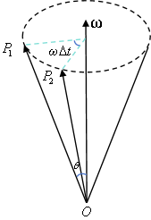

# 刚体转动下的向量求导公式

## 1 运动点在惯性系中的速度公式

考虑一个惯性系 $I$ 和一个运动坐标系 $B$ ，原点分别记作 $O_I$ 和 $O_B$ 。以下所有讨论，都默认以惯性系 $I$ 为参考。

### 固定点的位置导数

当 $B$ 系绕 $O_I$ 做角速度为 $\boldsymbol{\omega}$ 的转动时，考虑 $B$ 系中的任意一个固定点 P：

$$\frac{\mathrm{d}\vec{O_IP}}{\mathrm{d}t}=\boldsymbol{\omega}\times\vec{O_IP}.$$

**证明：**

记 P 点初始位置为 $P_1$ ，运动 $\Delta t$ 时间后位置为 $P_2$ 。记 $\vec{OP}$ 与角速度向量 $\boldsymbol{\omega}$ 的夹角为 $\theta$ . 用 $\mathbf{r}(t)=\mathbf{r}$ 表示 $\vec{O_IP_1}$ ，用 $\mathbf{r}(t+\Delta t)$ 表示 $\vec{O_IP_2}$ ，则变化量为 $\mathbf{r}(t+\Delta t)-\mathbf{r}=\vec{P_1P_2}$ .

{.img-center width=30%}

由图可知，变化量的大小为 $2r\sin\theta\sin\left(\frac{1}{2}\omega\Delta t\right)$ ，变化量的方向和 $\boldsymbol{\omega}\times(\mathbf{r}(t+\Delta t)+\mathbf{r})$ 一致。因此

$$\begin{aligned}
&\lim_{\Delta t\to 0}\frac{\mathbf{r}(t+\Delta t)-\mathbf{r}}{\Delta t}\\
=& \lim_{\Delta t\to 0}\frac{\frac{\boldsymbol{\omega}\times(\mathbf{r}(t+\Delta t)+\mathbf{r})}{\|\boldsymbol{\omega}\times(\mathbf{r}(t+\Delta t)+\mathbf{r})\|}\cdot2r\sin\theta\sin\left(\frac{1}{2}\omega\Delta t\right)}{\Delta t}\\
=& \lim_{\Delta t\to 0}\frac{\frac{2\boldsymbol{\omega}\times\mathbf{r}}{2\omega r\sin\theta}\cdot2r\sin\theta\cdot\left(\frac{1}{2}\omega\Delta t\right)}{\Delta t}\\
=& \boldsymbol{\omega}\times\mathbf{r}.
\end{aligned}$$

---

## 2 固定于运动坐标系的向量求导

### 固定在 $B$ 系中的向量导数公式

在此基础上，考虑固定在 $B$ 系的一个向量 $\vec{PQ}$：

$$\frac{\mathrm{d}\vec{PQ}}{\mathrm{d}t}=\boldsymbol{\omega}\times\vec{PQ}.$$

**证明：**

$$\begin{aligned}
\frac{\mathrm{d}\vec{PQ}}{\mathrm{d}t}&=
\frac{\mathrm{d}\vec{O_IQ}}{\mathrm{d}t}-\frac{\mathrm{d}\vec{O_IP}}{\mathrm{d}t}\\
&= \boldsymbol{\omega}\times\vec{O_IQ}-\boldsymbol{\omega}\times\vec{O_IP}\\
&=\boldsymbol{\omega}\times\vec{PQ}.
\end{aligned}$$

---

## 3. 任意向量在惯性系与运动系之间的导数关系

### 3.1 一阶导数变换公式

在此基础上，考虑 $B$ 系下的一个任意向量 $\mathbf{r}$ 。

$$\begin{aligned}
\left(\frac{\mathrm{d}\mathbf{r}}{\mathrm{d}t}\right)_{I}
&= \left(\frac{\mathrm{d}\mathbf{r}}{\mathrm{d}t}\right)_{B}+\boldsymbol{\omega}\times\mathbf{r}\\
\ddot{\mathbf{r}}_I
&=\ddot{\mathbf{r}}_B+2\boldsymbol{\omega}\times\dot{\mathbf{r}}_B+\dot{\boldsymbol{\omega}}\times\mathbf{r}+\boldsymbol{\omega}\times(\boldsymbol{\omega}\times\mathbf{r}).
\end{aligned}$$

**证明：**

设 $B$ 系的一组正交基向量为 $\mathbf{i},\mathbf{j},\mathbf{k}$ ，则 $\mathbf{r}$ 可以表示为

$$\mathbf{r} = r_x\mathbf{i} + r_y\mathbf{j} + r_z\mathbf{k} .$$

因此，$\dot{\mathbf{r}}_I$ 可以表示为

$$\begin{aligned}
\dot{\mathbf{r}}_I 
&= (\dot{r}_x\mathbf{i} + \dot{r}_y\mathbf{j} + \dot{r}_z\mathbf{k}) + r_x\dot{\mathbf{i}} + r_y\dot{\mathbf{j}} + r_z\dot{\mathbf{k}}\\
\left(\frac{\mathrm{d}\mathbf{r}}{\mathrm{d}t}\right)_{I}
&= \left(\frac{\mathrm{d}\mathbf{r}}{\mathrm{d}t}\right)_{B}+r_x\boldsymbol{\omega}\times \mathbf{i}+r_y\boldsymbol{\omega}\times \mathbf{j}+r_z\boldsymbol{\omega}\times \mathbf{k}\\
&= \left(\frac{\mathrm{d}\mathbf{r}}{\mathrm{d}t}\right)_{B}+\boldsymbol{\omega}\times(r_x\mathbf{i}+r_y\mathbf{j}+r_z\mathbf{k})\\
&= \left(\frac{\mathrm{d}\mathbf{r}}{\mathrm{d}t}\right)_{B}+\boldsymbol{\omega}\times\mathbf{r}.
\end{aligned}$$

### 3.2 二阶导数变换公式

接下来，再对 $I$ 系求导一次：  
  
$$\begin{aligned}  
\ddot{\mathbf{r}}_I  
&=\ddot{\mathbf{r}}_B+2\boldsymbol{\omega}\times\dot{\mathbf{r}}_B+\dot{\boldsymbol{\omega}}\times\mathbf{r}+\boldsymbol{\omega}\times(\boldsymbol{\omega}\times\mathbf{r})  
\end{aligned}$$

**证明：**

$$\begin{aligned}  
\ddot{\mathbf{r}}_I  
&=\left(\frac{\mathrm{d}}{\mathrm{dt}}\right)_I\dot{\mathbf{r}}_B+\left(\frac{\mathrm{d}}{\mathrm{dt}}\right)_I(\boldsymbol{\omega}\times\mathbf{r})\\  
&=\ddot{\mathbf{r}}_B+\boldsymbol{\omega}\times\dot{\mathbf{r}}_B+\dot{\boldsymbol{\omega}}\times\mathbf{r}+\boldsymbol{\omega}\times\dot{\mathbf{r}}_I\\  
&= \ddot{\mathbf{r}}_B+\boldsymbol{\omega}\times\dot{\mathbf{r}}_B+\dot{\boldsymbol{\omega}}\times\mathbf{r}+\boldsymbol{\omega}\times(\dot{\mathbf{r}}_B+\boldsymbol\omega\times\mathbf{r})\\  
&=\ddot{\mathbf{r}}_B+2\boldsymbol{\omega}\times\dot{\mathbf{r}}_B+\dot{\boldsymbol{\omega}}\times\mathbf{r}+\boldsymbol{\omega}\times(\boldsymbol{\omega}\times\mathbf{r}).  
\end{aligned}$$
