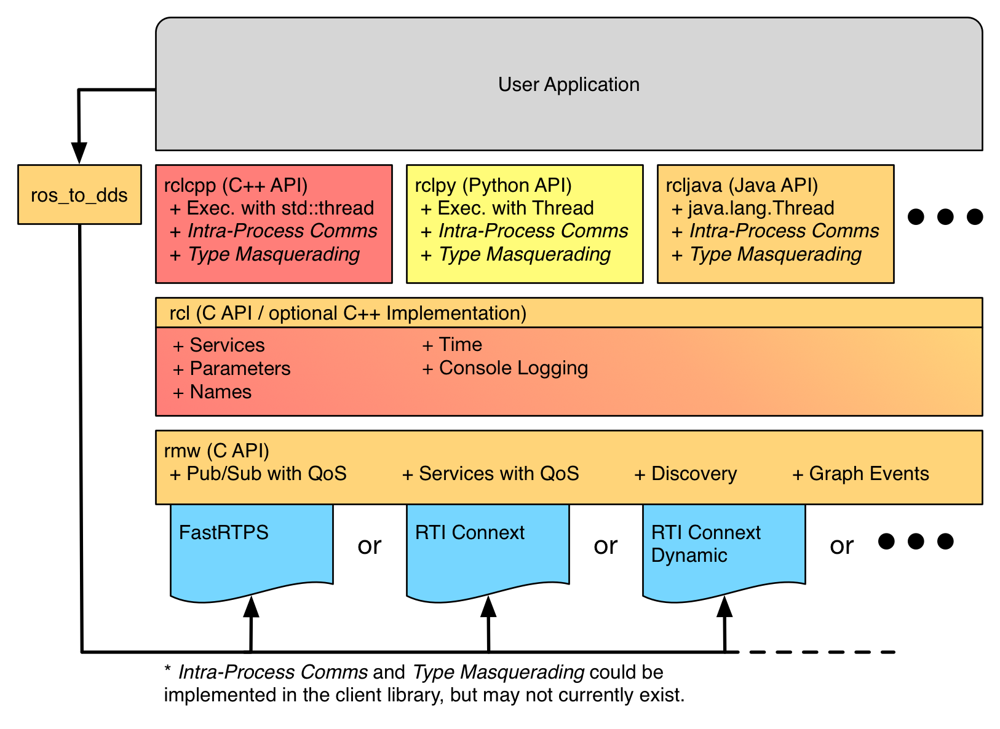

# ROS2 学习记录

## 1 工作空间与功能包

CLI（Command Line Interface， 命令行）

```shell
# 指令意义：启动 <package_num> 包下的 <executable_name> 节点
ros2 run <package_num> <executable_name>

# 查看节点列表
ros2 node list

# 查看节电信息
ros2 node info <node_name>

# 重映射节点名称
ros2 run turtlesim turtlesim_node --ros-args --remap __node:=my_turtle

使用 ros2 node <command> -h 可以获得更多使用细节
```

工作空间：一个工作空间下可以包含若干个功能包，每个功能包里都可以包含若干个节点。

ROS2 中，功能包根据编译方式的不同分为三类：ament_python, cmake, ament_cmake 。

每个功能包都有一个标配的 manifest.xml 文件，用于记录这个包的名字，构建工具，编译信息，拥有者，作用等信息。通过该信息，就可以自动为该功能包安装依赖，构建时确定编译顺序。

```shell
# 1 安装获取功能包
sudo apt install ros-<version>-package_name
# 安装获取会自动放置到系统目录，不用再次手动 source

# 2 创建功能包
ros2 pkg create <package-name>  --build-type {cmake,ament_cmake,ament_python}  --dependencies <依赖名字>

# 3 列出可执行文件
ros2 pkg executables # 列出所有
ros2 pkg executables <package_num> # 列出某个功能包的

# 4 列出所有功能包
ros2 pkg list

# 5 输出某个包所在路径的前缀
ros2 pkg prefix <package-name>

# 6 列出功能包的清单描述文件
ros2 pkg xml <package-name>

使用 ros2 pkg <command> -h 可以获得更多使用细节
```

---

## 2 Colcon

Colcon 是一个功能包构建工具，可以用来编译工作空间。（ROS2 默认居然是没有安装 Colcon 的！

!!! warning

    项目路径里不要出现中文，不然Cmake可能出现截断错误！！！

```shell
# 只编译一个包
colcon build --packages-select <package_name>

# 不编译测试单元
colcon build --packages-select <package_name> --cmake-args -DBUILD_TESTING=0

# 运行编译的包的测试
colcon test

# 允许通过更改 src 下的部分文件来改变 install
# （每次调整 python 脚本的时候就不用重新 build 了）
colcon build --symlink-install

```

详细讲解一下 `--symlink-install` 的作用：

Colcon 编译生成的可执行文件、库文件、配置文件等输出到 build 和 install 目录。`--symlink-install` 会用 符号链接（Symbolic Link）代替直接复制文件到 install 目录。

对于非编译型文件（比如 Python 脚本，配置文件），install 目录中的文件是源码的符号连接，在 src 更改后就可以直接生效，不用再 `colcon build` 了；

对于编译型文件（比如 C++ 可执行文件），install 目录中的是 build 目录中的编译结果，修改了 C++ 源代码之后仍然需要 `colcon build`。

---

## 3 RCL (ROS Client Library，ROS 客户端库)

在编写功能包以及其中的节点的时候，不管是 c++ 的 rclcpp 库，还是 python 的 rclpy 库，我们的代码总要去包含或者调用 rcl 开头的库函数，这个 rcl 是什么意思呢？

RCL 是 ROS 的一种 API (Application Programming Interface，应用程序编程接口)。

{.img-center width=75%}

这张图里，最底层是第三方的 DDS（Data Distribution Service 数据分发服务），rmw（ros2 middleware 中间件接口）是对各家 DDS 的统一抽象，基于 rmw 实现了 rclc（给 C 语言用的 API 库）。由于 C 语言是绝大部分语言的鼻祖，因此大部分语言的 API 库都可以基于 rclc 开发，于是就有了 rclcpp，rclpy，rcljava……

### 3.1 基于 rclcpp 的功能包开发节点时的编译注意事项

首先，我们可以在生成的功能包的 src 文件夹下加入 <name.cpp> 文件，作为一个新的节点。在这个 cpp 文件中，必须实现 `int main(int argc, char **argv)` 这样一个函数。

可能需要包含的头文件有：

```cpp
#include "rclcpp/rclcpp.hpp"
#include "std_msgs/msg/string.hpp"
#include "std_msgs/msg/u_int32.hpp"
```

为了让 ros2 能找到这个新节点，我们需要修改 CMakeLists.txt，再其中加上

```cmake
find_package(rclcpp REQUIRED)      # 一般在生成功能包的时候就写好了
find_package(std_msgs REQUIRED)    # 如果要用到 std_msgs 库，则自己加上

add_executable(wang2_node src/wang_er.cpp) # 这里的 wang2_node 真正定义了节点名称
ament_target_dependencies(wang2_node rclcpp std_msgs) # 依赖注入

install(
	TARGETS wang2_node
	DESTINATION lib/${PROJECT_NAME} # 把 wang2_node 打包到 install/${PROJECT_NAME}/lib/${PROJECT_NAME} 目录下
)
```

同时，还需要在 package.xml 里声明依赖。

```
<depend>rclcpp</depend>
<depend>std_msgs</depend>
```

### 3.2 基于 rclpy 的功能包开发节点时的编译注意事项

首先，需要在 package.xml 里添加依赖，声明依赖的库：

```
<depend>rclcpp</depend>
<depend>std_msgs</depend>
```

其次，在 setup.py 里配置入口点：

```python
entry_points={
	'console_scripts': [
		"li4_node = village_li.lisi:main",
		"li3_node = village_li.li3:main"
	],
},
```

这里的格式是 `"node_name = package_name.node_cpp_name:main"`.

---

## 4 话题

同一个话题可以有多个订阅者，多个发布者。

发布者发布一个话题，不断地通过话题发送数据；订阅者订阅话题，不断地通过话题获取数据——数据传输是单向的。

```shell
rqt_graph # 用于直观地看到节点与节点间的通信关系

ros2 topic list # 返回系统中当前活动的所有话题
ros2 topic list -t # 比前者增加了话题的消息类型

# 打印实时话题内容
ros2 topic echo <topic_name>
# 示例：ros2 topic echo /chatter（要包含 / ）

ros2 topic info <topic_name> # 查看话题信息

# 手动发布话题消息，示例：
ros2 topic pub /chatter std_msgs/msg/String 'data: "123"'
```

### 4.1 消息队列

rcply.node 里的 Node 类有 create_publisher 方法，其中有参数 qos_profile，其中包含了一个 ROS2 的消息机制。发布者发送消息的速度超过订阅者的接收速度时，ROS2 会用一个队列来缓存未处理的消息。默认采用 `keep last` 策略，即保留最新的 `N` 条消息；当队列里的消息达到容量上限 `N` 后，旧消息会被丢弃。越是实时性要求高的消息，队列的容量上限应该越小。

### 4.2 消息类型（接口类型）

创建发布者、订阅者时都需要指定发布消息的类型，这个“类型”在 ROS2 里又叫作“接口（interface）”。ROS2 提供了一系列拿来即用的接口，相关命令如下：

```shell
# 当前环境下 ROS2 自带的所有消息类型
ros2 interface list

# 查看所有接口包
ros2 interface packages

# 查看某一个包下的所有接口
ros2 interface package std_msgs

# 查看某一个接口详细的内容
ros2 interface show std_msgs/msg/String

# 输出某一个接口的所有属性
ros2 interface proto sensor_msgs/msg/Image
```

一般情况下，ros2 自带的这些类型已经够用了，实在不能满足需求的话，也可以自定义消息类型。

### 4.3 c++ OOP 订阅方式代码讨论

```c++
#include "rclcpp/rclcpp.hpp"
#include "std_msgs/msg/string.hpp"
#include "std_msgs/msg/u_int32.hpp"

using std::placeholders::_1;

class SingerNode : public rclcpp::Node
{
 public:
  SingerNode(std::string name) : Node(name)
  {
    RCLCPP_INFO(this->get_logger(), "Good everyone, I'm singer %s.", name.c_str());
    subscribe_novel = this->create_subscription<std_msgs::msg::String>("cloudmosquito", 10, std::bind(&SingerNode::topic_callback, this, _1));

}

 private:
  rclcpp::Subscription<std_msgs::msg::String>::SharedPtr subscribe_novel;
  void topic_callback(const std_msgs::msg::String::SharedPtr msg)
  {
    RCLCPP_INFO(this->get_logger(), "%s 写得真好啊！", msg->data.c_str());
  }
};
```

我这里非常不能理解的一点是这里的 `using std::placeholders::_1;` 和 `std::bind(&SingerNode::topic_callback, this, _1)`. 现在我们来探讨一下。

首先，我们在这里要创建一个订阅者，并且要注册一个回调函数，用以描述接收到订阅消息之后的行为。在订阅者（singer_node->subscribe_novel）收到消息后，它就会调用这个回调函数。

但是这里有一个问题：类的成员函数默认具有一个隐藏参数 `this`，但是回调函数是作为一个普通函数被调用的，没法获得这个 `this`。

所以我们要用 `std::bind` 把对象实例 `this` 直接给它显式地绑上。从而生成一个可调用的对象。

然后又有一个问题，现在这个回调函数相当于有 `this` 和 `msg` 两个参数，其中 `this` 参数被固定为 `SingerNode` 类的 `this`指针，但是仍然是排在第一位的参数。而回调函数被调用的时候，只有一个参数 `msg`，默认给排在第一位的参数，这就出了问题。

解决方法就是用占位符 `_1`，用来声明 `std::bind` 生成的回调函数接受的第一个参数传给 `SingerNode::topic_callback` 的第二个参数。

在现代 C++ 里，更推荐的一种写法是用 Lambda 表达式：`std::bind(&SingerNode::topic_callback, this, _1)` 可以直接写为 `[this](const std_msgs::msg::String::SharedPtr msg) { this->topic_callback(msg) }`

### 4.4 自定义话题接口

为了减少功能包间的互相依赖，通常把接口定义在一个独立的功能包里。

在新的功能包文件夹下，新建一个文件夹 `msg` ，在这个文件夹下新建一个接口文件 `<name>.msg` .

这里需要注意，`<name>` 的首字母需要大写，否则会有如下的报错：

```shell
  rosidl_adapter.parser.InvalidResourceName: 'novel' is an invalid message
  name.  It should have the pattern '^[A-Z][A-Za-z0-9]*$'
```

然后编写接口文件，只需要规定该接口需要用到哪些类型即可，比如：

```
# 标准消息接口std_msgs下的String类型
std_msgs/String content

# 图像消息，调用sensor_msgs下的Image类型
sensor_msgs/Image image
```

接下来是针对编译的处理，首先，对于 CMakeLists.txt，需要添加如下代码

```cmake
#添加对sensor_msgs的
find_package(sensor_msgs REQUIRED)
find_package(rosidl_default_generators REQUIRED)
#添加消息文件和依赖
rosidl_generate_interfaces(${PROJECT_NAME}
  "msg/Novel.msg"
   DEPENDENCIES sensor_msgs
 )
```

这里的 `ros_idle_generators` 是主力，声明 `msg` 文件所属的工程名字、文件的位置以及依赖的库。而 `find_package` 就是把这个主力和依赖的库查找到，参数 `REQUIRED` 代表必须查找到这些东西才能过编译，如果没查找到直接报错。

其次，对于 package.xml，添加依赖

```xml
  <depend>sensor_msgs</depend>
  <build_depend>rosidl_default_generators</build_depend>
  <exec_depend>rosidl_default_runtime</exec_depend>
  <member_of_group>rosidl_interface_packages</member_of_group>
```

---

## 5 服务

一个节点提供服务，叫“服务端”；另一个节点请求服务，叫“客户端”。服务和话题相比，其数据传输是双向的。

同一个服务只能由一个节点提供；但是同一个服务可以被多个客户端调用。

```shell
ros2 service list # 查看当前在线服务列表

ros2 service type <服务名称> # 查看服务接口类型

ros2 service find <服务类型> # 查找使用某种接口的服务

# 手动调用服务
ros2 service call <服务名称> <服务接口类型> <请求数据>
# 示例：
# ros2 service call /add_two_ints example_interfaces/srv/AddTwoInts “{a: 5, b: 10}”
# 如果不写参数，则以默认参数调用服务
```

### 5.1 自定义服务接口

在功能包文件夹下新建一个 `srv` 文件夹，在 `srv` 里新建 `<name>.srv` 服务接口文件。同样地，这里的 `<name>` 也得首字母大写。

接下来，编辑 `<name>.srv` 文件，服务接口应具有如下格式：

```
string name
uint32 money
---
bool success
uint32 money
```

中间的 `---` 是必需的。在 `---` 上方的是客户端传入的参数，在 `---` 下方的是服务端回传的参数。

过编译的操作步骤和 [4.4 节](#44)一致，这里不再赘述。
