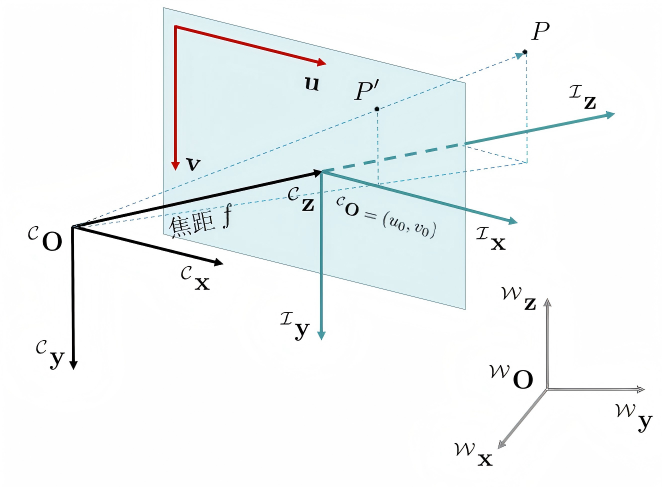
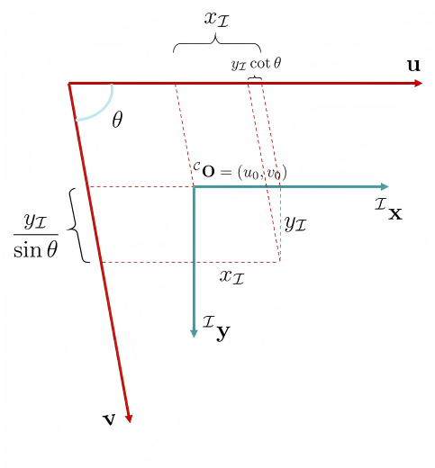

# 相机标定

> 网上资料很多：[相机标定- OpenCV 官方文档](https://docs.opencv.org/4.x/dc/dbb/tutorial_py_calibration.html)，[相机标定- OpenCV 使用教学](https://learnopencv.com/camera-calibration-using-opencv) .

## 动机

三维重建（3D-Reconstruction）是计算机视觉的一个主要研究方向。“三维重建”指**利用多张二维图片确定空间点的三维坐标**。在此过程中，需要事先标定相机内/外参数。讲人话，给定三维空间中一个点，我们需要知道它在拍摄所得图片里的二维坐标。

## 成像过程的理论推导

定义世界坐标系 $\mathcal{W}$ 、相机坐标系 $\mathcal{C}$ 、图像坐标系 $\mathcal{I}$ 和像素坐标系 $\mathcal{P}$ . 相机坐标系以相机光心为原点 ${}^{\mathcal{C}}\mathbf{O}$ ，以相机正对方向为 ${}^{\mathcal{C}}\mathbf{z}$ 轴。图像坐标系 $\mathcal{I}$ 原点为图像中心。相机光心到图像坐标系原点的距离为相机焦距 $f$ .

{.img-center width=50%}

考虑三维空间中一点 $P$ ，其在世界坐标系下的坐标为 ${}^{\mathcal{W}}P=\begin{bmatrix}x_{\mathcal{W}}& y_{\mathcal{W}}& z_{\mathcal{W}}& 1\end{bmatrix}^{\top}$ . 则其到相机坐标系的齐次变换为：

$$\begin{bmatrix}x_{\mathcal{C}}\\y_\mathcal{C}\\z_{\mathcal{C}}\\ 1\end{bmatrix}
= \begin{bmatrix}{}^{\mathcal{C}}P\\ 1\end{bmatrix}
= \begin{bmatrix}{}^{\mathcal{C}}_{\mathcal{W}}R & {}^{\mathcal{C}}\mathbf{O}_{\mathcal{W}}\\ \mathbf{0} & 1\end{bmatrix}
\begin{bmatrix}{}^{\mathcal{W}}P\\ 1\end{bmatrix}$$

其中，矩阵 $\begin{bmatrix}{}^{\mathcal{C}}_{\mathcal{W}}R & {}^{\mathcal{C}}\mathbf{O}_{\mathcal{W}}\\ \mathbf{0} & 1\end{bmatrix}$ 可视为描述了相机在世界坐标系下的位姿，被称为相机的**外参矩阵**。接下来，根据投影的相似三角形关系，可以得到：

$$\frac{x_{\mathcal{I}}}{x_{\mathcal{C}}} = \frac{y_{\mathcal{I}}}{y_{\mathcal{C}}} = \frac{f}{z_{\mathcal{C}}}$$

写成齐次坐标形式，有：

$$z_{\mathcal{C}}\begin{bmatrix}x_{\mathcal{I}}\\ y_{\mathcal{I}}\\ 1\end{bmatrix}
= \begin{bmatrix}f&0 & 0 &0\\0 & f&0&0\\0&0&1&0\end{bmatrix}\begin{bmatrix}x_{\mathcal{C}}\\y_\mathcal{C}\\z_{\mathcal{C}}\\ 1\end{bmatrix}$$

事实上，由于镜头光学特性，在投影过程中会出现**畸变**现象，例如桶形畸变、枕形畸变等。因此实际上有两个“图像坐标系”——理想图像坐标系（无畸变）和实际图像坐标系（有畸变），上文求的是投影点在理想图像坐标系下的坐标。**由于畸变现象比较复杂，本文暂不考虑畸变。**

径向畸变：

$$\begin{aligned}x_{distorted} &= x\left(1+k_1r^2+k_2r^4+k_3r^6\right)\\
y_{distorted} &= y\left(1+k_1r^2+k_2r^4+k_3r^6\right)\end{aligned}$$

切向畸变：

$$\begin{aligned}
x_{distorted} &= x + 2p_1xy+p_2\left(r^2+2x^2\right)\\
y_{distorted} &= y+2p_2xy+p_1\left(r^2+2y^2\right)
\end{aligned}$$

我们接下来考虑图像坐标系 $\mathcal{I}$ 到像素坐标系 $\mathcal{P}$ 的转换关系。

{.img-center width=40%}

如上图所示，像素轴不一定是标准正交的。（虽然现代图像传感器中 $\theta$ 几乎为直角。）设一个像素在图像坐标系下的尺寸是 $dx\times dy$ ，则有映射关系：

$$\begin{aligned}
u &= u_0 + \frac{x_{\mathcal{I}}-y_{\mathcal{I}}\cot\theta}{dx}\\
v &= v_0 + \frac{y_{\mathcal{I}}}{dy\sin\theta}
\end{aligned}$$

写成矩阵形式：

$$\begin{bmatrix}u\\ v\\ 1\end{bmatrix} = \begin{bmatrix}\dfrac{1}{dx} & -\dfrac{\cot\theta}{dx} & u_0\\ 0 & \dfrac{1}{dy\sin\theta} & v_0\\ 0 & 0 & 1\end{bmatrix}\begin{bmatrix}x_{\mathcal{I}}\\ y_{\mathcal{I}}\\ 1\end{bmatrix}$$

> 考虑到像素坐标系是整数坐标而图像坐标系是实数坐标，上式右半部分实际上还有一步取整。

综上所述，有

$$\begin{aligned}
z_{\mathcal{C}}\begin{bmatrix}u\\ v\\ 1\end{bmatrix} &= \begin{bmatrix}\dfrac{1}{dx} & -\dfrac{\cot\theta}{dx} & u_0\\ 0 & \dfrac{1}{dy\sin\theta} & v_0\\ 0 & 0 & 1\end{bmatrix}\begin{bmatrix}f&0 & 0 &0\\0 & f&0&0\\0&0&1&0\end{bmatrix}\begin{bmatrix}{}^{\mathcal{C}}_{\mathcal{W}}R & {}^{\mathcal{C}}\mathbf{O}_{\mathcal{W}}\\ \mathbf{0} & 1\end{bmatrix}
\begin{bmatrix}{}^{\mathcal{W}}P\\ 1\end{bmatrix}\\
&= \begin{bmatrix}\dfrac{f}{dx} & -\dfrac{f\cot\theta}{dx} & u_0 & 0\\0 & \dfrac{f}{dy\sin\theta} & v_0 & 0\\ 0 & 0 & 1 & 0\end{bmatrix}\begin{bmatrix}{}^{\mathcal{C}}_{\mathcal{W}}R & {}^{\mathcal{C}}\mathbf{O}_{\mathcal{W}}\\ \mathbf{0} & 1\end{bmatrix}\begin{bmatrix}{}^{\mathcal{W}}P\\ 1\end{bmatrix}\\
&= \begin{bmatrix}\dfrac{f}{dx} & -\dfrac{f\cot\theta}{dx} & u_0\\0 & \dfrac{f}{dy\sin\theta} & v_0\\ 0 & 0 & 1 \end{bmatrix}\begin{bmatrix}{}^{\mathcal{C}}_{\mathcal{W}}R & {}^{\mathcal{C}}\mathbf{O}_{\mathcal{W}}\end{bmatrix}\begin{bmatrix}{}^{\mathcal{W}}P\\ 1\end{bmatrix}
\end{aligned}$$

其中，矩阵 $\begin{bmatrix}\dfrac{f}{dx} & -\dfrac{f\cot\theta}{dx} & u_0\\0 & \dfrac{f}{dy\sin\theta} & v_0\\ 0 & 0 & 1 \end{bmatrix}$ 被称为**内参矩阵** ，默认 $\theta\approx \pi/2$  的情况下，该矩阵一般写成 $\begin{bmatrix}f_x & 0 & u_0\\0 & f_y & v_0\\ 0 & 0 & 1 \end{bmatrix}$ ，其中 $f_x = \dfrac{f}{dx}, f_y = \dfrac{f}{dy}$ .

## 张正友标定法

张正友标定法：用相机拍摄一张平面黑白棋盘格（标定板）的多角度图像，求解相机**内参**。

观察上文推导得到的忽略畸变的成像模型：

$$z_{\mathcal{C}}\begin{bmatrix}u\\ v\\ 1\end{bmatrix} 
= \begin{bmatrix}f_x & \gamma & u_0\\0 & f_y & v_0\\ 0 & 0 & 1 \end{bmatrix}\begin{bmatrix}{}^{\mathcal{C}}_{\mathcal{W}}R & {}^{\mathcal{C}}\mathbf{O}_{\mathcal{W}}\end{bmatrix}\begin{bmatrix}x_{\mathcal{W}}\\ y_{\mathcal{W}}\\ z_{\mathcal{W}}\\ 1\end{bmatrix}$$

我们选取恰当的世界坐标系，使得标定板平面与 $z_{\mathcal{W}} = 0$ 平面重合，则有：

$$z_{\mathcal{C}}\begin{bmatrix}u\\ v\\ 1\end{bmatrix} 
= \begin{bmatrix}f_x & \gamma & u_0\\0 & f_y & v_0\\ 0 & 0 & 1 \end{bmatrix}\begin{bmatrix}r_1 & r_2 & {}^{\mathcal{C}}\mathbf{O}_{\mathcal{W}}\end{bmatrix}\begin{bmatrix}x_{\mathcal{W}}\\ y_{\mathcal{W}}\\ 1\end{bmatrix}$$

其中 $r_1\ ,\ r_2$ 分别代表旋转矩阵 ${}^{\mathcal{C}}_{\mathcal{W}}R$ 的第一列和第二列。定义**单应矩阵** ：

$$H = \begin{bmatrix}h_1 & h_2 & h_3\end{bmatrix} = \lambda\begin{bmatrix}f_x & \gamma & u_0\\0 & f_y & v_0\\ 0 & 0 & 1 \end{bmatrix}\begin{bmatrix}r_1 & r_2 & {}^{\mathcal{C}}\mathbf{O}_{\mathcal{W}}\end{bmatrix}$$

记内参矩阵为 $K$ ，则有

$$\frac{1}{\lambda}K^{-1}\begin{bmatrix}h_1 & h_2 & h_3\end{bmatrix} = \begin{bmatrix}r_1 & r_2 & {}^{\mathcal{C}}\mathbf{O}_{\mathcal{W}}\end{bmatrix}$$

考虑旋转矩阵的两个约束 $r_1^{\top}r_2 = 0$ 和 $\left\|r_1\right\| = \left\|r_2\right\|$ ，有

$$\begin{aligned}
h_1^{\top}K^{-\top}K^{-1}h_2 &= 0\\
h_1^{\top}K^{-\top}K^{-1}h_1 &= h_2^{\top}K^{-\top}K^{-1}h_2
\end{aligned}$$

也就是说，一个“3维真实点-2维像素点”点对能够提供关于内参矩阵 $K$ 的两个约束。由于 $K$ 一共有 5 个自由变量，所以理论上根据大于等于 3 个点对，就能求解出内参矩阵。

## OpenCV 编程实现

OpenCV 的 `calibrateCamera` 函数原理：

1. （张正友标定法）以平面棋盘格为x-y平面建立世界坐标系，利用世界平面点与图像点的匹配关系，估计单应矩阵，一张图片的单应矩阵能提供关于内参矩阵的两个约束，利用多张图片可进一步求出内参矩阵初值；
2. 从内参和单应矩阵，求出每张图片外参的初值；
3. 将相机内参、畸变系数、每张图片的外参进行联合优化，目标是所有点的重投影误差平方和最小。

```python
import cv2
import numpy as np
import glob
import os

checkerboard = (6,8) # 棋盘内角点数量 1 行 6 个，1 列 8 个
square_side_length = 0.03 # 棋盘格子边长，单位：米

objpoints = [] # 棋盘内角点的三维坐标
imgpoints = [] # 棋盘内角点的二维坐标
objp = np.zeros((1, checkerboard[0] * checkerboard[1], 3), np.float32) # 尺寸 (1, 6*8, 3)
objp[0,:,:2] = np.mgrid[0:checkerboard[0], 0:checkerboard[1]].T.reshape(-1, 2)
objp *= square_side_length  # 将坐标乘以格子边长，得到实际尺寸

images = glob.glob('./Calibration board image/*.ppm') # 读取所有标定图像文件
criteria = (cv2.TERM_CRITERIA_EPS + cv2.TERM_CRITERIA_MAX_ITER, 30, 0.001) # 亚像素角点精确化终止条件（迭代30次或精度0.001）

for fname in images:
    img = cv2.imread(fname)
    gray = cv2.cvtColor(img, cv2.COLOR_BGR2GRAY) # 转为灰度图
    ret, corners = cv2.findChessboardCorners(gray, checkerboard, cv2.CALIB_CB_ADAPTIVE_THRESH + cv2.CALIB_CB_NORMALIZE_IMAGE)

    if ret == True:
        objpoints.append(objp)
        
        # 亚像素角点精确化
        corners2 = cv2.cornerSubPix(gray, corners, (11,11), (-1,-1), criteria)
        imgpoints.append(corners2)
        img = cv2.drawChessboardCorners(img, checkerboard, corners2, ret)
        basename = os.path.splitext(os.path.basename(fname))[0]
        outname = 'corners_' + basename + '.png'
        cv2.imwrite(os.path.join('./Calibration board image/', outname), img)  
    cv2.imshow('img',img)
    cv2.waitKey(0)
cv2.destroyAllWindows()

ret, mtx, dist, rvecs, tvecs = cv2.calibrateCamera(objpoints, imgpoints, gray.shape[::-1], None, None)

print("Camera matrix : \n")
print(mtx)
print("dist : \n")
print(dist)
print("rvecs : \n")
print(rvecs)
print("tvecs : \n")
print(tvecs)
```
