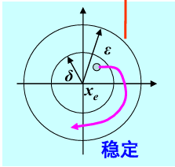
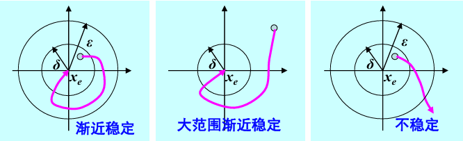

# Lyapunov 稳定性

## 1 背景

### 1.1 自治系统

考虑一个系统，有`n`个独立的状态，组成一个**状态变量** $\mathbf{x}_n$，即

$$ \mathbf{x}_n = \begin{bmatrix}x_1 & x_2 &... & x_n\end{bmatrix}^T$$

不妨认为，系统状态都是关于时间`t`的函数，则有

$$ \mathbf{x}_n(t) = \begin{bmatrix}x_1(t) & x_2(t) & ... &x_n(t)\end{bmatrix} $$

如果，系统的状态空间方程可以表示为

$$ \dot{\mathbf{x}}_n(t) = \mathbf{f}(\mathbf{x}_n(t)) $$

那么，我们就称该系统为**自治系统**。这意味着系统不受任何外部输入的影响而变化。

> Note:
> 这里的$\mathbf{f}(\cdot)$是一个定义在`n`维空间的向量函数，它可以表示为
>
> $$\mathbf{f} = \begin{bmatrix}f_1 & f_2 & ... & f_n\end{bmatrix}^T$$
>
> 其中，$f_1, f_2, ... ,f_n$都是定义在`n`维空间的标量函数。
>
> 举个例子，$\mathbf{f}(\mathbf{x}_2) = \begin{bmatrix}\sin(x_2) & x_1^2\end{bmatrix}^T$, 那么$f_1(\mathbf{x}_2) = \sin(x_2)$，$f_2(\mathbf{x}_2)=x_1^2$.

### 1.2 稳定状态/稳定点

如果存在一个状态 $\mathbf{x} = \mathbf{x}_e$，满足 $\mathbf{f}(\mathbf{x_e}) = 0$，则称该状态为 **稳定状态/稳定点**。

> Comment :
> 这个定义很好理解，就是该状态下，系统所有状态关于时间的变化率都为0.
>
> 换言之，如果系统初始状态在稳定点，那么系统将始终保持在稳定点。

#### 1.2 a 线性定常系统的稳定点

考虑我们熟知的线性定常状态空间模型 $\dot{x} = Ax + Bu$，当输入`u`为`0`时，该系统就是一个自治系统

$$ \dot{x} = f(x) = Ax $$

这个系统的稳定点是 `Ax = 0` 这一方程的解。

而根据我们的线性代数知识，我们很容易知道，若`A`不可逆，则方程只有唯一解`x = 0`；

若`A`可逆，则方程有无穷多解。通常，我们会将一个不可逆的方阵称为 **奇异的(Singular)**.

### 1.3 能量函数

参见[二次型与(半)正负定性](../数学/二次型与(半)正负定性.md)

## 2 Lyapunov 意义下的稳定性

### 2.1 Lyapunov 稳定性定义

首先，用`2-范数`定义自治系统关于平衡状态的邻域

$$ S(x_e, H) = \{x | x\in \mathbb{R}^n, \|x-x_e\|_2 \le H\} $$

> Comment :
> 我借鉴的《现代控制理论》PPT中关于邻域的符号，没有$x_e$，只有$S(H)$，我个人觉得加上更好一点。其实本质就是一个球心加半径定义出来的一个`n`维球体区域。

严格定义系统平衡点的 Lyapunov 稳定性：

$$ \forall \varepsilon > 0, \exists \delta > 0, \forall x(0) \in S(x_e,\delta), \forall t\in[0,\infty),  x(t)\in S(x_e, \varepsilon)$$

<figure markdown>
{width=100%}
<!-- <figcaption>Lyapunov稳定性定义示意图</figcaption> -->
</figure>

说人话就是，在系统的`n`维状态空间里，以平衡点为球心画个任意大小的球，我都能在其中找到一个更小的球体范围。无论系统状态从新球体中哪一点开始演变，我都能保证系统状态不会超出老球体的范围。

> Note :
> 该定义与 $\forall \delta > 0, \exists \varepsilon > 0, \forall x(0) \in S(x_e,\delta), \forall t\in[0,\infty),  x(t)\in S(x_e, \varepsilon)$ 是不等价的。
>
> 事实上，Lyapunov 稳定性的定义只规定了系统状态初值在离平衡点无限近的一个邻域内时，系统状态变化不越界。而这个新定义则要求系统状态初值在平衡点的任意大邻域内时，系统状态都不发散到无穷。

#### 2.1 a Lyapunov 的渐进稳定性

<figure markdown>
{width=100%}
<!-- <figcaption>Lyapunov稳定性定义示意图</figcaption> -->
</figure>

1. 考虑一个Lyapunov稳定的平衡点$x_e$，如果系统状态从邻域$S(x_e, \delta)$内任意一点开始演变，最后都能收敛到$x_e$，那么称$x_e$是**渐进稳定的**。把邻域$S(x_e, \delta)$称为$x_e$的**吸引域**。
2. 如果这个自治系统不管初始状态是什么，最后状态都能收敛到$x_e$，那么称$x_e$是**大范围渐进稳定的**。
3. 平衡点$x_e$在Lyapunov意义下**不稳定**的严格表述

$$\exists \varepsilon > 0,\forall \delta>0, \exists x(0) \in S(x_e, \delta), \exists t \in[0,\infty), x(t) \notin S(x_e, \varepsilon) $$

### 2.2 如何使用Lyapunov稳定性？

#### 2.2 b 线性定常系统 Lyapunov 稳定的条件

考虑这样一个线性定常系统

$$\dot{x} = Ax, x(0)=x_0, t\ge 0$$

有以下定理：

1. 该系统所有的平衡状态都 Lyapunov 稳定 的充要条件是 `A`的所有特征值都具有非正实部，

#### 2.2 a Lyapunov 第一法（间接法，用的不多）

**基本思路**：对于一个非线性系统，将它在平衡点位置做线性化，然后按照线性系统的方式来判断其Lyapunov稳定性。
考虑一个非线性系统

$$\dot{\mathbf{x}} = \mathbf{f}(\mathbf{x})$$

在$\mathbf{x} = \mathbf{x}_e$位置有一个平衡点，那么我们可以在平衡点位置对其做泰勒展开，得到

$$\dot{\mathbf{x}} = \frac{\partial \mathbf{f}}{\partial \mathbf{x}^T}(\mathbf{x}-\mathbf{x}_e)+O(\mathbf{x})$$

> Comment :
> Q：为什么这里求偏导的时候，是对`x`的转置求偏导而不是对`x`本身求偏导？
>
> A：参见[矩阵微积分](../数学/矩阵微积分.md/#113-分子布局-符号特别版)中关于“分子布局(符号特别版)”的介绍。

这里的$\frac{\partial \mathbf{f}}{\partial \mathbf{x}^T}$本质上是一个$n\times 1$的向量关于一个$n\times 1$的向量求导，结果是

$$\frac{\partial \mathbf{f}}{\partial \mathbf{x}^T} = \begin{bmatrix}\frac{\partial f_1}{\partial x_1} & \frac{\partial f_1}{\partial x_2} & ... & \frac{\partial f_1}{\partial x_n}\\ \frac{\partial f_2}{\partial x_1} & \frac{\partial f_2}{\partial x_2} & ... & \frac{\partial f_2}{\partial x_n}\\ .. & .. &.. & ..\\ \frac{\partial f_n}{\partial x_1} & \frac{\partial f_n}{\partial x_2} & .. & \frac{\partial f_n}{\partial x_n}\end{bmatrix} \overset{\bigtriangleup}{=} A_n$$

我们忽略掉高阶项$O(\mathbf{x})$，再做变量代换$\mathbf{z} = \mathbf{x} - \mathbf{x}_e$，即把原来的非线性系统，在平衡点附近化为了如下的线性系统形式

$$\dot{\mathbf{z}} = A_n\mathbf{z}$$

// TODO（补充完整）
