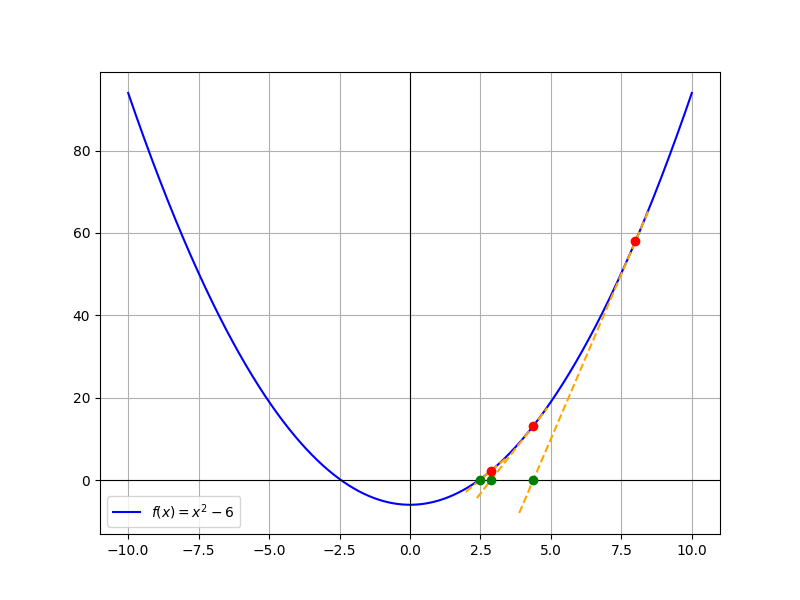
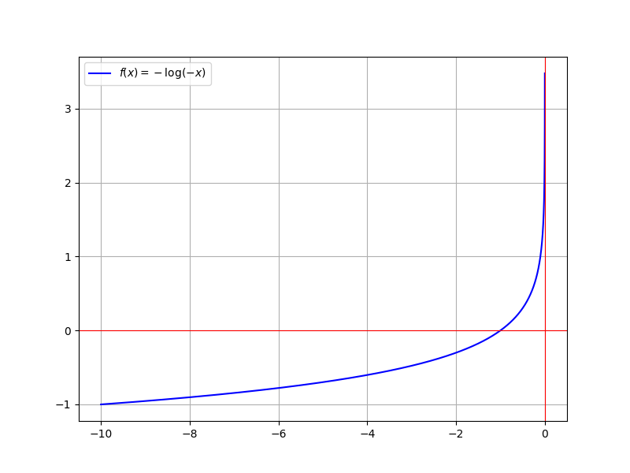

# 优化理论速成

## 牛顿法

牛顿法用于求非线性方程 $f(x) = 0$ 的根。先估计一个点 $x_0$ ，然后反复迭代 $x \leftarrow x + \Delta x$ ，直至精度符合要求。

$$\begin{aligned}
f(x+\Delta x) &\approx f(x) + \frac{\partial f}{\partial x} \Delta x = 0\\
\Rightarrow \Delta x &= -\left(\frac{\partial f}{\partial x}\right)^{-1} f(x)
\end{aligned}$$

原理就是在当前 $x_0$ 位置对非线性函数 $f$ 做一阶近似，找到该近似函数的零点 $x_0+\Delta x_0$ ，跳过去 $x_1 \leftarrow x_0+\Delta x_0$，然后重复上述过程直至接近非线性方程的零点，满足 $|f(x_n)-0| < \varepsilon$ .

{.img-center width=50%}

> 1. 我们观察一下 $\Delta x$ 的方向：当 $f(x)$ 大于 0 的时候，沿负梯度方向，即函数值减小的方向；当 $f(x)$ 小于 0 的时候，沿正梯度方向，即函数值增大的方向。
> 2. 常把函数 $f(x)$ 称为“残差函数”（Residual function）。

### 牛顿法用于优化

考虑

$$\min_{x} f(\mathbf{x})\ ,\ \ \ f(\mathbf{x}):\mathbb{R}^{n} \rightarrow \mathbb{R}$$

为了找到局部最小值点，我们考虑其必要条件 $\nabla_{\mathbf{x}} f(\mathbf{x}) = \mathbf{0}$ .

这是一个方程求根问题，我们使用牛顿法：

$$\begin{aligned}
\nabla f(\mathbf{x}+\Delta \mathbf{x}) &\approx \nabla f(\mathbf{x}) + \frac{\partial\nabla f(\mathbf{x})}{\partial \mathbf{x}} \Delta \mathbf{x} = \mathbf{0}\\
&=\nabla f(\mathbf{x}) + \left[\nabla^2f(\mathbf{x})\right]^{\top} \Delta \mathbf{x}= \mathbf{0}\\
\Rightarrow \Delta \mathbf{x} &= -\left[\nabla^2f(\mathbf{x})\right]^{-\top} \nabla f(\mathbf{x})
\end{aligned} \tag{2-1}$$

这里的 $\nabla^2 f(\mathbf{x})$ 又被称为 Hessian Matrix 黑塞矩阵。

$$\begin{aligned}
H = \nabla^2f(\mathbf{x})
&= \begin{bmatrix}\frac{\partial^2 f}{\partial x_1^2} & \frac{\partial^2 f}{\partial x_1\partial x_2 } & \cdots & \frac{\partial^2 f}{\partial x_1\partial x_n} \\ \frac{\partial^2 f}{\partial x_2\partial x_1} & \frac{\partial^2 f}{\partial x_2^2} & \cdots & \frac{\partial^2 f}{\partial x_2\partial x_n}\\ \vdots & \vdots & \ddots & \vdots\\ \frac{\partial^2 f}{\partial x_n\partial x_1} & \frac{\partial^2f}{\partial x_2 \partial x_n} & \cdots & \frac{\partial^2 f}{\partial x_n^2}\end{bmatrix}
\end{aligned}$$

一般情况下，非线性函数 $f$ 都是二阶偏导连续可微的， $H = H^{\top}$ .

式 (2-1) 类似于梯度下降，不同点在于”步长/学习率“ $\left[\nabla^2f(\mathbf{x})\right]^{-1}$ 不一定是正定的，这就导致用牛顿法解该优化问题时，最终收敛的位置不一定是局部最小值点（可能是局部最大值点、鞍点等满足”一阶导数为 0 “的点）。

#### Damped Newton 阻尼牛顿法

为了解决上述问题，想办法将“步长/学习率”（Hessian Matrix 的逆）变成正定的，做法如下：

在使用牛顿法迭代前，检查 Hessian Matrix 是否正定，若否，则 $H \leftarrow H + \beta I$ ，重复该步骤，直至 $H$ 正定。

> 1. 这个操作叫作 Regularization（正规化/正则化） .
> 2. 这里的 $\beta$ 不能选太小，否则操作完之后的 $H$ 的特征值太接近于 0 ，$H^{-1}$ 的特征值极大，计算所得 $\Delta \mathbf{x}$ 也极大。  

#### 回溯线搜索 backtracking

用牛顿法找最小值点，可能出现超调。在极端情况下，可能会在最小值点附近重复迭代，无法下降。回溯线搜索可解决该问题。

牛顿法已经确定了迭代的方向 $\Delta \mathbf{x} = -H^{-1}\nabla f(\mathbf{x})$ （这里的 Hessian 矩阵 $H$ 是经过 Regularization 的，是正定的），现在需要调整迭代的步长，调整方式是乘一个比例系数 $\alpha \in (0, 1]$ ，以保证 $f(\mathbf{x}+\alpha\Delta\mathbf{x})$ 相对于 $f(\mathbf{x})$ 有“良好的下降”。

问题是，如何定义“良好的下降”？

一种简单可行的方式是 **Armijo Rule** ：

设 $\alpha = 1$ ，然后检查以下条件是否成立：

$$f(\mathbf{x}+\alpha\Delta\mathbf{x}) \le f(\mathbf{x})+b\alpha(\nabla f(\mathbf{x}))^{\top}\Delta\mathbf{x}$$

若不成立，则收缩 $\alpha$ （比如乘以 0.5 ）；反复迭代直至满足条件。

Armijo 条件的含义：取切线，斜率乘以 $b$ （放宽要求，否则不可能满足）作为下降基准线，在步长范围（$\alpha \Delta\mathbf{x}$）内，函数值下降速度必须比基准线快。

实践中 $b$ 一般取得比较小，在 $[10^{-4}, 0.1]$ 范围内。也就是说，大体上还是认为，只要函数值有下降就是好的。

{.img-center width=50%}

该算法的计算效率相当高，因为最耗时的部分 $\nabla f(\mathbf{x})$ 在牛顿法求 $\Delta \mathbf{x}$ 时已经计算好了。

## 带约束的优化问题

对于优化问题，我们的核心思路是将其**转化为求根问题**。

1. 无约束的优化问题，我们求其梯度为 0 方程的根；
2. 等式约束的优化问题，我们求其 KKT 方程的根；
3. 不等式约束的优化问题，我们想办法把不等式约束放到代价函数里，转化为无约束的优化问题，然后求其梯度为 0 方程的根。

### 等式约束

#### 拉格朗日乘子法

考虑如下问题：

$$\begin{aligned}\min_{\mathbf{x}}f(\mathbf{x})\\
\mathrm{s.t.}\ \ \ c(\mathbf{x}) = \mathbf{0}
\end{aligned}$$

其中， $f$ 是 $\mathbb{R}^{n}\rightarrow \mathbb{R}$ 的映射，$c$ 是 $\mathbb{R}^{n}\rightarrow\mathbb{R}^{m},m<n$ 的映射。对于多个等式约束的情况，必然可以将其整理、简化为如上形式。

上述问题的局部最小值点，需要满足两个一阶必要条件：

1. 在自由方向上， $\nabla f(\mathbf{x}) = 0$ ,
2. 满足约束条件 $c(\mathbf{x}) = \mathbf{0}$ .

这里的“自由方向”指的是沿着约束曲线运动的方向。极值点一定是沿着约束曲线运动一个小 $\delta \mathbf{x}$ ，函数值不发生变化的位置。

第一个一阶必要条件可以等价地表述为， $\nabla f(\mathbf{x})$ 完全指向非自由方向，也就是与约束曲线垂直的方向，也就是 $\left(\dfrac{\partial c}{\partial \mathbf{x}}\right)^{\top}$ 的方向。更进一步，以上表述可以用形式化的语言写成：

$$\nabla f(\mathbf{x}) + \left(\dfrac{\partial c}{\partial \mathbf{x}}\right)^{\top}\lambda = \mathbf{0}$$

这里的 $\lambda \in \mathbb{R}^{m}$ 就是拉格朗日乘子。

> $\nabla f(\mathbf{x}) \in \mathbb{R}^{n\times 1}, \left(\dfrac{\partial c}{\partial \mathbf{x}}\right)^{\top} \in \mathbb{R}^{n\times m}$ .

我们写出拉格朗日函数，囊括以上两个条件：

$$L(\mathbf{x},\lambda) = f(\mathbf{x})+ \lambda^{\top}c(\mathbf{x})$$

**于是，我们将原先的等式约束极值问题，转化为拉格朗日函数的无约束极值问题，这两个问题是对偶问题。更进一步，我们将其转化为 KKT 方程求根问题。**

其必要条件（ KKT 条件）为：

$$\begin{cases}\nabla_{\mathbf{x}}L(\mathbf{x},\lambda)=\nabla f(\mathbf{x})+\left(\dfrac{\partial c}{\partial \mathbf{x}}\right)^{\top}\lambda = \mathbf{0}\\
\nabla_{\lambda}L(\mathbf{x}, \lambda) = c(\mathbf{x}) = \mathbf{0}
\end{cases}$$

这是一个方程求根问题，我们使用 **牛顿法** ，上式即为残差函数。

不妨令 $G(\mathbf{x},\lambda)=\nabla_{\mathbf{x}}L(\mathbf{x},\lambda)$ ， $K(\mathbf{x},\lambda)=\nabla_{\lambda}L(\mathbf{x},\lambda)$ . 则有

$$\begin{aligned}
G(\mathbf{x}+\Delta\mathbf{x},\lambda+\Delta\lambda) &= G(\mathbf{x},\lambda)+\frac{\partial G}{\partial\mathbf{x}}\Delta\mathbf{x}+\frac{\partial G}{\partial\lambda}\Delta\lambda\\
&= \nabla_{\mathbf{x}}L + \frac{\partial \nabla_{\mathbf{x}}L}{\partial\mathbf{x}}\Delta\mathbf{x}+\frac{\partial\left[\left(\dfrac{\partial c}{\partial \mathbf{x}}\right)^{\top}\lambda\right]}{\partial \lambda}\Delta\lambda\\
&=\nabla_{\mathbf{x}}L+\left(\nabla^2_{\mathbf{xx}}L\right)^{\top}\Delta\mathbf{x} + \left(\dfrac{\partial c}{\partial \mathbf{x}}\right)^{\top}\Delta\lambda = \mathbf{0}\\
K(\mathbf{x}+\Delta\mathbf{x}, \lambda+\Delta\lambda)&=K(\mathbf{x},\lambda)+\frac{\partial K}{\partial\mathbf{x}}\Delta\mathbf{x}+\frac{\partial K}{\partial\lambda}\Delta\lambda\\
&= c(\mathbf{x}) + \dfrac{\partial c(\mathbf{x})}{\partial \mathbf{x}}\Delta\mathbf{x}=\mathbf{0}
\end{aligned}$$

整理一下，得到 **KKT 系统**：

$$\begin{bmatrix}\dfrac{\partial^2L}{\partial\mathbf{x}^2} & \left(\dfrac{\partial c}{\partial \mathbf{x}}\right)^{\top}\\
\dfrac{\partial c}{\partial \mathbf{x}} & 0
\end{bmatrix} \begin{bmatrix}\Delta \mathbf{x}\\ \Delta \lambda\end{bmatrix} = \begin{bmatrix}-\nabla_{\mathbf{x}}L\\ -c(\mathbf{x})\end{bmatrix}$$

> 1. KKT，全称 Karush-Kuhn-Tucker ，是三个人名。
> 2. 上式在推导时用到了梯度与偏导间的转置关系，同时默认拉格朗日函数的 Hessian 矩阵对称。

从而有迭代变化量

$$\begin{bmatrix}\Delta \mathbf{x}\\ \Delta \lambda\end{bmatrix} = -\begin{bmatrix}\dfrac{\partial^2L}{\partial\mathbf{x}^2} & \left(\dfrac{\partial c}{\partial \mathbf{x}}\right)^{\top}\\
\dfrac{\partial c}{\partial \mathbf{x}} & 0
\end{bmatrix}^{-1}\begin{bmatrix}\nabla_{\mathbf{x}}L\\ c(\mathbf{x})\end{bmatrix}$$

#### 高斯牛顿法 Gauss-Newton

我们考察 KKT 系统中的 $\dfrac{\partial^2L}{\partial\mathbf{x}^2}$ 一项

$$\dfrac{\partial^2L}{\partial\mathbf{x}^2} = \nabla^2f(\mathbf{x}) + \frac{\partial}{\partial \mathbf{x}}\left[\left(\dfrac{\partial c}{\partial \mathbf{x}}\right)^{\top}\lambda\right]$$

注意到 $\left(\dfrac{\partial c}{\partial \mathbf{x}}\right)^{\top}$ 是一个 $n\times m$ 的矩阵，其对 $\mathbf{x}$ 这一 $n\times 1$ 的向量求偏导，结果是一个三阶张量（本质上是每个分量对 $\mathbf{x}$ 求偏导，得到一个 $1\times n$ 的向量）。

若系统维度较大，该部分计算所消耗的时空资源极大，简直不可接受。所以，我们考虑舍弃掉这一项。从而有新的迭代变化量

$$\begin{bmatrix}\Delta \mathbf{x}\\ \Delta \lambda\end{bmatrix} = -\begin{bmatrix}\nabla^2f(\mathbf{x}) & \left(\dfrac{\partial c}{\partial \mathbf{x}}\right)^{\top}\\
\dfrac{\partial c}{\partial \mathbf{x}} & 0
\end{bmatrix}^{-1}\begin{bmatrix}\nabla_{\mathbf{x}}L\\ c(\mathbf{x})\end{bmatrix}$$

### 不等式约束

考虑如下问题：

$$\begin{aligned}
\min_{\mathbf{x}}f(\mathbf{x})\\
\mathrm{s.t.}\ \ \ c(\mathbf{x})\le \mathbf{0}
\end{aligned}$$

其中， $f$ 是 $\mathbb{R}^{n}\rightarrow \mathbb{R}$ 的映射，$c$ 是 $\mathbb{R}^{n}\rightarrow\mathbb{R}^{m},m<n$ 的映射。式中的不等号代表每个分量都小于 0 .

同样地，构造拉格朗日函数 $L(\mathbf{x},\lambda) = f(\mathbf{x})+\lambda^{\top}c(\mathbf{x})$ ，则对于上述问题中的局部最优解 $\mathbf{x}^{*}$ ，必能找到 KKT 乘子 $\lambda$ ，使得以下四个一阶必要条件（ KKT 条件）成立：

1. 驻点/平稳性（Stationarity）： $\nabla f+ \left(\dfrac{\partial c}{\partial \mathbf{x}}\right)^{\top} \lambda = \mathbf{0}$ ;
2. 原始可行性（Primal feasibility）： $c(\mathbf{x}^{*}) \le \mathbf{0}$ ;
3. 对偶可行性（Dual feasibility）： $\lambda \ge \mathbf{0}$ ;
4. 互补松弛性（Complementary slackness）： $\lambda \odot c(\mathbf{x}^{*}) = 0$ .

> $\odot$ 是哈达玛积，代表向量对应元素相乘。

可以将 $\lambda^{\top}c(\mathbf{x})$ 理解为一个惩罚项，当 $c(\mathbf{x}) > 0$ （超出约束时）， $\lambda>0$ 保证了目标代价函数是增大的，这是我们不希望看到的。

#### 优化算法

##### Active-Set 有效集

1. 利用先验知识，猜测有效/无效约束（即猜测最优解在哪条约束的边界上）；
2. 解等式约束问题。

在最糟的情况下，算法复杂度会爆炸！（遍历所有可能组合。）因此该算法必须有良好的先验知识。

##### Barrier / Interior Point 障碍点/内点法

> 解决凸优化问题的一般方法。

用障碍函数替代不等式约束，放入目标函数，将不等式约束极值问题转化为无约束极值问题。最常用的障碍函数是“对数障碍函数”。障碍函数的特点是，在约束边界处趋于无穷大。

$$\begin{cases}\min_{\mathbf{x}}f(\mathbf{x})\\
c(\mathbf{x}) \le 0
\end{cases}\implies\min_{\mathbf{x}}\ f(\mathbf{x})-\sum_{i=1}^{m}\frac{1}{\rho}\log[-c_i(\mathbf{x})]$$

以 $c(x)=x$ 为例，当 $c(x)=x<0$ 时，障碍函数的值较小，几乎不影响目标函数；但当 $c(x)=x$ 接近约束边界 $c(x)=0$ 时，障碍函数值急剧升高，导致目标函数值同时急剧升高。这就像一道无法跨越的屏障，将优化过程限制在可行域内。

{.img-center width=50%}

##### 惩罚函数

用惩罚函数替代不等式约束，放入目标函数，将不等式约束极值问题转化为无约束极值问题。最常用的是二次型惩罚函数。

$$\begin{cases}\min_{\mathbf{x}}f(\mathbf{x})\\
c(\mathbf{x}) \le 0
\end{cases}\implies\min_{\mathbf{x}}\ f(\mathbf{x})+\frac{\rho}{2}[\max(0,c(\mathbf{x}))]^2$$

惩罚函数的优势是易于实现。但是，惩罚函数的边界约束相较于障碍函数而言弱得多（只对超出约束的点做惩罚）。如果想让惩罚函数达到合适的约束效果，必须将 $\rho$ 设得非常非常大，容易导致浮点计算溢出。因此，该种方法无法获得高精度准确解。

##### Augmented Lagrangian 增广拉格朗日法

在惩罚函数中引入拉格朗日乘子估计项：

$$\min_{\mathbf{x}}\ L_{\rho}\left(\mathbf{x},\tilde{\lambda}\right) = \min_{\mathbf{x}}\ f(\mathbf{x})+\tilde{\lambda}^{\top}c(\mathbf{x})+\frac{\rho}{2}[\max(0,c(\mathbf{x}))]^2$$

式中 $L_{\rho}\left(\mathbf{x},\tilde{\lambda}\right)$ 是增广拉格朗日函数。核心思路是在迭代过程中，将惩罚项逐步迁移至 $\tilde{\lambda}$ .

$$\begin{aligned}
\frac{\partial L_{\rho}}{\partial\mathbf{x}} &= \frac{\partial f}{\partial\mathbf{x}}+\tilde{\lambda}^{\top}\frac{\partial c}{\partial\mathbf{x}}+\rho c^{\top}\frac{\partial c}{\partial \mathbf{x}}\\
&=\frac{\partial f}{\partial \mathbf{x}}+\left[\tilde{\lambda}^{\top}+\rho c^{\top}\right]\frac{\partial c}{\partial \mathbf{x}}\\
\implies\tilde{\lambda} &= \tilde{\lambda}+\rho c(\mathbf{x})
\end{aligned}$$

首先设 $\tilde{\lambda}$ 初值为 0 ，然后求当前增广拉格朗日函数的最小值（牛顿法），再更新 $\tilde{\lambda} \leftarrow \max(0, \tilde{\lambda}+\rho c(\mathbf{x}))$ ，接下来可以增大 $\rho \leftarrow \alpha \rho$ ，此处 $\alpha$ 一般取 10 . 最后，不断重复上述步骤直至收敛。

1. 解决了惩罚函数法易出现浮点计算溢出的问题；
2. 对于非凸问题也表现良好。

### 实例-二次规划

$$\begin{aligned}
\min_{\mathbf{x}}\ \ &\frac{1}{2}\mathbf{x}^{\top}Q\mathbf{x}+q^{\top}\mathbf{x}\\
\mathrm{s.t.}\ \ &A\mathbf{x}\le\mathbf{b}\\
&C\mathbf{x}=\mathbf{d}
\end{aligned}$$

为了保证目标函数是严格凸的， $Q$ 必须是正定的，即 $Q \succ 0$ .

### KKT 系统的正则化

对于等式约束极值问题，拉格朗日乘子法的核心思路是将问题转化为无约束极值问题。从这一想法出发，最直观的转化方式是：

$$\begin{cases}\min_{\mathbf{x}}f(\mathbf{x})\\
c(\mathbf{x}) = \mathbf{0}
\end{cases}\implies \min_{\mathbf{x}}\ f(\mathbf{x}) + P_{\infty}(c(\mathbf{x})), \ \ \ P_{\infty}(\mathbf{u}) = \begin{cases}0, & \mathbf{u}=\mathbf{0}\\+\infty,&\mathbf{u}\neq\mathbf{0}\end{cases} \tag{1-2-1}$$

这玩意在实践上没什么价值，因为 $P_{\infty}$ 函数性质太差了，不可导，无法用一般的优化方式求最小值。但是，我们可以构造等价的问题，实现同样的效果：

$$\min_{\mathbf{x}}\max_{\lambda}\ f(\mathbf{x})+\lambda^{\top}c(\mathbf{x})\tag{1-2-2}$$

当 $c(\mathbf{x}) = \mathbf{0}$ 满足约束条件时，两个问题都转变为 $\min_{\mathbf{x}}\ f(\mathbf{x})$ . 当 $c(\mathbf{x})\neq\mathbf{0}$ 违反约束条件时，(1-2-1) 的目标函数受 $P_{\infty}$ 主导，为 $+\infty$ ；同时，由于我们没有限制 $\lambda$ 的取值， (1-2-2) 的内层目标函数 $\max_{\lambda}\ f(\mathbf{x})+\lambda^{\top}c(\mathbf{x})$ 也会趋向正无穷。因此，(1-2-1) 和 (1-2-2) 是等价的。

类似地，对于不等式约束，有理想转换方式：

$$\begin{cases}\min_{\mathbf{x}}f(\mathbf{x})\\
c(\mathbf{x}) \le \mathbf{0}
\end{cases}\implies \min_{\mathbf{x}}\ f(\mathbf{x}) + P^{+}_{\infty}(c(\mathbf{x})), \ \ \ P_{\infty}(\mathbf{u}) = \begin{cases}0, & \mathbf{u}\le\mathbf{0}\\+\infty,&\mathbf{u}>\mathbf{0}\end{cases}$$

等价于

$$\min_{\mathbf{x}}\max_{\lambda\ge\mathbf{0}}f(\mathbf{x})+\lambda^{\top}c(\mathbf{x})$$

以上等价 $\min\max$ 问题，最优解在 $\lambda$ 方向是极大值，在 $\mathbf{x}$ 方向是极小值，构成了一个“鞍点”。

回忆一下牛顿法解优化问题，如果求最小值，我们要求 Hessian 矩阵是正定的；反之，求最大值，Hessian 矩阵就应该是负定的。因此，在带约束的优化问题上，KKT 矩阵应该在 $\mathbf{x}$ 方向的特征值是正定的，在 $\lambda$ 方向的特征值是负定的。这被称为“quasi definite”（拟正定）。

正因此，我们得到了 KKT 矩阵的 regularization 方式：

$$\begin{bmatrix}H & c^{\top}\\c & 0\end{bmatrix} \rightarrow \begin{bmatrix}H+\beta I & c^{\top}\\ c & -\beta I\end{bmatrix}$$

### 评价函数 Merit Function

考虑带约束的优化问题：

$$\begin{aligned}
\min_{\mathbf{x}} \quad &f(\mathbf{x})\\
\mathrm{s.t.} \quad &c(\mathbf{x}) \le \mathbf{0}\\
&d(\mathbf{x}) = \mathbf{0}
\end{aligned}$$

写出其拉格朗日方程

$$L(\mathbf{x},\lambda,\mu) = f(\mathbf{x})+\lambda^{\top}c(\mathbf{x})+\mu^{\top}d(\mathbf{x})$$

我们可以将该问题转化为 KKT 条件的求根问题。在我们求根过程中，我们需要使用线搜索保证迭代过程的收敛性。现在的问题是，KKT 方程不是一个标量方程，我们该如何衡量当前值 $\mathbf{x}$ 距离根 $\mathbf{x}^{*}$ 有多远？

很简单的一个思路是，构造一个标量函数，称为“评价函数”（Merit function），用来衡量这一距离。

给出一些例子：

用 KKT 残差衡量，计算复杂度较高：

$$P(\mathbf{x},\lambda,\mu) = \frac{1}{2}\left\|r_{\mathrm{KKT}}(\mathbf{x},\lambda,\mu)\right\|^2_{2} \quad,\quad r_{\mathrm{KKT}} = \begin{bmatrix}\nabla_{\mathbf{x}}L\\ \min(0, c(\mathbf{x}))\\ d(\mathbf{x})\end{bmatrix}$$

用目标函数加上约束范数：

$$P(\mathbf{x},\lambda,\mu) = f(\mathbf{x})+p\left\|\begin{bmatrix}\min(0,c(\mathbf{x}))\\ d(\mathbf{x})\end{bmatrix}\right\|$$

这里的 $p$ 是一个标量系数；约束的范数可以任意选择，简单起见一般选 1- 范数（各元素绝对值求和）即可。

或者直接用增广拉格朗日函数：

$$P(\mathbf{x},\lambda,\mu) = L_{\rho}(\mathbf{x},\lambda,\mu)$$

得到了标量函数之后，我们就可以根据 Armijo 规则，回溯线搜索得到合适的迭代步长。
