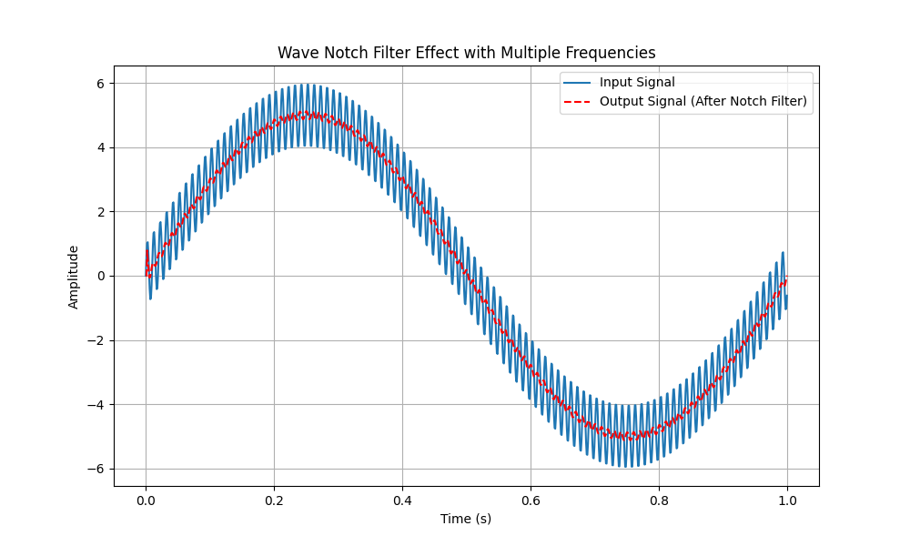

# TD滤波器（微分跟踪器）

## 引言

考虑一个变化比较剧烈的输入信号，想求其导数。

如果使用差分近似的方法，直接对蓝色输入信号求导，计算出的导数绝对值必定大得异常，这不好。

解决方法是，我们牺牲一部分实时性，以换取导数值的平稳。

举个例子，考虑一个 **阶跃信号** ，k 时刻的值是 0，k+1 时刻的值是 100；我们的想法是去构造一个变化更加平稳的新信号追踪原始信号：例如新信号 k 时刻的值是 1，在 k+1 时刻的值是 50，在 k+2 时刻的值是 100。对新信号求导数，这个导数值显然更小更平稳。

那这个导数和真实导数相差大吗？

事实上，在实际工程中，输入信号的“剧烈变化”往往是测量误差导致的，是应该规避的。也就是说，虽然新信号的导数会有一定的滞后，但这个更加平滑的导数，才是更加真实的导数。

> 上文举了一个阶跃信号的例子，事实上下图这种蓝色信号才是更加常见的，而我们想要的其实是红色信号的导数。

{.img-center width=75%}

接下来的问题是，怎么构造这个用来代替输入信号的新信号？

## 线性跟踪微分器 LTD

考虑一个二阶对象（也有三阶、四阶以上的，计算方法都同理）

$$
\frac{Y}{U}=\frac{\omega_n^2}{s^2+2\zeta\omega_n s+\omega_n^2}.
$$

理论上最好的情况是 $\zeta=1$，此时的过渡曲线在无超调前提下最快达到稳态。

也即

$$
\frac{Y}{U}=\frac{\omega_n^2}{s^2+2\omega_n s+\omega_n^2}.
$$

举个例子，如果输入 $u(t)$ 是一个阶跃信号，该对象的输出 $y(t)$ 不会阶跃，而是缓缓上升直至达到输入值的大小，并且之后保持不变（无超调）。这就是我们想要的效果。

用该二阶对象来跟踪输入信号，就能在复杂度为二阶的前提下，实现 **无超调的最快跟踪** 。

我们把上式转到时域表示，有

$$
\ddot{y}+2\omega_n\dot{y}+\omega_n^2y=\omega_n^2u.
$$

选取状态变量 $x_1=y, x_2=\dot{x}_1$，有

$$
\begin{aligned}
\dot{x}_1 &= x_2 \\
\dot{x}_2 &= -2\omega_nx_2+\omega_n^2(u-x_1).
\end{aligned}
$$

稳态情况下，$x_1=y=u$，所以 $x_1$ 能跟踪输入信号。（$x_1$ 就是引言中说的新信号）

又因为 $x_2=\dot{x}_1$，所以 $x_2$ 能跟踪输入信号的一阶导。（$x_2$ 就是我们想要的输入信号的导数）

当输入信号发生变化时，$x_1$ 相当于是输入信号通过一个传递函数为 $\dfrac{Y}{U}=\dfrac{\omega_n^2}{s^2+2\omega_n s+\omega_n^2}$ 的输出。 $x_2$ 是 $x_1$ 的导数，我们将其视为原始输入信号的导数。

如此，即可有效避免输入信号突变导致的导数值异常，有效抑制导数的波动。

实际使用时的离散计算方法：

$$
\begin{aligned}
\frac{x_1[k+1]-x_1[k]}{T_s} &= x_2[k] \\
\frac{x_2[k+1]-x_2[k]}{T_s} &= -2rx_2[k]+r^2\bigl(u[k]-x_1[k]\bigr)
\end{aligned}
$$

上式中的 $T_s$ 是采样时间，$r$ 是上文的 $\omega_n$。

改写一下，有

$$
\begin{aligned}
x_1[k+1] &= x_1[k]+T_sx_2[k] \\
x_2[k+1] &= x_2[k]-T_s\left\{2rx_2[k]+r^2\bigl(x_1[k]-u[k]\bigr)\right\}
\end{aligned}
$$

这就是我们使用 TD 滤波器的依据公式。每次输入 `u[k]`，维护更新两个变量 `x1[k+1]` 和 `x2[k+1]`，其中 `x2[k+1]` 是我们期望的微分值。要维护 `x1` 是因为 `x2[k+1]` 的计算要用到前一刻的 `x1[k]`。