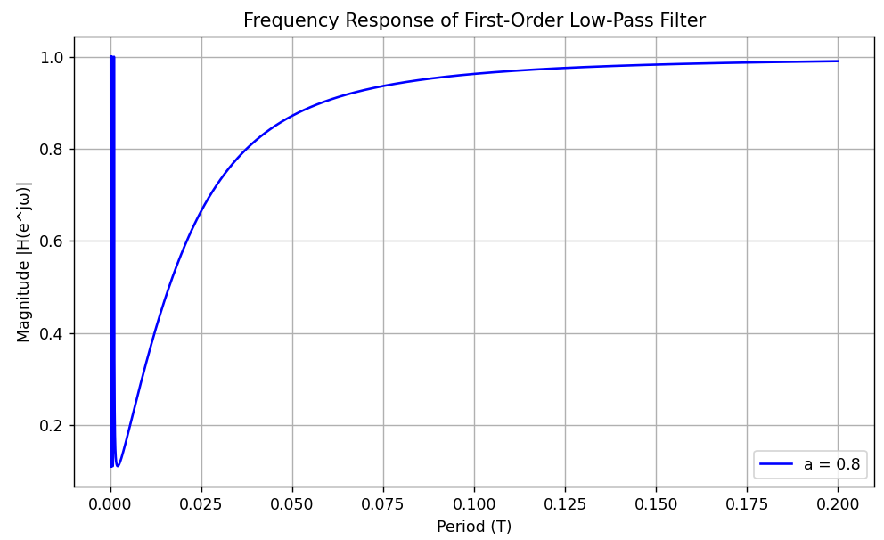
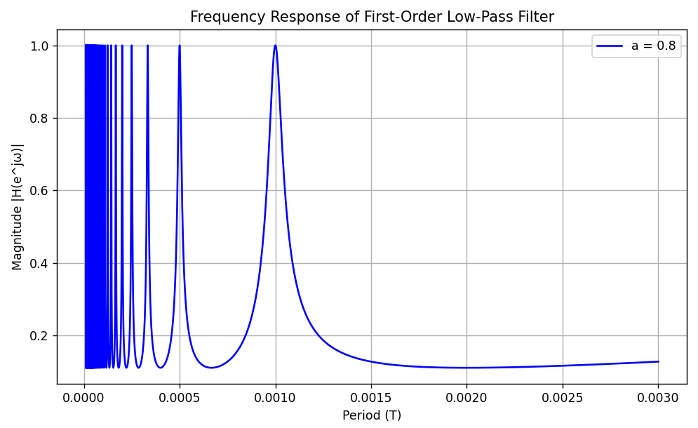

# 一阶惯性滤波

## 1 一阶惯性滤波的形式

一阶惯性滤波是一种常用、简单的滤波方式，对于输入序列 $u(n)$ ，输出序列 $y(n)$ ，滤波器公式如下：

$$y(n) = \alpha \cdot y(n-1) + (1-\alpha)\cdot u(n)$$

其中 $\alpha$ 是滤波器系数。

## 2 频域角度分析

### 2.1 准备工作：从Z域到S域

对一个 Z 域的函数 $H(z)$ ，**我们可以用 $e^{sT_s}$ 代替 $z$ ，从而将此函数从Z域转化到s域**。

这是因为：假设我们有个连续的函数 $y(t)$ ，然后我们对它进行周期采样，得到

$$y^*(t) = \sum_{k=0}^{+\infty} y(t)\delta(t-kT_s) = \sum_{k=0}^{+\infty}y(kT_s)\delta(t-kT_s)$$

那么对 $y^*(t)$ 的拉氏变换结果是

$$\begin{aligned}Y^*(s) &= \int_{0}^{+\infty}y^*(t)e^{-st}\mathrm{d}t\\
&= \int_{0}^{+\infty}\sum_{k=0}^{+\infty}y(kT_s)\delta(t-kT_s)e^{-st}\mathrm{d}t\\
&= \sum_{k=0}^{+\infty}y(kT_s)\int_0^{+\infty}\delta(t-kT_s)e^{-st}\mathrm{d}t\\
&= \sum_{k=0}^{+\infty}y(kT_s)\int_{kT_s^-}^{kT_s^+}e^{-st}\mathrm{d}t\\
&= \sum_{k=0}^{+\infty}y(kT_s)e^{-kT_ss}
\end{aligned}$$

而 $Y(z)$ 可以定义为

$$Y(z) = Y^*(s)|_{z = e^{sT_s}} = \sum_{k=0}^{+\infty}y(kT_s)z^{-k}$$

### 2.2 幅频响应

我们从频域角度对该滤波器进行分析。首先，对上式进行 Z 变换：

$$Y(z) = \alpha z^{-1}Y(z)+(1-\alpha)U(z)$$

从而可以求得传递函数:

$$H(z) = \frac{Y(z)}{U(z)} = \frac{1-\alpha}{1-\alpha z^{-1}}$$

首先，根据 Z 变换的知识，我们可以用 $e^{sT_s}$ 代替 $z$ ，从而将此函数从 Z 域转化到 s 域。

所以，$H(s)$ 可以表示为

$$H(s) = \frac{1-\alpha}{1-\alpha e^{-sT_s}} \tag{2-2-1}$$

然后把 $s$ 转化为 $j\omega$ ，就能得到频率响应函数。

$$H(j\omega) = \frac{1-\alpha}{1-\alpha e^{-j\omega T_s}}$$

这里的 $\omega$ 是把输入信号视为连续信号之后的角频率。
频率响应函数反映了该滤波器对于某一特定频率的周期函数的幅值放大和角度偏移。

$$\begin{aligned}
|H(j\omega)| &= \frac{1-\alpha}{|1-\alpha e^{-j\omega T_s}|} = \frac{1-\alpha}{\sqrt{1+\alpha^2-2\alpha\cos(\omega T_s)}}\\
&= \frac{1-\alpha}{\sqrt{(1-\alpha)^2+2\alpha[1-\cos(2\pi T_s/T)]}}
\end{aligned}$$

我们不难发现，当输入信号的周期 $T$ 大于 $2T_s$ 之后，随着周期的增大/频率的降低，幅值响应越来越接近于 1 。而 $T$ 在 $[0,2T_s]$ 区间内时，幅值响应是振荡的。

我们用 python 画个图来详细看一下。我们取 $T_s = 0.001s, \alpha = 0.8$ 。

{.img-center width=100%}

像一个很漂亮的低通滤波器，但是在更高频段会振荡，下图详细看看。

{.img-center width=100%}

很明显可以发现，**一阶惯性滤波只在采样频率大于2倍输入信号频率的情况下发挥作用**。

## 3 之所以被称为“一阶惯性滤波”

我们熟知，一阶惯性环节的频域形式为

$$G(s) = \frac{1}{Ts+1} \tag{3-1}$$

这与（2-2-1）式的形式不太一样。事实上，倘若我们用一阶的后向差分代替求导，就可以得到（3-1）式的形式：

$$\begin{aligned}
y\left[n\right] &= \alpha y\left[n-1\right] + (1-\alpha)u\left[n\right]\\
\alpha(y\left[n\right] - y\left[n-1\right])+(1-\alpha)y\left[n\right] &= (1-\alpha)u\left[n\right]\\
\alpha\frac{y\left[n\right] - y\left[n-1\right]}{T_s} + \frac{1-\alpha}{T_s}y\left[n\right] &= \frac{1-\alpha}{T_s}u\left[n\right]\\
\overset{\text{转化到时域}}\Rightarrow \alpha \dot{y} + \frac{1-\alpha}{T_s}y &= \frac{1-\alpha}{T_s}u\\
\overset{\text{转化到频域}}\Rightarrow \alpha sY + \frac{1-\alpha}{T_s}Y &= \frac{1-\alpha}{T_s}U\\
\frac{Y}{U} &= \frac{(1-\alpha)/T_s}{\alpha s + (1-\alpha)/T_s}\\
&= \frac{1}{(\alpha T_s)/(1-\alpha) s + 1}
\end{aligned}$$

换一个角度。我们对（2-2-1）式中的 $e^{-sT_s}$ 项做一阶的泰勒展开线性化，也能得到（3-1）式的形式：

$$\begin{aligned}
\frac{1-\alpha}{1-\alpha e^{-sT_s}} &= \frac{1-\alpha}{1-\alpha(1-sT_s)}\\
&= \frac{1-\alpha}{1-\alpha+\alpha T_s s}\\
&= \frac{1}{\dfrac{\alpha T_s}{1-\alpha}s + 1}
\end{aligned}$$

这里面的原理是这样的：

$$\begin{aligned}
&y\left[n-1\right] \Leftrightarrow z^{-1}y\left[n\right] \Leftrightarrow e^{-sT_s}Y(s) \overset{一阶线性化}\Rightarrow (1-sT_s)Y(s)\\
&(1-sT_s)Y(s) \Leftrightarrow y(t) - T_s\dot{y}(t) \overset{一阶后向差分}\Rightarrow y\left[n\right]-T_s\frac{y\left[n\right]-y\left[n-1\right]}{T_s} = y\left[n-1\right]
\end{aligned}$$

观察一阶惯性环节的幅频响应函数：

$$\left|G(j\omega)\right| = \frac{1}{\sqrt{1+(T\omega)^2}}$$

这是一个非常完美的低通滤波器。但是我们用**离散一阶后向差分代替求导**后，得到的滤波器就在高频处存在严重缺陷（振荡）。

## 4 再深入一点

为什么离散化的一阶惯性环节滤波器，其幅频响应曲线振荡的临界点恰好是采样频率等于 2 倍输入信号频率的位置，并且与参数 $\alpha$ 无关？

因为 **香农/奈奎斯特采样定理** ：采样频率必须大于等于模拟信号最高频率的 2 倍，才能不失真地恢复模拟信号。

也就是说，对于所有的离散化滤波器，我们都要求采样频率大于等于 2 倍的输入信号最高频率，否则滤波器都会失效。这并不是一阶惯性滤波器的固有缺陷，而是信号采样原理所决定的。
