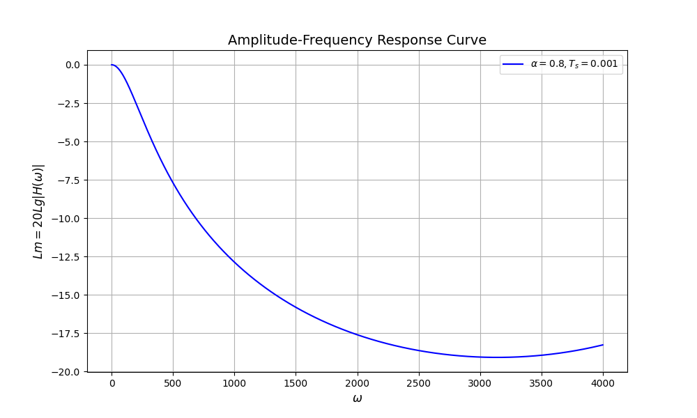

# 一阶惯性滤波

## 1 一阶惯性滤波的形式

一阶惯性滤波是一种常用、简单的滤波方式，对于输入序列 $u[n]$ ，输出序列 $y[n]$ ，滤波器公式如下：

$$y[n+1] = \alpha \cdot y[n] + (1-\alpha)\cdot u[n]$$

其中 $\alpha$ 是滤波器系数。

## 2 频域角度分析

### 2.1 准备工作：从Z域到S域

对一个 Z 域的函数 $H(z)$ ，**我们可以用 $e^{sT_s}$ 代替 $z$ ，从而将此函数从Z域转化到s域**。

这是因为：假设我们有个连续的函数 $y(t)$ ，然后我们对它进行周期采样，得到

$$y^*(t) = \sum_{k=0}^{+\infty} y(t)\delta(t-kT_s) = \sum_{k=0}^{+\infty}y(kT_s)\delta(t-kT_s)$$

那么对 $y^*(t)$ 的拉氏变换结果是

$$\begin{aligned}Y^*(s) &= \int_{0}^{+\infty}y^*(t)e^{-st}\mathrm{d}t\\
&= \int_{0}^{+\infty}\sum_{k=0}^{+\infty}y(kT_s)\delta(t-kT_s)e^{-st}\mathrm{d}t\\
&= \sum_{k=0}^{+\infty}y(kT_s)\int_0^{+\infty}\delta(t-kT_s)e^{-st}\mathrm{d}t\\
&= \sum_{k=0}^{+\infty}y(kT_s)\int_{kT_s^-}^{kT_s^+}e^{-st}\mathrm{d}t\\
&= \sum_{k=0}^{+\infty}y(kT_s)e^{-kT_ss}
\end{aligned}$$

而 $Y(z)$ 可以定义为

$$Y(z) = Y^*(s)|_{z = e^{sT_s}} = \sum_{k=0}^{+\infty}y(kT_s)z^{-k}$$

### 2.2 幅频响应

我们从频域角度对该滤波器进行分析。首先，对上式进行 Z 变换：

$$zY(z) = \alpha Y(z)+(1-\alpha)U(z)$$

从而可以求得传递函数:

$$H(z) = \frac{Y(z)}{U(z)} = \frac{1-\alpha}{z-\alpha}$$

首先，根据 Z 变换的知识，我们可以用 $e^{sT_s}$ 代替 $z$ ，从而将此函数从 Z 域转化到 s 域。

所以，$H(s)$ 可以表示为

$$H(s) = \frac{1-\alpha}{e^{sT_s}-\alpha} \tag{2-2-1}$$

然后把 $s$ 转化为 $j\omega$ ，就能得到该滤波器的频率特性（频率传递函数）。

$$H(j\omega) = \frac{1-\alpha}{e^{j\omega T_s}-\alpha}$$

这里的 $\omega$ 是把输入信号的角频率。频率特性反映了该滤波器对于某一特定频率的周期函数的幅值放大和相位偏移。

$$|H(j\omega)| = \frac{1-\alpha}{|e^{j\omega T_s}-\alpha|} = \frac{1-\alpha}{\sqrt{1+\alpha^2-2\alpha\cos(\omega T_s)}}$$

易知，当输入信号角频率 $\omega < \dfrac{\pi}{T_s}$ （小于 1/2 采样角频率）时，随着 $\omega$ 的增大，幅频特性变小，说明滤波器有效抑制高频成分。

!!! Question

    Q: 为什么一阶惯性滤波只在采样频率大于等于 2 倍输入信号频率的时候奏效，并且与参数 $\alpha$ 无关？

    A：因为 **香农/奈奎斯特采样定理** ：采样频率必须大于等于模拟信号最高频率的 2 倍，才能不失真地恢复模拟信号。

    也就是说，对于所有的离散化滤波器，我们都要求采样频率大于等于 2 倍的输入信号最高频率，否则滤波器都会失效。这并不是一阶惯性滤波器的固有缺陷，而是信号采样原理所决定的。

我们用 python 画个图来详细看一下。

{.img-center width=80%}

很明显可以发现，**一阶惯性滤波只在采样频率大于2倍输入信号频率的情况下发挥作用**。

## 3 之所以被称为“一阶惯性滤波”

参见 [微分方程的离散化](../自动控制原理/微分方程的离散化.md) ，一阶惯性滤波器是增益为 1 的一阶惯性环节的无误差离散化。

!!! Question

    Q: 为什么 (2-2-1) 式与一阶惯性环节 $H(s) = \frac{1}{Ts+1}$ 不一致？
    A：因为 (2-2-1) 式是采样-保持（ZOH）-滤波的传递函数，而一阶惯性环节传递函数不含采样-保持（ZOH）。
