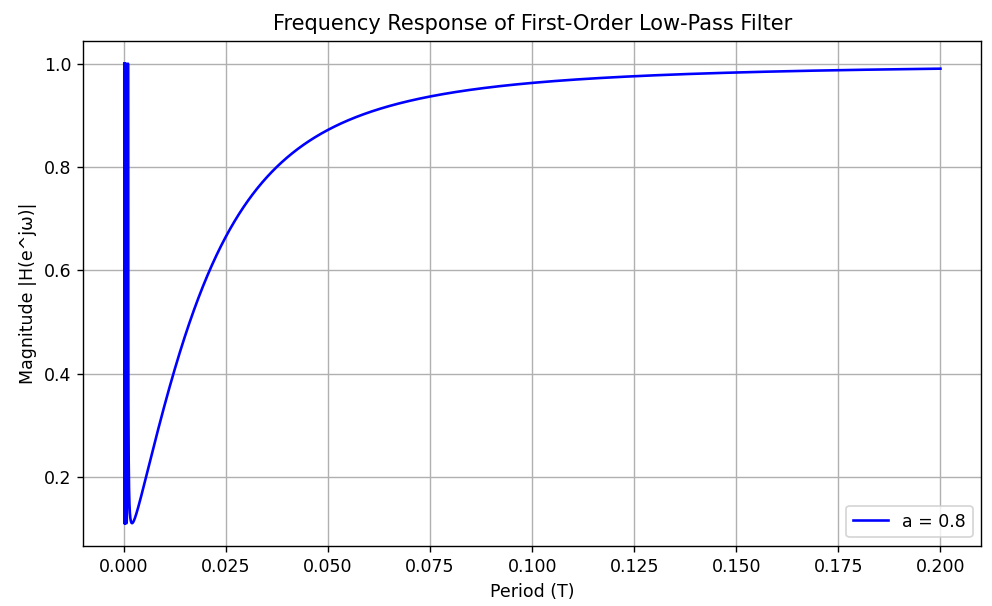

# 一阶滞后滤波

## 1 一阶滞后滤波的形式

一阶滞后滤波是一种常用、简单的滤波方式，对于输入序列$u(n)$，输出序列$y(n)$，滤波器公式如下：

$$y(n) = \alpha \cdot y(n-1) + (1-\alpha)\cdot u(n)$$

其中$\alpha$是滤波器系数。

## 2 频域角度分析

### 2.1 准备工作：从Z域到S域

对一个Z域的函数$H(z)$，**我们可以用$e^{sT_s}$代替$z$，从而将此函数从Z域转化到s域**。

这是因为：假设我们有个连续的函数$y(t)$，然后我们对它进行周期采样，得到

$$y^*(t) = \sum_{k=0}^{+\infty} y(t)\delta(t-kT_s) = \sum_{k=0}^{+\infty}y(kT_s)\delta(t-kT_s)$$

那么对$y^*(t)$的拉氏变换结果是

$$\begin{aligned}Y^*(s) &= \int_{0}^{+\infty}y^*(t)e^{-st}\mathrm{d}t\\
&= \int_{0}^{+\infty}\sum_{k=0}^{+\infty}y(kT_s)\delta(t-kT_s)e^{-st}\mathrm{d}t\\
&= \sum_{k=0}^{+\infty}y(kT_s)\int_0^{+\infty}\delta(t-kT_s)e^{-st}\mathrm{d}t\\
&= \sum_{k=0}^{+\infty}y(kT_s)\int_{kT_s^-}^{kT_s^+}e^{-st}\mathrm{d}t\\
&= \sum_{k=0}^{+\infty}y(kT_s)e^{-kT_ss}
\end{aligned}$$

而$Y(z)$可以定义为

$$Y(z) = Y^*(s)|_{z = e^{sT_s}} = \sum_{k=0}^{+\infty}y(kT_s)z^{-k}$$

### 2.2 开始分析

我们从频域角度对该滤波器进行分析。首先，对上式进行Z变换：

$$Y(z) = \alpha z^{-1}Y(z)+(1-\alpha)U(z)$$

从而可以求得传递函数:

$$H(z) = \frac{Y(z)}{U(z)} = \frac{1-\alpha}{1-\alpha z^{-1}}$$

首先，根据Z变换的知识，我们可以用$e^{js}$代替$z$，从而将此函数从Z域转化到s域。

所以，$H(s)$可以表示为

$$H(s) = \frac{1-\alpha}{1-\alpha e^{-sT_s}}$$

然后把$s$转化为$j\omega$，就能得到频率响应函数。

$$H(j\omega) = \frac{1-\alpha}{1-\alpha e^{-j\omega T_s}}$$

这里的$\omega$是把输入信号视为连续信号之后的角频率。
频率响应函数反映了该滤波器对于某一特定频率的周期函数的幅值放大和角度偏移。

$$\begin{aligned}
|H(j\omega)| &= \frac{1-\alpha}{|1-\alpha e^{-j\omega T_s}|} = \frac{1-\alpha}{\sqrt{1+\alpha^2-2\alpha\cos(\omega T_s)}}\\
&= \frac{1-\alpha}{\sqrt{(1-\alpha)^2+2\alpha[1-\cos(2\pi T_s/T)]}}
\end{aligned}$$

我们不难发现，当输入信号的周期$T$大于$2T_s$之后，随着周期的增大/频率的降低，幅值响应越来越接近于1。而$T$在$[0,2T_s]$区间内时，幅值响应是振荡的。

我们用python画个图来详细看一下。我们取$T_s = 0.001s, \alpha = 0.8$。

<figure markdown>
{width=100%}
<!-- <figcaption>一阶滞后滤波效果</figcaption> -->
</figure>
像一个很漂亮的低通滤波器，但是在更高频段会振荡，下图详细看看。

<figure markdown>
{width=100%}
<!-- <figcaption>一阶滞后滤波效果（高频部分）</figcaption> -->
</figure>
很明显可以发现，**一阶滞后滤波只在采样频率大于2倍输入信号频率的情况下发挥作用**。
