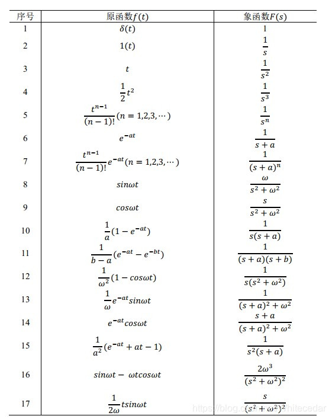
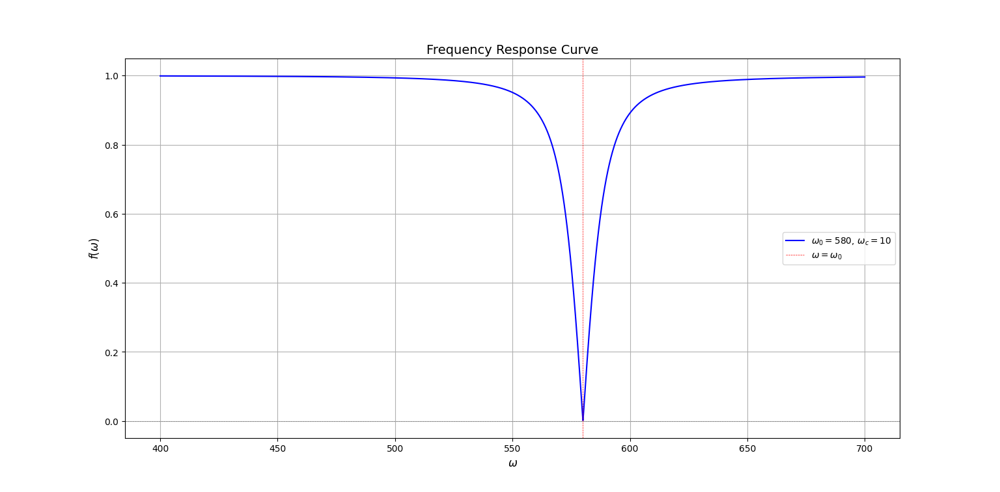
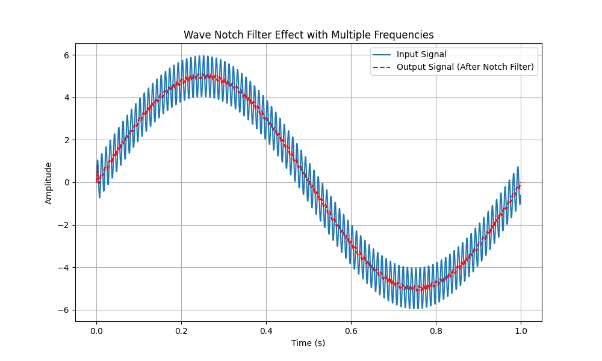
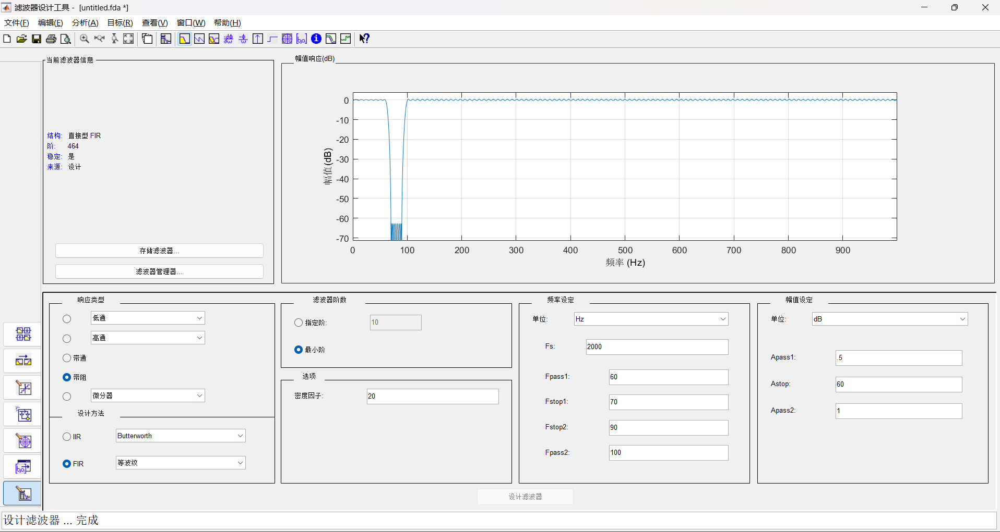

# 陷波器说明

## 1 前置知识

### 1.1 描述线性系统的基本方式（微分方程）

对于一个线性系统 $G$，输入 $r(t)$，输出  $y(t)$，我们通常用微分方程的形式来描述这一系统：

$$D^ny + a_{n-1}D^{n-1}y + a_{n-2}D^{n-2}y + ... + a_{1}Dy + a_0y = b_mD^{m}r + b_{m-1}D^{m-1}r + ... +  b_1Dr + b_0r$$

其中，$a_{i}, b_{j}$ 是常系数，$D^{k}y$ 代表 $\frac{\mathrm{d}^ky(t)}{\mathrm{d}t^k}$。

如果是现实世界中存在的系统，考虑到**因果性**，必然有 $n > m$。

这样一个系统，输入信号后，输出信号可以分成两个部分，一个是**暂态输出**，指的是 $t\to \infty$ 后会变成 0 的部分；另一个是**稳态输出**，指的是 $t\to \infty$ 后仍然存在的部分。

### 1.2 拉普拉斯变换

拉氏变换可以将连续的时域信号/函数转化为复频域的信号/函数。

对于一个时域上的函数 $f(t)$，定义 拉普拉斯变换（以下简称拉氏变换）：

$$F(s) = \mathcal{L}(f(t)) = \int_{0}^{+\infty}f(t)e^{-st}\mathrm{d}t$$

其中，$\mathcal{L}(f(t))$ 表示对 $f(t)$ 做拉氏变换。（注：拉氏变换要求 $f(t)$ 在 $(0,+\infty)$ 上有定义）

拉氏变换实际上是将时域上的函数转化到复频域，有一些特殊的性质，例如：

**时域位移相当于复频域乘以 $e^{-sT}$**。

$$\mathcal{L}(f(t-T)) = e^{-sT}F(s) + \int_{-T}^{0}f(p)e^{-sp}\mathrm{d}p$$

证明：

$$\begin{aligned}\int_{0}^{+\infty}f(t-T)e^{-st}\mathrm{d}t &\overset{p = t-T}{=} \int_{-T}^{+\infty}f(p)e^{-s(p+T)}\mathrm{d}p\\
&=e^{-sT}\int_{-T}^{+\infty}f(p)e^{-sp}\mathrm{d}p\\
&= e^{-sT}F(s) + \int_{-T}^{0}f(p)e^{-sp}\mathrm{d}p
\end{aligned}$$

只要 $f(t)$ 在 $t < 0$ 的部分均等于 0，那么上式就可以简化为

$$\mathcal{L}(f(t-T)) = e^{-sT} F(s)$$

**复频域上乘以 s 相当于时域求微分**。

$$\begin{aligned}
sF(s) - f(0) &= \mathcal{L}(\frac{\mathrm{d}f(t)}{\mathrm{d}t})\\
s^2F(s) - sf(0)-f'(0) &= \mathcal{L}(\frac{\mathrm{d}^2f(t)}{\mathrm{d}t^2})\\
\end{aligned}$$

证明：

$$\begin{aligned}
\mathcal{L}(\frac{\mathrm{d}f(t)}{\mathrm{d}t}) &= \int_0^{+\infty}\frac{\mathrm{d}f(t)}{\mathrm{d}t}e^{-st}\mathrm{d}t\\ &= \int_0^{+\infty}e^{-st}\mathrm{d}f(t)\\
&= e^{-st}f(t)|_{0}^{+\infty} - \int_0^{+\infty}f(t)\mathrm{d}e^{-st}\\
&= 0\cdot f(t)-1\cdot f(0) +s\int_0^{+\infty}f(t)e^{-st}\mathrm{d}t\\
&= -f(0) + sF(s)\\
\mathcal{L}(\frac{\mathrm{d}^2f(t)}{\mathrm{d}t^2}) &= \int_0^{+\infty}\frac{\mathrm{d}^2f(t)}{\mathrm{d}t^2}e^{-st}\mathrm{d}t\\ &= \int_0^{+\infty}e^{-st}\mathrm{d}(\frac{\mathrm{d}f(t)}{\mathrm{d}t})\\
&= e^{-st}\frac{\mathrm{d}f(t)}{\mathrm{d}t}|_{0}^{+\infty} - \int_0^{+\infty}\frac{\mathrm{d}f(t)}{\mathrm{d}t}\mathrm{d}e^{-st}\\
&= -f'(0) +s\int_0^{+\infty}\frac{\mathrm{d}f(t)}{\mathrm{d}t}e^{-st}\mathrm{d}t\\
&= -f'(0) + s(-f(0) + sF(s))\\
&= -f'(0) -sf(0) + s^2F(s)
\end{aligned}$$

其中，$F(s) = \mathcal{L}(f(t))$。在以上推导过程中，我们假定了 $f(0_+) = f(0_-)$。如果 $f(t)$ 的性质特别好，满足 $t = 0$ 时，$f(t)$ 的任意阶导数值均为 0，那么上式可以进一步简化为

$$\mathcal{L}(\frac{\mathrm{d}^n f(t)}{\mathrm{d}^t}) = s^{n}F(s)$$

拉氏变换可以用来分析微分方程，大大简化我们的分析难度。

比如，对于 1.1 节中的系统，我们输入 $r(t) = 1$，求输出 $y(t)$？直接解微分方程不太容易，但是用拉氏变换分析就会简单不少：

首先，我们在零初始条件下，将系统的微分方程等式两边做拉氏变换，得到

$$\begin{aligned}
s^nY(s) + a_{n-1}s^{n-1}Y(s) + ...+a_1sY(s)+a_0Y(s) &= b_ms^{m}R(s) + b_{m-1}s^{m-1}R(s)+...+b_1sR(s)+b_0R(s)\\
\frac{Y(s)}{R(s)} &= \frac{b_ms^m + b_{m-1}s^{m-1} + ... + b_0}{s^n + a_{n-1}s^{n-1} + ... + a_1s + a_0}
\end{aligned}$$

上面这个比值形式就是系统的**传递函数**。我们考虑一个简单一点的情况：

$$\frac{Y(s)}{R(s)} = \frac{1}{s + 1}$$

因此，我们有

$$Y(s) = R(s)\frac{1}{s+1} = \frac{1}{s}\frac{1}{s+1} = \frac{1}{s} - \frac{1}{s+1}$$

对上式做拉氏反变换，即可得到 $y(t) = 1 - e^{-t}$。（注：$\mathcal{L}(1) = \frac{1}{s}$ 很容易证明；拉氏反变换一般是直接查表）

{.img-center width=60%}

### 1.3 频率响应

#### 1.3.1 复变函数相关知识

复变函数中最重要的一个式子是欧拉公式 $e^{j\theta}=\cos\theta+j\sin\theta$，其中 $\cos\theta$ 是复数的实部，$j\sin\theta$ 是复数的虚部。根据欧拉公式，我们可以很简单地推导出，$j = e^{j\frac{\pi}{2}}$。

事实上，在复变函数的理论中，所有的复数 $\mathbf{A}$ 都可以由 $Ae^{j\theta}$ 的形式表示。$\mathbf{A}$ 可以理解为一个复平面上的矢量，从原点指向 $(A\cos\phi,A\sin\phi)$ 的位置。通常，我们用幅度 $A$ 和相位角 $\phi$ 来描述这个矢量。定义一个求幅度的运算：$|\mathbf{A}| = |Ae^{j\theta}| = A$。

任意一个复数乘以 $Ae^{j\theta}$，表示将该复数对应的复平面矢量的幅度乘以 $A$，角度转 $\theta$。相反地，除以 $Ae^{j\theta}$，就是幅度除以 $A$，角度反转 $\theta$。

根据上述知识，我们可以得到：

$$\left|\frac{Ae^{j\theta}}{Be^{j\phi}}\right| = \left|\frac{A}{B}e^{j(\theta-\phi)}\right| = \left|\frac{A}{B}\right| = \frac{|Ae^{j\theta}|}{|Be^{j\phi}|}$$

#### 1.3.2 频率响应函数

根据傅里叶变换的思想，现实世界中的信号可以由一组不同频率、幅度的周期信号线性组合而成。因此，研究周期输入信号对应的输出形式是有意义的。

我们设输入信号：

$$u(t) = Acos(\omega t + \phi) = A \cdot \mathbf{Re}(e^{j(\omega t +\phi)}) = \mathbf{Re}(\mathbf{A}e^{j\omega t})$$

其中 $\mathbf{Re}(\cdot)$ 表示取实部，$\mathbf{A} = Ae^{j\phi}$。

很容易可以知道，输入信号的导数是：

$$\begin{aligned}
\frac{\mathrm{d}u(t)}{\mathrm{d}t} &= \mathbf{Re}(\mathbf{A}(j\omega)e^{j\omega t})\\
&= \mathbf{Re}(A\omega e^{j(\phi+\frac{\pi}{2})}e^{j\omega t})\\
&= \mathbf{Re}(\mathbf{B}e^{j\omega t})
\end{aligned}$$

其中，$\mathbf{B} = \mathbf{A}\cdot(j\omega) = A\omega e^{j(\phi+\frac{\pi}{2})}$。我们可以发现，对输入信号不管怎么求导，$e^{j\omega t}$ 这个部分是不变的。

接下来，我们把输入信号输入到 1.1 节的系统里，得到

$$
D^ny + a_{n-1}D^{n-1}y + a_{n-2}D^{n-2}y + ... + a_{1}Dy + a_0y = \mathbf{Re}(\mathbf{A}b_m(j\omega)^me^{j\omega t}) + \mathbf{Re}(\mathbf{A}b_{m-1}(j\omega)^{m-1}e^{j\omega t}) + ... + \mathbf{Re}(\mathbf{A}b_1(j\omega)e^{j\omega t}) + \mathbf{Re}(\mathbf{A}b_0e^{j\omega t})
$$

用瞪眼法可以知道，这个输入对应的**稳态输出**一定具有如下形式

$$y(t) = \mathbf{Re}(\mathbf{C}e^{j\omega t})$$

也就是说，**输入一个周期信号，稳态输出也一定是一个同频率的周期信号，只有幅度和相位发生改变**。

将这个输出信号同样代入 1.1 的系统，我们得到

$$\begin{aligned}
\mathbf{Re}(\mathbf{C}(j\omega)^ne^{j\omega t}) + \mathbf{Re}(\mathbf{C}a_{n-1}(j\omega)^{n-1}e^{j\omega t}) + ... + \mathbf{Re}(\mathbf{C}a_1(j\omega)e^{j\omega t}) + \mathbf{Re}(\mathbf{C}a_0e^{j\omega t}) =& \mathbf{Re}(\mathbf{A}b_m(j\omega)^me^{j\omega t}) + \mathbf{Re}(\mathbf{A}b_{m-1}(j\omega)^{m-1}e^{j\omega t}) + ... \\&+ \mathbf{Re}(\mathbf{A}b_1(j\omega)e^{j\omega t}) + \mathbf{Re}(\mathbf{A}b_0e^{j\omega t})\\
\mathbf{C}e^{j\omega t}[(j\omega)^n + a_{n-1}(j\omega)^{n-1} + ... + a_1(j\omega) + a_0] =& \mathbf{A}e^{j\omega t}[b_m(j\omega)^m + b_{m-1}(j\omega)^{m-1}+...+b_1(j\omega)+b_0]\\
\frac{\mathbf{C}e^{j\omega t}}{\mathbf{A}e^{j\omega t}} =& \frac{b_m(j\omega)^m + b_{m-1}(j\omega)^{m-1}+...+b_1(j\omega)+b_0}{(j\omega)^n + a_{n-1}(j\omega)^{n-1} + ... + a_1(j\omega) + a_0}
\end{aligned}$$

这就是**频率响应函数**，描述了系统对于某一特定频率的周期性输入信号的响应。

不难发现，频率响应函数的形式和 $s$ 域传递函数的形式基本一致，只需要把 $s$ 用 $j\omega$ 代替即可。这个论断是正确的，严格证明略。

#### 1.3.3 频率响应函数能干嘛呢？

我们把频率响应函数取个幅值，就可以得到

$$g(\omega) = \frac{|\mathbf{C}e^{j\omega t}|}{|\mathbf{A}e^{j\omega t}|} = \frac{|b_m(j\omega)^m + b_{m-1}(j\omega)^{m-1}+...+b_1(j\omega)+b_0|}{|(j\omega)^n + a_{n-1}(j\omega)^{n-1} + ... + a_1(j\omega) + a_0|}$$

这就是**幅频响应曲线**，根据这个曲线，我们可以知道该系统对于输入信号中不同频率的成分，响应是什么样的，是抑制还是增强。

举个例子：

{.img-center width=100%}

观察上图幅频响应曲线，横轴为角频率，纵轴为幅度，幅度值在绝大部分都为 1，也就是说该系统对绝大部分频率的输入信号，幅度都不做变化；但是在角频率 580 rad/s 附近，幅度值快速降低到 0，说明该系统对 580 rad/s 频率附近的输入信号有极强的抑制作用。

事实上，这个系统就是一个我们理想的**陷波器**。

### 1.4 离散系统

以上内容均在讨论连续系统，但在实际的计算机控制过程中，我们面对的都是离散数据、离散系统。因此，我们要讨论离散系统的特性、如何将连续系统转化为离散系统等问题。

#### 1.4.1 冲激采样函数

最基础的连续信号转化为离散信号的方法是**采样**，即按照某一固定频率采集连续信号的值，作为离散信号。

$\delta(t)$ 是一种广义函数，可以定义为

$$\delta(t) = \begin{cases}\infty & t=0\\
0 & t \neq 0\end{cases}$$

并且满足

$$\int_{-\infty}^{+\infty}\delta(t)\mathrm{d}t = 1$$

该函数具有采样特性，即

$$\int_{-\infty}^{+\infty}f(t)\delta(t-t_0)\mathrm{d}t = f(t_0)$$

利用冲激函数的采样特性，我们可以在连续时域中表示出采样结果：

$$f(t)\sum_{n = -\infty}^{+\infty}\delta(t-nT_s) = \sum_{n=-\infty}^{+\infty}f(nT_s)\delta(t-nT_s)$$

其中 $T_s$ 代表采样时间。以上采样结果产生一个离散化的序列，就是 $\sum_{n = -\infty}^{+\infty}f[n] = \sum_{n = -\infty}^{+\infty}f(nT_s)$。

我们算一下冲激函数的拉氏变换结果：

$$\begin{aligned}
\mathcal{L}(\delta(t)) &= \int_{0}^{+\infty}\delta(t)e^{-st}\mathrm{d}t = e^0 = 1
\end{aligned}$$

#### 1.4.2 Z 变换

拉氏变换将连续的时域信号转化到复频域信号；而 Z 变换可以将离散的时域信号转化到复频域。

对于一个离散的时域信号 $x(n)$，我们定义一个复变量 $z = re^{j\Omega}$，并定义 Z 变换

$$X(z) = \sum_{n = -\infty}^{+\infty}x[n]z^{-n}$$

Z 变换与拉氏变换有密切的关系，一言以蔽之，**对某一连续信号，进行采样周期为 $T_s$ 的冲激采样后产生的序列做 Z 变换，相当于对连续信号冲激采样的结果进行拉式变换后做 $z = e^{sT_s}$ 映射**，证明如下：

首先，我们取原连续信号为 $f(t)$，其冲激采样产生的序列为 $\sum_{n = -\infty}^{+\infty}f[n] = \sum_{n=-\infty}^{+\infty}f(nT_s)$，对其做 Z 变换：

$$F(z) = \sum_{n = -\infty}^{+\infty}f[n]z^{-n} = \sum_{n = -\infty}^{+\infty}f(nT_s)z^{-n}$$

接下来，我们对冲激采样的结果做拉氏变换：

$$\begin{aligned}
F(s) &= \mathcal{L}\left(\sum_{n=-\infty}^{+\infty}f(nT_s)\delta(t-nT_s)\right) = \sum_{n=-\infty}^{+\infty}f(nT_s)\mathcal{L}(\delta(t-nT_s))\\
&= \sum_{n=-\infty}^{+\infty}f(nT_s)e^{-nsT_s}
\end{aligned}$$

不难发现，只要对 $F(z)$ 做 $z = e^{sT_s}$ 映射，就能得到 $F(s)$。该过程是可逆的，也就是说，对 $F(s)$ 做 $s = \ln z / T_s$ 映射，就能得到 $F(z)$。

但是，$s$ 域中的 $e^{sT_s}$ 和 $z$ 域中的 $\ln z$ 都是非常难处理的，并且，$z = e^{sT_s}$ 映射有 **频谱混叠** 的风险，因为不同 $s$ 可能映射到同一个 $z$. 举个例子，$s = a+j\frac{2k\pi}{T_s},k = 0, 1,2...$，它们都映射到 $e^{aT_s}$

#### 1.4.3 双线性变换

为了简化变换后的形式，并且规避频谱混叠的风险，前人提出了 **双线性变换** 的方法，原理其实就是泰勒展开做一阶近似：

$$z = e^{sT_s} = \frac{e^{sT_s/2}}{e^{-sT_s/2}} \approx \frac{1+sT_s/2}{1-sT_s/2}$$

根据上式，可以推出 $z\to s$ 的双线性变换公式：

$$s = \frac{2}{T_s}\frac{1-z^{-1}}{1+z^{-1}}$$

双线性变换会带来一个新的问题，就是频率的畸变。

不考虑频率畸变（模拟频率与数字频率都为 $\omega$ ），根据 $s = j\omega$ 和 $z = e^{sT_s}$ ，可知 $z$ 与频率 $\omega$ 的关系 $z = e^{j\omega T_s}$ 。

现考虑畸变，假定模拟频率用 $\omega$ 表示，数字频率用 $\Omega$ 表示。则模拟频率与 $s$ 相关， $s = j\omega$ ；数字频率与 $z$ 相关， $z = e^{j\Omega T_s}$ . 由此推导双线性变换后的频率畸变公式：

$$\begin{aligned}
e^{j\Omega T_s} &= \frac{1+j\omega T_s/2}{1-j\omega T_s/2} = \frac{1-\omega^2T_s^2/4 + j\omega T_s}{1+\omega^2T_s^2/4}\\
&= \cos{\Omega T_s} + j\sin{\Omega T_s}\\
\cos{\Omega T_s} &= \frac{1-\omega^2T_s^2/4}{1+\omega^2T_s^2/4} \ \ \ \ \sin{\Omega T_s} = \frac{\omega T_s}{1+\omega^2T_s^2/4}\\
\Omega &=\frac{1}{T_s}\arctan\left(\frac{\omega T_s}{1-\omega^2T_s^2/4}\right) \\
\text{方法二：}
j\omega &= \frac{2}{T_s}\frac{1-e^{-j\Omega T_s}}{1+e^{-j\Omega T_s}}\\
&= \frac{2}{T_s}\frac{e^{j\Omega T_s/2} - e^{-j\Omega T_s/2}}{e^{j\Omega T_s/2} + e^{-j\Omega T_s/2}}\\
&= \frac{2}{T_s}\frac{j2\sin(\Omega T_s/2)}{2\cos(\Omega T_s/2)}\\
&= j\frac{2}{T_s}\tan\left(\frac{\Omega T_s}{2}\right)\\
\Omega &= \frac{2}{T_s}\arctan\left(\frac{\omega T_s}{2}\right)
\end{aligned}$$

可以证明两种结果是等价的。

## 2 陷波器

> 从最开始的微分方程，到 $s$ 域、$z$ 域的变换，你已经历许多。现在，让我们开始本文的正题——“陷波器”。

陷波器，又称为带阻滤波器，用于抑制输入信号中特定频率成分，同时最好对其它频率成分影响尽可能小。

感谢互联网，我们发现一种可行的陷波器形式是：

$$G(s) = \frac{s^2+\omega_0^2}{s^2 + 2\omega_cs + \omega_0^2}$$

其中 $\omega_0$ 是陷波器的中心频率，$\omega_c$ 是陷波部分的带宽。

我们可以推导一下该陷波器的幅频特性：

$$\begin{aligned}
G(j\omega) &= \frac{(j\omega)^2 + \omega_0^2}{(j\omega)^2+2\omega_cj\omega+\omega_0^2}\\
\frac{|Y(\omega)|}{|U(\omega)|} &= \frac{|(j\omega)^2 + \omega_0^2|}{|(j\omega)^2+2\omega_cj\omega+\omega_0^2|}\\
&= \frac{|\omega_0^2-\omega^2|}{\sqrt{(\omega_0^2-\omega^2)^2+4\omega_c^2\omega^2}}
\end{aligned}$$

用 Python 画个图展示一下：

```python
import numpy as np
import matplotlib.pyplot as plt

def f(omega, omega0, omega_c):
    numerator = np.abs(omega0**2 - omega**2)
    denominator = np.sqrt((omega0**2 - omega**2)**2 + 4 * omega_c**2 * omega**2)
    return numerator / denominator

omega0 = 580  # 中心频率设为580
omega_c = 10  # 频率带宽设为10

omega = np.linspace(400, 700, 10000)  # 生成400到700的频率范围
y = f(omega, omega0, omega_c)

plt.figure(figsize=(10, 6))
plt.plot(omega, y, color='b', label=f'$ω_0={omega0}$, $ω_c={omega_c}$')
plt.axhline(0, color='gray', linestyle='--', linewidth=0.5)
plt.axvline(omega0, color='r', linestyle='--', linewidth=0.5, label='$ω=ω_0$')
plt.xlabel('$ω$', fontsize=12)
plt.ylabel('$f(ω)$', fontsize=12)
plt.title('Frequency Response Curve', fontsize=14)
plt.legend()
plt.grid(True)
plt.show()
```

{.img-center width=100%}

## 3 陷波器离散计算公式

### 3.1 Z 变换离散化计算方法

对 $G(s)$ 做双线性变换，得到

$$\begin{aligned}
G(z) &= \frac{4(1+z^{-2}-2z^{-1})+\omega_0^2T_s^2(1+z^{-2}+2z^{-1})}{4(1+z^{-2}-2z^{-1})+4\omega_cT_s(1-z^{-2})+\omega_0^2T_s^2(1+z^{-2}+2z^{-1})}\\
&= \frac{(4+\omega_0^2T_s^2)z^{-2} + (2\omega_0^2T_s^2-8)z^{-1} + 4 + \omega_0^2T_s^2}{(4-4\omega_cT_s+\omega_0^2T_s^2)z^{-2}+(2\omega_0^2T_s^2-8)z^{-1}+4+4\omega_cT_s+\omega_0^2T_s^2}\\
&= \frac{Y(z)}{U(z)}
\end{aligned}$$

!!! info

    只要把分母最高项系数化为 1，上式就是一个 IIR 滤波器的形式。

    !!! quote "IIR滤波器"

        $$H(z) = \frac{\sum_{j=0}^{m}b_jz^{-j}}{1 + \sum_{i=0}^{n}a_iz^{-i}}$$

    IIR 滤波器有发散的风险，需要保证极点（分母多项式 = 0时的 z）都在复平面的单位圆内部。更多内容参见 [IIR 与 FIR 滤波器](./IIR%20与%20FIR%20滤波器.md)。

对角相乘，再对等式两边做 Z 逆变换，即可得到：

$$\begin{aligned}
&(4-4\omega_cT_s+\omega_0^2T_s^2)y(n-2) + (2\omega_0^2T_s^2-8)y(n-1)+(4+4\omega_cT_s+\omega_0^2T_s^2)y(n)\\
= &(4+\omega_0^2T_s^2)u(n-2)+(2\omega_0^2T_s^2-8)u(n-1)+(4+\omega_0^2T_s^2)u(n)\\
y(n) =&\frac{1}{4+4\omega_cT_s+\omega_0^2T_s^2}[(4+\omega_0^2T_s^2)u(n-2)+(2\omega_0^2T_s^2-8)u(n-1)+(4+\omega_0^2T_s^2)u(n)+(8-2\omega_0^2T_s^2)y(n-1)-(4-4\omega_cT_s+\omega_0^2T_s^2)y(n-2)]
\end{aligned}$$

我们要注意，最后递推式中的 $\omega_c$ 和 $\omega_0$ 都是数字频率，与期望陷波器中的模拟频率不同。设计陷波器时，先设计模拟频率，然后利用双线性变换的频率畸变公式，推导出数字频率，代入上式得到数字陷波器。

写个Python代码观察一下滤波效果：

```Python
# 陷波器效果：
import numpy as np
import matplotlib.pyplot as plt

# 陷波器参数
Omega0 = 100  # 中心频率 Hz
Omega_c = 50  # 频带宽度 Hz
Ts = 0.001  # 采样周期 s

omega0 = 2/Ts * np.arctan(Omega0*2*np.pi*Ts/2)
omega_c = 2/Ts * np.arctan(Omega_c*2*np.pi*Ts/2)

duration = 1  # 信号持续时间
time = np.arange(0, duration, Ts)

# 创建复合输入信号 - 包含多个频率和幅度
frequencies = [1, 100, 500]  # 不同频率
amplitudes = [5, 1, 0.5]  # 对应的幅度
input_signal = np.zeros_like(time)

for i in range(len(frequencies)):
    input_signal += amplitudes[i] * np.sin(2 * np.pi * frequencies[i] * time)

# 初始化输出信号
output_signal = np.zeros_like(input_signal)

# 差分方程的前两项初始化
u_prev1 = 0
u_prev2 = 0
y_prev1 = 0
y_prev2 = 0
  
# 计算输出信号
for k in range(2, len(time)):
    output_signal[k] = ((4+omega0**2 * Ts**2)*u_prev2 + (2*omega0**2 * Ts**2 - 8)*u_prev1 \
                        + (4 + omega0**2 * Ts**2)*input_signal[k] + (8-2*omega0**2 * Ts**2)*y_prev1 \
                          - (4-4*omega_c*Ts + omega0**2 * Ts**2)*y_prev2) \
                          / (4 + 4 * omega_c * Ts + omega0**2 * Ts**2)
    # 更新历史值
    u_prev2 = u_prev1
    u_prev1 = input_signal[k]
    y_prev2 = y_prev1
    y_prev1 = output_signal[k]

# 绘制结果
plt.figure(figsize=(10, 6))
plt.plot(time, input_signal, label="Input Signal")
plt.plot(time, output_signal, label="Output Signal (After Notch Filter)", linestyle='--',color='r')
plt.title("Wave Notch Filter Effect with Multiple Frequencies")
plt.xlabel("Time (s)")
plt.ylabel("Amplitude")
plt.legend()
plt.grid(True)
plt.show()
```

{.img-center width=100%}


输入信号是一个 1Hz 幅度 5，100Hz 幅度 1，500Hz 幅度 0.5 的组合信号，陷波器滤掉 100Hz 的成分，效果不错。

需要注意的是，我们用复频域的传递函数分析幅频响应时，该陷波器能将中心频率 $\omega_0$ 的信号完全滤除；但是实验结果不然，需要将 $\omega_c$ 设得相对较大才能得到一个不错的滤波效果，这是因为双线性变换是一个近似变换。

### 3.2 一种错误的计算方法：

首先，将陷波器转化为时域形式，即：

$$\begin{aligned}
\frac{Y(s)}{U(s)}&= \frac{s^2+\omega_0^2}{s^2+2\omega_cs+\omega_0^2}\\
s^2Y+2\omega_csY+\omega_0^2Y &= s^2U + \omega_0^2U\\
\mathcal{L}^{-1}(s^2Y+2\omega_csY+\omega_0^2Y) &= \mathcal{L}^{-1}(s^2U + \omega_0^2U)\\
\frac{\mathrm{d}^2y(t)}{\mathrm{d}t} + 2\omega_c\frac{\mathrm{d}y(t)}{\mathrm{d}t} + \omega_0^2y(t) &= \frac{\mathrm{d}^2u(t)}{\mathrm{d}t} + \omega_0^2u(t)
\end{aligned}$$

然后我们用后向差分将其离散化，后向差分的式子是：

$$f'(t) \approx \frac{f(t)-f(t-T_s)}{T_s},f''(t)\approx \frac{f'(t)-f'(t-T_s)}{T_s} \approx \frac{f(t)-2f(t-T_s)+f(t-2T_s)}{T_s^2}$$

因此有：

$$\begin{aligned}
\frac{y_k - 2y_{k-1} + y_{k-2}}{T_s^2} + 2\omega_c\frac{y_{k} - y_{k-1}}{T_s} + \omega_0^2y_{k} &= \frac{u_{k}-2u_{k-1}+u_{k-2}}{T_s^2} + \omega_0^2u_{k}\\
y_k(1+2\omega_cT_s+\omega_0^2T_s^2)-2y_{k-1}(1+\omega_cT_s) + y_{k-2} &= u_k(1+\omega_0^2T_s^2)-2u_{k-1}+u_{k-2}\\
y_k &= \frac{u_k(1+\omega_0^2T_s^2)-2u_{k-1}+u_{k-2} + 2y_{k-1}(1+\omega_cT_s) - y_{k-2}}{1+2\omega_cT_s+\omega_0^2T_s^2}
\end{aligned}$$

根据上述公式，我们就可以写代码实现一个陷波器了。

这种计算方法的错误之处在于，将陷波器转化为时域形式时，忽略了 $sF(s) - f(0) = \mathcal{L}(\frac{\mathrm{d}f(t)}{\mathrm{d}t}),s^2F(s) - sf(0)-f'(0) = \mathcal{L}(\frac{\mathrm{d}^2f(t)}{\mathrm{d}t^2})$ 中的 $f(0)$、$f'(0)$ 项。

## 4 后记

### 4.1 陷波器的另一面——带通

陷波器的幅频响应函数，取个反往上平移一下就是一个带通滤波器。

### 4.2 MATLAB 滤波器设计工具

{.img-center width=100%}

MATLAB提供了非常强大的滤波器设计工具，可以支持设计多种不同滤波器的设计，并且可以通过导出 C 头文件的方式导出参数，可以配合组件库中的IIR、FIR数字滤波器使用。

滤波器设计需要懂得取舍，滤波器性能强大的代价是需要更多的计算资源。
