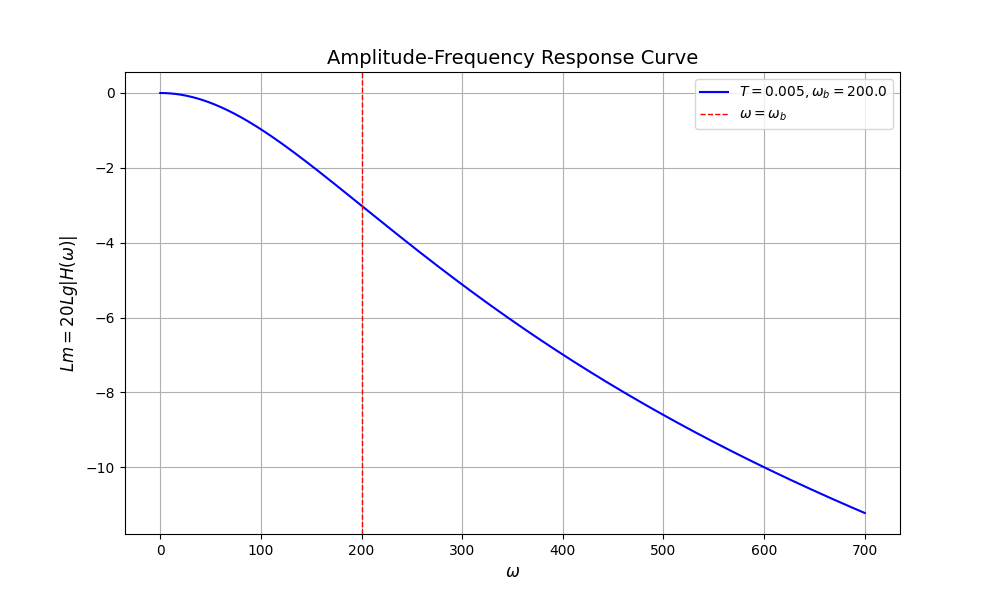
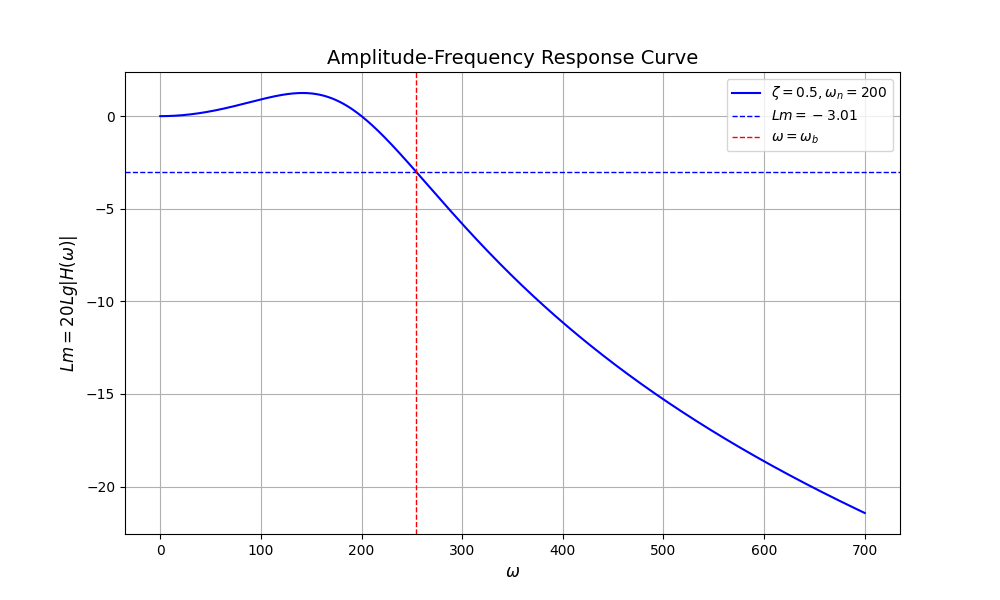

# 带宽

带宽 (Bandwidth) 是控制系统中的一个常见概念，用以描述一个系统有效响应输入信号的频率上限/范围。

在控制系统设计时，一般预先给定带宽频率指标。控制系统应有效响应频率小于带宽频率的输入信号，同时有效衰减高于带宽频率的噪声信号。

## 定义

### 闭环系统 -3 dB 截止频率

针对闭环系统 $H(s)$ ，带宽频率定义为闭环幅频特性 $|H(j\omega)|$ 降低到直流低频值 $|H(0)|$ 的 $\dfrac{1}{\sqrt{2}}$ （ $20\lg\dfrac{1}{\sqrt{2}}\approx-3.01$ dB ）时的频率 $\omega_b = 2\pi f_b$ . 称 $(0, \omega_b)$ 为闭环系统的带宽。

> 很多时候，直接将带宽频率 $\omega_b$ 称为带宽（Bandwidth）。

## 例子

### 一阶惯性环节

$$H(s) = \frac{1}{Ts+1}$$

其带宽 $\omega_b$ 满足如下方程

$$\begin{aligned}|H(j\omega_b)|&=\frac{|H(0)|}{\sqrt{2}}\\
\frac{1}{\sqrt{1+(T\omega_b)^2}} &= \frac{1}{\sqrt{2}}
\end{aligned}$$

可以解得，一阶惯性环节的带宽 $\omega_b = \dfrac{1}{T}$ .

{.img-center width=70%}

### 二阶系统

$$H(s) = \frac{\omega_n^2}{s^2+2\zeta\omega_ns+\omega_n^2}$$

求其带宽：

$$\begin{aligned}
\frac{\omega_n^2}{\sqrt{\left(\omega_n^2-\omega_b^2\right)^2+4\zeta^2\omega_n^2\omega_b^2}} &= \frac{1}{\sqrt{2}}\\
\end{aligned}$$

解析解不太好求，用计算机解了一个，幅频特性的 Bode 图如下所示。

{.img-center width=70%}

```python
import numpy as np
import matplotlib.pyplot as plt

# 定义幅频特性
def f(omega, zeta, omega_n):
    numerator = omega_n ** 2
    denominator = np.sqrt((omega_n ** 2 - omega ** 2) ** 2 + (2 * zeta * omega_n * omega) ** 2)
    return 20 * np.log10(numerator / denominator)

# 定义系统参数
zeta = 0.5
omega_n = 200

# 绘制角频率 0 - 700 范围内的幅频特性，共 10000 个点
omega = np.linspace(0, 700, 10000)
y = f(omega, zeta, omega_n)

# 找到带宽频率
target_y = 20 * np.log10(1/np.sqrt(2))
idx = np.argmin(np.abs(y - target_y))
omega_b = omega[idx]

# 画图
plt.figure(figsize=(10, 6))
plt.plot(omega, y, color='b', label=f'$ζ = {zeta}, ω_n = {omega_n}$')
plt.axhline(20 * np.log10(1/np.sqrt(2)), color='b', linestyle='--', linewidth=1, label='$Lm = -3.01$')
plt.axvline(omega_b, color='r', linestyle='--', linewidth=1, label='$ω=ω_b$')
plt.xlabel('$ω$', fontsize=12)
plt.ylabel('$Lm = 20Lg|H(ω)|$', fontsize=12)
plt.title('Amplitude-Frequency Response Curve', fontsize=14)
plt.legend()
plt.grid(True)
plt.show()
```

## 扩展——开环系统截止频率

带宽 $\omega_b$ 又称为闭环系统的截止频率，那么开环系统的截止频率 $\omega_c$ 如何定义呢？

考虑一个负反馈闭环系统，前向通道传递函数为 $G(s)$ ，反馈通道传递函数为 $H(s)$ ，其开环传递函数为 $G(s)H(s)$ ，由此定义开环系统的截止频率 $\omega_c$ 满足如下式子：

$$|G(j\omega_c)H(j\omega_c)| = 1$$
