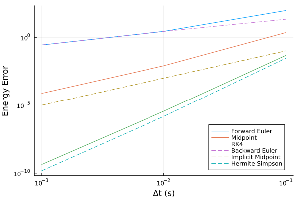

# 离散积分法

本文内容与 [微分方程的离散化](./微分方程的离散化.md) 有重合之处，需结合阅读。

## 概述

我们考虑如下连续系统：

$$\dot{\mathbf{x}} = f(\mathbf{x})$$

> 一般来说，描述一个系统的状态方程还会包括一个输入变量 $\mathbf{u}$ ，但在一个控制周期内，输入变量 $\mathbf{u}$ 不发生变化，可视为常量，因此我们不加以考虑。

我们要解决的问题是，已知连续信号采样保持的周期 $\Delta t$ 和当前状态量采样结果 $\mathbf{x}_k$ ，如何求解下一时刻的状态量 $\mathbf{x}_{k+1}$ ? 这个问题在数值求解、模拟仿真中经常遇到。

解决该问题有两大流派：显式积分法和隐式积分法。显式积分法的计算方式为：

$$\mathbf{x}_{k+1} = f_{\mathrm{explicit}}(\mathbf{x}_{k},\Delta t)$$

隐式积分法的计算方式为：

$$f_{\mathrm{implicit}}(\mathbf{x}_{k+1},\mathbf{x}_k,\Delta t) = 0$$

两者最关键的区别是， $\mathbf{x}_{k+1}$ 是否在函数 $f$ 里面。如果“否”，我们就不用解方程，可以直接显式地计算出 $\mathbf{x}_{k+1}$ ；如果“是”，那我们还得解个方程。

总体而言，隐式积分法虽然计算复杂度高，但精度也略高于显式积分法。下图是某个系统的实验结果，其中前向欧拉法和后向欧拉法精度存在差异，主要是系统特性导致的。从方法本身看，其精度应该是一致的。

{.img-center width=50%}

## 显式积分法

### 前向欧拉法

$$\mathbf{x}_{k+1} = \mathbf{x}_k + \Delta t \cdot f(\mathbf{x}_k)$$

把 $\mathbf{x}_{k+1}$ 在 $\mathbf{x}_k$ 处一阶泰勒展开，用 $\mathbf{x}_k$ 处的切线替代原函数。

### 中点法

$$\begin{aligned}
\mathbf{x}_{\mathrm{mid}} &= \mathbf{x}_k + \frac{\Delta t}{2} \cdot f(\mathbf{x}_k)\\
\mathbf{x}_{k+1} &= \mathbf{x}_k + \Delta t \cdot f(\mathbf{x}_{\mathrm{mid}})
\end{aligned}$$

### RK4

RK4，全称 4 阶 Runge-Kutta 法（龙格库塔法）。

$$\begin{aligned}
k_1 &= \Delta t \cdot f(\mathbf{x}_k)\\
k_2 &= \Delta t \cdot f(\mathbf{x}_k + k_1/2)\\
k_3 &= \Delta t \cdot f(\mathbf{x}_k + k_2/2)\\
k_4 &= \Delta t \cdot f(\mathbf{x}_k + k_3)\\
\mathbf{x}_{k+1} &= \mathbf{x}_k + \frac{1}{6}(k_1+2k_2+2k_3+k_4)
\end{aligned}$$

## 隐式积分法

隐式积分法的思路是先写出 $f_{\mathrm{implicit}}$ ，然后求这个函数以 $\mathbf{x}_{k+1}$ 为自变量时的零点。

很多时候我们无法形式化地求解方程，最常用的还是各类数值解法，比如牛顿法。

顺嘴提一句，很多库都能求解牛顿法所需的 Jacobian 矩阵，它们用的也是数值法，用前向差分或者中心差分，来近似计算偏导数。

### 后向欧拉法

$$\mathbf{x}_k+\Delta t \cdot f(\mathbf{x}_{k+1})-\mathbf{x}_{k+1} = 0$$

把 $\mathbf{x}_k$ 在 $\mathbf{x}_{k+1}$ 处一阶泰勒展开，用 $\mathbf{x}_{k+1}$ 处的切线代替原函数。

### 隐式中点法

$$\begin{aligned}
\mathbf{x}_{k+\frac{1}{2}}=\frac{1}{2}(\mathbf{x}_k+\mathbf{x}_{k+1})\\
\mathbf{x}_k+\Delta t\cdot f\left(\mathbf{x}_{k+\frac{1}{2}}\right)-\mathbf{x}_{k+1} = 0
\end{aligned}$$

### Hermite-Simpson 法

$$\begin{aligned}
\mathbf{x}_{k+\frac{1}{2}}=\frac{1}{2}(\mathbf{x}_k+\mathbf{x}_{k+1})+\frac{\Delta t}{8}[f(\mathbf{x}_k)-f(\mathbf{x}_{k+1})]\\
\mathbf{x}_k+\frac{\Delta t}{6}\left[f(\mathbf{x}_k)+4f\left(\mathbf{x}_{k+\frac{1}{2}}\right)+f(\mathbf{x}_{k+1})\right]-\mathbf{x}_{k+1}=0
\end{aligned}$$

