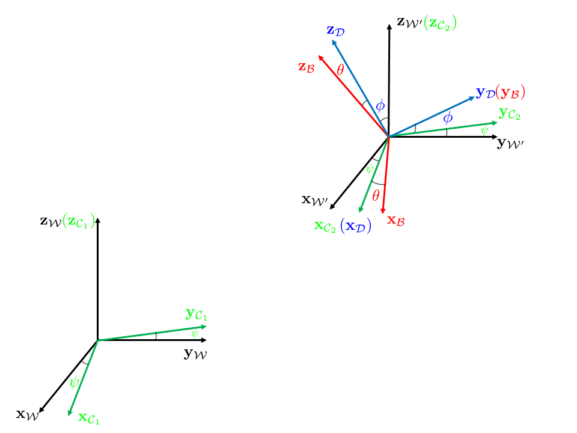

# 四旋翼微分平坦与最小 snap 轨迹

## 0 论文与前言

本次阅读的论文为：[D. Mellinger and V. Kumar, "Minimum snap trajectory generation and control for quadrotors," 2011 IEEE International Conference on Robotics and Automation, Shanghai, China, 2011, pp. 2520-2525.](./四旋翼微分平坦与最小%20snap%20轨迹.assets/论文.pdf)

这篇论文是四旋翼无人机微分平坦以及 Minimun Snap 轨迹生成的开山之作。但是论文之中也有些错误或者不详尽之处，本文会按照自己的思路加以补充。

---

## 1 微分平坦

一个系统是微分平坦的，指可以选取一组系统输出量，使用该输出量及其有限阶导数，可以完整表示系统所有状态变量和输入变量。

## 2 四旋翼模型

规定三个坐标系，一个世界坐标系 $\{\mathcal{W}\}$，一个机体坐标系 $\{\mathcal{B}\}$，四个中间过渡用的坐标系： $\{\mathcal{W}'\}$，$\{\mathcal{C}_1\}$ 和 $\{\mathcal{C}_2\}$ 以及 $\{\mathcal{D}\}$.

用 $^WR_B$ 表示从 $\{\mathcal{B}\}$ 坐标系到 $\{\mathcal{W}\}$ 坐标系的旋转矩阵。如果一个变量没有在左上角指明坐标系，那就默认是在 $\{\mathcal{W}\}$ 坐标系下。

我们用 Z-X-Y 欧拉角表示四旋翼机体姿态，绕 Z-X-Y 旋转的角度分别定义为 $\psi, \phi, \theta$，规定它们的取值范围是 $[-\pi, \pi)$ 。

坐标系 $\{\mathcal{W}'\}$ 是坐标系 $\{\mathcal{W}\}$ 平移到机体坐标系 $\{B\}$ 使得两原点重合的结果。
坐标系 $\{\mathcal{C_1}\}$ 是 $\{\mathcal{W}\}$ 绕 yaw 轴（$\mathbf{z}_\mathcal{W}$）旋转了 $\psi$ 角度。坐标系 $\{\mathcal{C}_2\}$ 是坐标系 $\{\mathcal{C}_1\}$ 平移到机体坐标系 $\{\mathcal{B}\}$ 使得两原点重合的结果。坐标系 $\{\mathcal{D}\}$ 是坐标系 $\{\mathcal{C}_2\}$ 绕 roll 轴（$\mathbf{x}_{\mathcal{C}_2}$）旋转了 $\phi$ 角度，坐标系 $\{\mathcal{B}\}$ 是坐标系 $\{\mathcal{D}\}$ 绕 pitch 轴（$\mathbf{y}_{\mathcal{D}}$）旋转了 $\theta$ 角度。

<figure markdown>
{width=100%}
<!-- <figcaption>RCL Layers</figcaption> -->
</figure>

$$\begin{aligned}\mathcal{W} & \overset{Translation}\Longleftrightarrow \mathcal{W}'\\
\mathcal{C}_1 &\overset{Translation}\Longleftrightarrow \mathcal{C}_2\\
\mathcal{W}' \overset{Rotate \ \psi}\Longrightarrow \mathcal{C}_2 & \overset{Rotate \ \phi}\Longrightarrow \mathcal{D} \overset{Rotate \ \theta}\Longrightarrow \mathcal{B}
\end{aligned}
$$

> 【注意】论文原文仅给出了 $\{\mathcal{W}\}$，$\{\mathcal{C}\}$ 和 $\{\mathcal{B}\}$ 三个坐标系，但为了下文讨论的精确性和严谨性，我们需要定义上述所有坐标系。

由于仅发生平移，所以从坐标系 $\{\mathcal{C}_1\}$ 或坐标系 $\{\mathcal{C}_2\}$ 到 $\{\mathcal{W}\}$ 的旋转矩阵均为 $^WR_C$，从坐标系 $\{\mathcal{B}\}$ 到坐标系 $\{\mathcal{C}_1\}$ 或 $\{\mathcal{C}_2\}$ 的旋转矩阵均为 $^CR_B$ ，从坐标系 $\{\mathcal{B}\}$ 到坐标系 $\{\mathcal{W}'\}$ 或 $\{\mathcal{W}\}$ 的旋转矩阵为 $^WR_B$ 。

在 $\{\mathcal{W}\}$ 坐标系下， $\{\mathcal{C}_1\}$ 坐标系的角速度向量与在 $\{\mathcal{W}'\}$ 坐标系下，$\{\mathcal{C}_2\}$ 坐标系的角速度向量是相同的，统一用 $\omega_{\mathcal{CW}}$ 表示。

在 $\{\mathcal{W}'\}$ 坐标系下，四旋翼机体 $\{\mathcal{B}\}$ 的角速度向量用 $\omega_{\mathcal{BW}}$ 表示 。以$\mathbf{x}_B, \mathbf{y}_B, \mathbf{z}_B$作为一组基，定义其三轴分量分别为 $p, q, r$。

$$\begin{aligned}
\omega_{\mathcal{BW}} &= p \mathbf{x}_{B} +q\mathbf{y}_{B} + r\mathbf{z}_{B}\\
\end{aligned} \tag{1}$$

在 $\{\mathcal{W}'\}$ 系下：坐标系 $\{\mathcal{D}\}$ 相对于坐标系 $\{\mathcal{C}_2\}$ 角速度向量用  $\omega_{\mathcal{DC}_2}$ 表示；四旋翼机体 $\{\mathcal{B}\}$ 相对于坐标系 $\{\mathcal{D}\}$ 的角速度向量用 $\omega_{\mathcal{BD}}$ 表示。从而有

$$\begin{aligned}
\omega_{\mathcal{BW}} &=\omega_{\mathcal{BD}} + \omega_{\mathcal{DC}_2} + \omega_{\mathcal{C}\mathcal{W}}\\
&=\begin{bmatrix}\mathbf{x}_D & \mathbf{y}_D & \mathbf{z}_D\end{bmatrix}\begin{bmatrix}0 \\ \dot{\theta} \\ 0\end{bmatrix} + \begin{bmatrix}\mathbf{x}_{C_2} & \mathbf{y}_{C_2} & \mathbf{z}_{C_2}\end{bmatrix}\begin{bmatrix}\dot{\phi} \\ 0 \\ 0\end{bmatrix} + \begin{bmatrix}\mathbf{x}_{W'} & \mathbf{y}_{W'} & \mathbf{z}_{W'}\end{bmatrix}\begin{bmatrix}0 \\ 0 \\ \dot\psi\end{bmatrix}\\
&= \dot{\theta}\mathbf{y}_{D} + \dot\phi\mathbf{x}_{C_2} + \dot{\psi}\mathbf{z}_{W'}
\end{aligned} \tag{2}$$

四旋翼的四个螺旋桨转速分别定义为 $\omega_1,\omega_2,\omega_3,\omega_4$，则其提供的升力

$$F_i = k_F\omega_i, M_i = k_M\omega_i^2$$

从而我们可以定义一个输入量 $\mathbf{u}$

$$
\mathbf{u} = \begin{bmatrix}F\\ M_x\\ M_y\\ M_z\end{bmatrix} = \begin{bmatrix}k_F & k_F & k_F & k_F\\
0 & k_FL & 0 & -k_FL\\
-k_FL & 0 & k_FL & 0\\
k_M & -k_M & k_M & -k_M\end{bmatrix}\begin{bmatrix}\omega_1^2\\ \omega_2^2\\ \omega_3^2\\ \omega_4^2\end{bmatrix}\tag{3}
$$

逆变换如下：

$$
\begin{bmatrix}\omega_1^2\\ \omega_2^2\\\omega_3^2\\ \omega_4^2\end{bmatrix} = \begin{bmatrix}\frac{1}{4k_F} & 0 & -\frac{1}{2k_FL} & \frac{1}{4k_M}\\
\frac{1}{4k_F} & \frac{1}{2k_FL} & 0 & -\frac{1}{4k_M}\\
\frac{1}{4k_F} & 0 & \frac{1}{2k_FL} & \frac{1}{4k_M}\\
\frac{1}{4k_F} & -\frac{1}{2k_FL} & 0 & -\frac{1}{4k_M}
\end{bmatrix}
\begin{bmatrix}
F \\ M_x \\ M_y \\ M_z
\end{bmatrix}\tag{4}
$$

其中 $F$ 是总升力，$L$ 是旋臂长度。

然后是两个动力学方程：

$$m\ddot{\mathbf{r}} = -mg\mathbf{z}_{W} + u_1\mathbf{z}_B \tag{5}$$

$$\begin{bmatrix}u_2\\u_3\\u_4\end{bmatrix} = \mathcal{I}\dot{\omega}_{\mathcal{BW}} + \omega_{\mathcal{BW}} \times \mathcal{I}\omega_{\mathcal{BW}} \tag{6}$$

这里的 $\mathcal{I}$ 代表四旋翼的惯性张量。

我们定义四旋翼的状态变量

$$\mathbf{x} = \begin{bmatrix}x & y & z & \phi & \theta & \psi & \dot{x} & \dot{y} & \dot{z} & p & q & r\end{bmatrix}^T$$

---

## 3 四旋翼模型的微分平坦性证明

我们选取的输出量是

$$\sigma = \begin{bmatrix}x\\ y\\ z\\ \psi\end{bmatrix} = \begin{bmatrix}\mathbf{r}\\ \psi\end{bmatrix}$$

已知量包括四旋翼质量 $m$，惯性张量 $\mathcal{I}$，重力加速度 $g$ .

我们需要说明，可以通过 $\sigma$ 及 $\sigma$ 的有限阶导数表示 $\mathbf{u}$ 和 $\mathbf{x}$ （共 16 个量）。

### 3.1 位置和线速度（6 个量）

我们选取的输出量及其一阶导数中直接包含了四旋翼的位置和线速度信息：

$$\begin{bmatrix}x \\ y \\ z \\ \dot x \\ \dot y \\ \dot z\end{bmatrix} = \begin{bmatrix}\sigma_1 \\ \sigma_2 \\ \sigma_3 \\ \dot \sigma_1 \\ \dot \sigma_2 \\ \dot \sigma_3\end{bmatrix} \tag{Result 1}$$

---

### 3.2 推力与姿态（4 个量）

四旋翼的姿态既可用欧拉角表示，也可用旋转矩阵表示，二者关系为

$$\begin{aligned}
^WR_{B} &= R_{Z,\psi}R_{X,\phi}R_{Y,\theta}\\
&= \begin{bmatrix}c\psi & -s\psi & 0 \\ s\psi & c\psi & 0 \\ 0 & 0 & 1 \end{bmatrix}
\begin{bmatrix}1 & 0 & 0 \\ 0 & c\phi & -s\phi \\ 0 & s\phi & c\phi \end{bmatrix}
\begin{bmatrix}c\theta & 0 & s\theta \\ 0 & 1 & 0 \\ -s\theta & 0 & c\theta \end{bmatrix}\\
&= \begin{bmatrix}c\psi & -s\psi c\phi & s\psi s\phi\\
s\psi & c\psi c\phi & -c\psi s\phi\\
0 & s\phi & c\phi
\end{bmatrix}\begin{bmatrix}c\theta & 0 & s\theta \\ 0 & 1 & 0 \\ -s\theta & 0 & c\theta \end{bmatrix}\\
&= \begin{bmatrix}c\psi c\theta-s\psi s\phi s\theta & -s\psi c\phi & c\psi s\theta +s\psi s\phi c\theta\\
s\psi c\theta + c\psi s\phi s\theta & c\psi c\phi & s\psi s\theta -c\psi s\phi c\theta\\
-c\phi s\theta & s\phi & c\phi c\theta
\end{bmatrix}
\end{aligned}$$

设 $^WR_B = \begin{bmatrix}\mathbf{x}_B & \mathbf{y}_B & \mathbf{z}_B\end{bmatrix}$，要求 $\psi, \phi, \theta$，就等同于求 $\mathbf{x}_B, \mathbf{y}_B, \mathbf{z}_B$ .

首先，根据 (5) 式，我们有

$$\begin{aligned}
m\begin{bmatrix}\ddot{\sigma}_1\\ \ddot{\sigma}_2\\ \ddot{\sigma}_3\end{bmatrix} + mg\begin{bmatrix}0 \\ 0\\ 1\end{bmatrix} &= u_1 \mathbf{z}_B\\
m\begin{bmatrix}\ddot{\sigma}_1\\ \ddot{\sigma}_2\\ \ddot{\sigma}_3 + g\end{bmatrix} &= u_1\mathbf{z}_B
\end{aligned}$$

利用 $\mathbf{z}_B$ 的单位长度性质，可以推得

$$\mathbf{z}_B = \frac{\mathbf{t}}{\left \| \mathbf{t} \right\|},\mathbf{t} = \begin{bmatrix}\ddot{\sigma}_1& \ddot{\sigma}_2 & \ddot{\sigma}_3+g\end{bmatrix}^T \tag{Result 2}$$

以及

$$u_1 = m \left\| \mathbf{t} \right\| \tag{Result 3}$$

因为我们采用 Z-X-Y 欧拉角，所以 $\mathbf{x}_B$ 是 $\mathbf{x}_C$ 绕 $\mathbf{y}_B$ 旋转 $\phi$ 得到的。换言之，$\mathbf{x}_B$ 和 $\mathbf{x}_C$ 共面且垂直 $\mathbf{y}_B$ . 因为 $\mathbf{z}_B$ 也与 $\mathbf{x}_B$ 共面且垂直 $\mathbf{y}_B$，所以 $\mathbf{z}_B$ ，$\mathbf{x}_B$ 和 $\mathbf{x}_C$ 共面。因此，有

$$\mathbf{y}_B = \frac{\mathbf{z}_B \times \mathbf{x}_B}{\left\| \mathbf{z}_B \times \mathbf{x}_B \right\|} = \frac{\mathbf{z}_B \times \mathbf{x}_C}{\left\| \mathbf{z}_B \times \mathbf{x}_C \right\|}$$

> 【注意（欧拉角的奇异性）】：当 $\phi = \pm \pi / 2$ 的时候，$\mathbf{z}_B$ 和 $\mathbf{x}_C$ 会共线，此时无法使用上式求解。

上一步已求得 $\mathbf{z}_B$，而 $\mathbf{x}_C$ 是世界坐标系绕 z 轴旋转 $\psi$ 角，因此显然等于 $\begin{bmatrix}\cos\sigma_4, \sin\sigma_4, 0\end{bmatrix}^T$ 。

$$\mathbf{y}_B = \frac{\mathbf{z}_B \times \begin{bmatrix}\cos\sigma_4, \sin\sigma_4, 0\end{bmatrix}^T}{\left\| \mathbf{z}_B \times \begin{bmatrix}\cos\sigma_4, \sin\sigma_4, 0\end{bmatrix}^T\right\|} \tag{Result 4}$$

求得 $\mathbf{z}_B$ 和 $\mathbf{y}_B$ 后，我们可以轻松得到

$$\mathbf{x}_B = \mathbf{y}_B \times \mathbf{z}_B \tag{Result 5}$$

---

### 3.3 角速度（3 个量）

设

$$\mathbf{a} = \ddot{\mathbf{r}} = \begin{bmatrix}\ddot{\sigma}_1 & \ddot{\sigma}_2 & \ddot{\sigma}_3\end{bmatrix}^T\tag{Result 6}$$

对 (5) 式等号两边求一阶导可以得到

$$\begin{aligned}m\dot{\mathbf{a}} &= 0 + \dot{u}_1 \mathbf{z}_B + u_1\dot{\mathbf{z}}_B\\
&= \dot{u}_1\mathbf{z}_B + u_1\dot{\left(^WR_B\right)}\left(^B\mathbf{z}_B\right)\\
&= \dot{u}_1\mathbf{z}_B + u_1 \omega_{\mathcal{BW}} \times\left(^WR_B\right)\left(^B\mathbf{z}_B\right)\\
&= \dot{u}_1\mathbf{z}_B + u_1\omega_{\mathcal{BW}} \times \mathbf{z}_B\\
\end{aligned} \tag{7}$$

在 (7) 式左右两边同时点乘 $\mathbf{z}_{B}$，则有

$$\begin{aligned}
\mathbf{z}_B\cdot m\dot{\mathbf{a}} &= \dot{u}_1\mathbf{z}_B\cdot\mathbf{z}_B + u_1\mathbf{z}_B\cdot(\omega_{\mathcal{BW}}\times\mathbf{z}_B)\\
&= \dot{u}_1
\end{aligned}\tag{8}$$

把 (8) 式代入到 (7) 式，得到

$$\begin{aligned}
 \omega_{\mathcal{BW}}  \times \mathbf{z}_B &= \frac{1}{u_1}\left(m\dot{\mathbf{a}}-\dot{u}_1\mathbf{z}_B\right)\\
&= \frac{m}{u_1}\left(\dot{\mathbf{a}}-\left(\mathbf{z}_B\cdot\dot{\mathbf{a}}\right)\mathbf{z}_B\right)\\
& \overset{\Delta}= \mathbf{h}_{\omega}
\end{aligned} \tag{Result 7}$$

这里的 $\mathbf{h}_{\omega}$ 是 $\frac{m}{u_1}\dot{\mathbf{a}}$ 到一个垂直于 $\mathbf{z}_B$ 的平面的投影。

从另一个角度计算 $\mathbf{h}_{\omega}$ ：

以 $\mathbf{x}_B, \mathbf{y}_B, \mathbf{z}_B$ 作为一组基，则 $\omega_{\mathcal{BW}}$ 可以表示为 $\begin{bmatrix}\mathbf{x}_{B}& \mathbf{y}_B& \mathbf{z}_B\end{bmatrix}\begin{bmatrix}p& q& r\end{bmatrix}^T$，$\mathbf{z}_{B}$ 可以表示为 $\begin{bmatrix}\mathbf{x}_{B}& \mathbf{y}_B& \mathbf{z}_B\end{bmatrix}\begin{bmatrix}0 & 0 & 1\end{bmatrix}^T$，因此有

$$\begin{aligned}
\mathbf{h}_{\omega} &= \begin{bmatrix}\mathbf{x}_{B}& \mathbf{y}_B& \mathbf{z}_B\end{bmatrix}\left(\begin{bmatrix}p\\ q\\ r\end{bmatrix} \times \begin{bmatrix}0 \\ 0 \\ 1\end{bmatrix}\right)\\
&= \begin{bmatrix}\mathbf{x}_{B}& \mathbf{y}_B& \mathbf{z}_B\end{bmatrix}\begin{bmatrix}0 & -r & q\\ r & 0 & -p\\ -q & p & 0\end{bmatrix}\begin{bmatrix}0 \\ 0 \\ 1\end{bmatrix}\\
&= \begin{bmatrix}\mathbf{x}_{B}& \mathbf{y}_B& \mathbf{z}_B\end{bmatrix}\begin{bmatrix}q \\ -p \\ 0\end{bmatrix}\\
&= q\mathbf{x}_B -p\mathbf{y}_B
\end{aligned}$$

所以

$$p = -\mathbf{h}_{\omega}\cdot \mathbf{y}_B,q = \mathbf{h}_{\omega}\cdot\mathbf{x}_B \tag{Result 8}$$

---

接下来，利用 (1) 式和 (2) 式计算 $r$ ：

$$\begin{aligned}
r &= \left(p\mathbf{x}_B + q\mathbf{y}_B + r\mathbf{z}_{B}\right) \cdot \mathbf{z}_B\\
&= \omega_{\mathcal{BW}} \cdot \mathbf{z}_{B}\\
&= \left(\omega_{\mathcal{BD}} + \omega_{\mathcal{DC}_2} + \omega_{\mathcal{C}\mathcal{W}}\right)\cdot \mathbf{z}_B\\
&= \left(\dot{\theta}\mathbf{y}_{D} + \dot\phi\mathbf{x}_{C_2} + \dot{\psi}\mathbf{z}_{W'}\right)\cdot\mathbf{z}_B\\
&= \dot\phi\mathbf{x}_{C_2}\cdot\mathbf{z}_B + \dot{\psi}\mathbf{z}_{W'}\cdot\mathbf{z}_B \\
\end{aligned}$$

> 【注意】论文此处推导出 $r = \dot{\psi}\mathbf{z}_{W'}\cdot \mathbf{z}_B$，这是错误的。
> Faessler M , Franchi A , Scaramuzza D .Differential Flatness of Quadrotor Dynamics Subject to Rotor Drag for Accurate Tracking of High-Speed Trajectories[J].IEEE Robotics & Automation Letters, 2017, 3(2):620-626.DOI:10.1109/LRA.2017.2776353.
> 这篇文章在附录里也指出了这个错误，不过他们也没有完全理解原文作者的建系思路，给出的解释并不令人信服。

其中，只有 $\dot\phi\mathbf{x}_{C_2}\cdot\mathbf{z}_B = \dot\phi \cos(\frac{\pi}{2} - \theta) = \dot\phi \sin\theta$ 是一个未知项。

我们利用刚刚求出的 $p$ ，同样结合 (1) 式和 (2) 式求解该项：

$$\begin{aligned}
p &= \left(p\mathbf{x}_B + q\mathbf{y}_B + r\mathbf{z}_{B}\right)\cdot \mathbf{x}_B\\
&=\omega_{\mathcal{BW}}\cdot \mathbf{x}_B\\
&= (\dot{\theta}\mathbf{y}_{D} + \dot\phi\mathbf{x}_{C_2} + \dot{\psi}\mathbf{z}_{W'})\cdot\mathbf{x}_B\\
&= \dot\phi \mathbf{x}_{C_2}\cdot\mathbf{x}_B + \dot\psi\mathbf{z}_{W'}\cdot \mathbf{x}_B\\
\Rightarrow \dot\phi\mathbf{x}_{C_2}\cdot\mathbf{x}_B &= p - \dot\psi \mathbf{z}_{W'}\cdot \mathbf{x}_B\\
\Rightarrow \dot\phi \cos\theta &= p - \dot\psi \mathbf{z}_{W'}\cdot \mathbf{x}_B
\end{aligned}$$

从而有

$$\begin{aligned}
r &= (p - \dot\psi \mathbf{z}_{W'}\cdot \mathbf{x}_B) \tan\theta + \dot{\psi}\mathbf{z}_{W'}\cdot\mathbf{z}_B \\
\end{aligned}$$

> 【注意：（欧拉角的奇异性）】 $\tan\theta$ 可能会发散。

这里的 $\mathbf{z}_{W'} = \mathbf{z}_{W} = \begin{bmatrix}0 & 0 & 1\end{bmatrix}^T$ .

---

还有一种做法：

$$\begin{aligned}
r &= -\mathbf{x}_B \cdot \dot{(\mathbf{y}_B)}\\
&= -\mathbf{x}_B \cdot(\omega_{BW} \times \mathbf{y}_B)\\
&= -\mathbf{x}_B \cdot \left(\begin{bmatrix}\mathbf{x}_B & \mathbf{y}_B & \mathbf{z}_B\end{bmatrix}\left(\begin{bmatrix}p\\q\\r\end{bmatrix}\times \begin{bmatrix}0\\1\\0\end{bmatrix}\right)\right)\\
&= -\mathbf{x}_B \cdot \left(-r\mathbf{x}_B + p\mathbf{z}_B \right)
\end{aligned}$$

因为 $\mathbf{y}_B$ 同时垂直于 $\mathbf{z}_B$  ，$\mathbf{x}_C$ ，所以 $\mathbf{y}_B = \frac{\mathbf{z}_B \times \mathbf{x}_C}{\left\| \mathbf{z}_B \times \mathbf{x}_C \right\|}$ ，所以有：

$$\begin{aligned}
\dot{\mathbf{y}_B} &= \frac{\dot{(\mathbf{z}_B \times \mathbf{x}_C)}}{\left\| \mathbf{z}_B \times \mathbf{x}_C \right\|} - (\mathbf{z}_B \times \mathbf{x}_C) \frac{(\mathbf{z}_B \times \mathbf{x}_C)\cdot \dot{(\mathbf{z}_B \times \mathbf{x}_C)}}{\left\| \mathbf{z}_B \times \mathbf{x}_C\right\|^3}\\
\end{aligned}$$

因为 $\mathbf{y}_B$ 垂直 $\mathbf{x}_B$ ，所以

$$r = -\mathbf{x}_B\cdot \dot{\mathbf{y}_B} = -\mathbf{x}_B\frac{\dot{(\mathbf{z}_B \times \mathbf{x}_C)}}{\left\| \mathbf{z}_B \times \mathbf{x}_C \right\|}$$

其中，$\dot{(\mathbf{z}_B \times \mathbf{x}_C)}$ 可以如下计算：

$$\begin{aligned}
\dot{(\mathbf{z}_B \times \mathbf{x}_C)} &= \dot{\mathbf{z}_B}\times\mathbf{x}_C + \mathbf{z}_B \times \dot{\mathbf{x}_C}\\
&= \omega_{BW}\times\mathbf{z}_B \times \mathbf{x}_C + \mathbf{z}_B \times \left(\omega_{CW}\times\mathbf{x}_C \right)\\
&= \begin{bmatrix}\mathbf{x}_B & \mathbf{y}_B & \mathbf{z}_B\end{bmatrix} \cdot \left(\begin{bmatrix}p \\q\\r\end{bmatrix}\times\begin{bmatrix}0 \\0 \\1\end{bmatrix}\right) \times \mathbf{x}_C\\
& \ \ \ \ \ \ + \mathbf{z}_B \times \left(\begin{bmatrix}\mathbf{x}_C & \mathbf{y}_C & \mathbf{z}_C\end{bmatrix} \cdot \left(\begin{bmatrix}0 \\0\\ \dot{\psi}\end{bmatrix}\times\begin{bmatrix}1 \\0 \\0\end{bmatrix}\right) \right)\\
&= (q\mathbf{x}_B-p\mathbf{y}_B)\times\mathbf{x}_C + \mathbf{z}_B \times \left(\dot\psi \mathbf{y}_C \right)
\end{aligned}$$

所以

$$r = \frac{\mathbf{x}_B \left( p\left(\mathbf{y}_B\times\mathbf{x}_C\right) - \dot\psi \left(\mathbf{z_B}\times\mathbf{y_C}\right)\right) }{\left\| \mathbf{z}_B \times \mathbf{x}_C \right\|} \tag{result 9}$$

> 【注意（欧拉角的奇异性）：】 $\left\|\mathbf{z}_B \times \mathbf{x}_C\right\|$ 可能为 0 .

---

### 3.4 三轴力矩（3 个量）

考虑 (6) 式，$\mathcal{I}$ 和 $\omega_{\mathcal{WB}}$ 已知，要求出 $u_2, u_3, u_4$，只需要求出 $\dot{\omega}_{\mathcal{WB}}$ . 接下来，使用 3.3 节中的方法求出  $\dot{\omega}_{\mathcal{WB}}$ 在 $\mathbf{x}_B$ 和 $\mathbf{y}_B$ 方向上的分量：

对 (5) 式求两阶导，得到

$$\begin{aligned}
m\ddot{\mathbf{a}} &= \ddot{u}_1\mathbf{z}_B + \dot{u}_1\omega_{\mathcal{BW}}\times \mathbf{z}_B + \dot{u}_1\omega_{\mathcal{BW}}\times \mathbf{z}_B + u_1 \frac{\mathrm{d}(\omega_{\mathcal{BW}}\times \mathbf{z}_B)}{\mathrm{d}t}\\
&= \ddot{u}_1\mathbf{z}_B + 2\dot{u}_1\omega_{\mathcal{BW}}\times \mathbf{z}_B + u_1 \dot{\omega_{\mathcal{BW}}} \times\mathbf{z}_B + u_1 \omega_{\mathcal{BW}} \times (\omega_{\mathcal{BW}}\times \mathbf{z}_B)\\
\end{aligned} \tag{9}$$

对 (9) 式左右两边同时点乘 $\mathbf{z}_B$，得到

$$\begin{aligned}
m\ddot{\mathbf{a}} \cdot \mathbf{z}_B &= \ddot{u}_1 + u_1\omega_{\mathcal{BW}}\times(\omega_{\mathcal{BW}}\times\mathbf{z}_B)\cdot \mathbf{z}_B\\
\Rightarrow \ddot{u}_1 &= u_1\omega_{\mathcal{BW}}\times(\omega_{\mathcal{BW}}\times\mathbf{z}_B)\cdot \mathbf{z}_B - m\ddot{\mathbf{a}} \cdot \mathbf{z}_B
\end{aligned} \tag{10}$$

把 (10) 式代入 (9) 式，得到

$$\begin{aligned}
u_1 \dot{\omega_{\mathcal{BW}}} \times\mathbf{z}_B &= m\ddot{\mathbf{a}} - \left( u_1\omega_{\mathcal{BW}}\times(\omega_{\mathcal{BW}}\times\mathbf{z}_B)\cdot \mathbf{z}_B - m\ddot{\mathbf{a}} \cdot \mathbf{z}_B \right) \mathbf{z}_B\\
& \ \ \ \ \ \  - 2(\mathbf{z}_B\cdot m\mathbf{a})\omega_{\mathcal{BW}}\times \mathbf{z}_B - u_1 \omega_{\mathcal{BW}} \times (\omega_{\mathcal{BW}}\times \mathbf{z}_B)
\end{aligned}$$

设

$$\dot{\omega_{\mathcal{BW}}} = \begin{bmatrix}\mathbf{x}_B & \mathbf{y}_B & \mathbf{z}_B\end{bmatrix}\begin{bmatrix}\omega_{a1} \\ \omega_{a2} \\ \omega_{a3}\end{bmatrix} \tag{result 10}$$

则

$$\dot{\omega_{\mathcal{BW}}} \times \mathbf{z}_B = \omega_{a2}\mathbf{y}_B - \omega_{a1}\mathbf{x}_B$$

则有

$$\begin{aligned}
\omega_{a2} &= (\dot{\omega_{\mathcal{BW}}}\times \mathbf{z}_B)\cdot \mathbf{x}_B\\
&= \frac{m}{u_1} \left( \ddot{\mathbf{a}} - 2(\mathbf{z}_B\cdot \mathbf{a})\omega_{\mathcal{BW}}\times \mathbf{z}_B \right)\cdot \mathbf{x}_B\\
&\ \ \ \ - \omega_{\mathcal{BW}} \times (\omega_{\mathcal{BW}}\times \mathbf{z}_B)\cdot \mathbf{x}_B
\end{aligned} \tag{result 11}$$

$$\begin{aligned}
\omega_{a1} &= -\frac{m}{u_1} \left( \ddot{\mathbf{a}} - 2(\mathbf{z}_B\cdot \mathbf{a})\omega_{\mathcal{BW}}\times \mathbf{z}_B \right)\cdot \mathbf{y}_B\\
&\ \ \ \ + \omega_{\mathcal{BW}} \times (\omega_{\mathcal{BW}}\times \mathbf{z}_B)\cdot \mathbf{y}_B
\end{aligned} \tag{result 12}$$

---

从另一个视角理解一下 $\dot{\omega_{BW}}$：

$$\begin{aligned}
\dot{\omega_{BW}} &= \dot{(^WR_B)}\begin{bmatrix}p\\ q\\ r\end{bmatrix} + \begin{bmatrix}\mathbf{x}_B &  \mathbf{y}_B & \mathbf{z}_B\end{bmatrix}\begin{bmatrix}\dot p\\ \dot q\\ \dot r\end{bmatrix}\\
&= \omega_{BW} \times \omega_{BW} + \left(^WR_B\right)\dot{\left(^B\omega_B\right)}\\
&= \left(^WR_B\right)\dot{\left(^B\omega_B\right)}
\end{aligned}$$

所以，$\begin{bmatrix}\omega_{a1} & \omega_{a2} & \omega_{a3}\end{bmatrix}^T = \begin{bmatrix}\dot p & \dot q& \dot r\end{bmatrix}^T$ .

要对 $r$ （参见result 9 式）求导是一个有点复杂的事情，我们一点点来。

$$\begin{aligned}
\frac{\mathrm{d}\left( p\left(\mathbf{y}_B\times\mathbf{x}_C\right)\right) }{\mathrm{d}t} &= \dot{p}(\mathbf{y}_B\times\mathbf{x}_C) + p(\omega_{BW}\times\mathbf{y}_B\times\mathbf{x}_C + \mathbf{y}_B\times(\omega_{CW}\times\mathbf{x}_C))\\
&= \dot{p}(\mathbf{y}_B\times\mathbf{x}_C) + p((p\mathbf{z}_B-r\mathbf{x}_B)\times \mathbf{x}_C + \dot\psi\mathbf{y}_B\times \mathbf{y}_C)\\
\frac{\mathrm{d}\left( \dot\psi\left(\mathbf{z}_B\times\mathbf{y}_C\right)\right) }{\mathrm{d}t} &= \ddot\psi(\mathbf{z}_B\times\mathbf{y}_C) + \dot\psi(\omega_{BW}\times\mathbf{z}_B\times\mathbf{y}_C + \mathbf{z}_B \times(\omega_{CW}\times \mathbf{y}_C))\\
&= \ddot\psi(\mathbf{z}_B\times\mathbf{y}_C) + \dot\psi((q\mathbf{x}_B-p\mathbf{y}_B)\times\mathbf{y}_C -\dot\psi\mathbf{z}_B\times\mathbf{x}_C )\\
\dot{\mathbf{x}_B}(p\left(\mathbf{y}_B\times\mathbf{x}_C\right) -& \dot\psi \left(\mathbf{z_B}\times\mathbf{y_C}\right))\\
&= (r\mathbf{y}_B-q\mathbf{z}_B)(p\left(\mathbf{y}_B\times\mathbf{x}_C\right) - \dot\psi \left(\mathbf{z_B}\times\mathbf{y_C}\right))\\
&= -r\dot{\psi}\mathbf{y}_B\cdot (\mathbf{z}_B\times\mathbf{y}_C)-pq\mathbf{z}_B\cdot(\mathbf{y}_B\times\mathbf{x_C})
\end{aligned}$$

$$\begin{aligned}
\dot r &= \frac{\mathbf{x}_B\left(\frac{\mathrm{d}\left( p\left(\mathbf{y}_B\times\mathbf{x}_C\right)\right) }{\mathrm{d}t} - \frac{\mathrm{d}\left( \dot\psi\left(\mathbf{z}_B\times\mathbf{y}_C\right)\right) }{\mathrm{d}t}\right)-r\dot{\psi}\mathbf{y}_B\cdot (\mathbf{z}_B\times\mathbf{y}_C)-pq\mathbf{z}_B\cdot(\mathbf{y}_B\times\mathbf{x_C})}{\left\|\mathbf{z}_B\times\mathbf{x}_C\right\|}\\
&\ \ \ \ \ \ - \left(\mathbf{x}_B \left( p\left(\mathbf{y}_B\times\mathbf{x}_C\right) - \dot\psi \left(\mathbf{z_B}\times\mathbf{y_C}\right)\right)\right)\\
&\ \ \ \ \ \ \ \ \ \ \ \ \ \ \ \ \ \ \ \ \ \ \ \ \ \ \ \ \cdot\frac{(\mathbf{z}_B\times\mathbf{x}_C) \cdot \left((q\mathbf{x}_B-p\mathbf{y}_B)\times\mathbf{x}_C + \mathbf{z}_B \times \left(\dot\psi \mathbf{y}_C \right)\right)}{\left\| \mathbf{z}_B \times \mathbf{x}_C \right\|^3}
\end{aligned}\tag{result 13}$$

> 【注意（欧拉角的奇异性）：】 $\left\|\mathbf{z}_B \times \mathbf{x}_C\right\|$ 可能为 0 .

---

### 3.5 小结

综合上述 (result 1-13) 式 以及 (6) 式，即可用 $\sigma$ 以及 $\sigma$ 的有限阶导数，表示系统的所有状态变量以及输入变量，即证明了四旋翼系统具有微分平坦的性质。

需要注意的是，上文讨论忽略了 $\mathbf{z}_B$ 与 $\mathbf{x}_C$ 重合（欧拉角奇异性）的位置。

---

## 4 控制器设计

首先，定义我们的期望值 $\sigma_T(t) = \begin{bmatrix}\mathbf{r}_T(t)^T & \psi_T(t)\end{bmatrix}^T$ ，从而定义位置和速度上的两个误差，分别为 $\mathbf{e}_p = \mathbf{r} - \mathbf{r}_T$ 和 $\mathbf{e}_v = \dot{\mathbf{r}} - \dot{\mathbf{r}}_T$ .

> 论文原文计算误差就是用反馈值减去期望值，这与常规的 err = ref - fdb 不太一致。正因此，下文的控制器设计时，需要在 err 一项的系数前加负号。

### 4.1 推力

设计控制器，如下计算四旋翼的期望推力

$$\mathbf{F}_{des} = -K_p\mathbf{e}_p - K_v\mathbf{e}_v + mg\mathbf{z}_{W} + m\ddot{\mathbf{r}}_T$$

并且我们将其与当前机体坐标系的 Z 轴做点乘，以获得 $u_1$ ，即

$$u_1 = \mathbf{F}_{des}\cdot \mathbf{z}_B$$

> 四旋翼是一个欠驱动系统，只能产生 $\mathbf{z}_B$ 轴方向上的推力。

---

### 4.2 力矩

4.1 节中我们计算的四旋翼期望推力是三轴的，但是由于四旋翼构型限制，我们被迫放弃了其中的 $\mathbf{x}_B$ 和 $\mathbf{y}_B$ 轴的分量。为了不丢失这部分分量，我们需要使 $\mathbf{z}_B$ 轴与 $\mathbf{F}_{des}$ 的方向保持一致，即

$$\mathbf{z}_{B,des} = \frac{\mathbf{F}_{des}}{\left\| \mathbf{F}_{des} \right\|}$$

根据 $\psi_{des}$，我们可以求出 $\mathbf{x}_{C,des} = \begin{bmatrix}c\psi & s\psi & 0\end{bmatrix}^T$ . 因为 $\mathbf{x}_{C_2}$ 和 $\mathbf{x}_{D}$ 重合，又因为 $\mathbf{z}_D$ 和 $\mathbf{x}_D$ 绕着 $\mathbf{y}_D(\mathbf{y}_B)$ 旋转分别生成 $\mathbf{z}_B$ 和 $\mathbf{x}_B$，所以 $\mathbf{z}_B$ 和 $\mathbf{x}_D$，$\mathbf{x}_B$ 共面，且都垂直于 $\mathbf{y}_B$ . 所以有

$$\mathbf{y}_{B,des} = \frac{\mathbf{z}_{B,des}\times\mathbf{x}_{C,des}}{\left\| \mathbf{z}_{B,des}\times\mathbf{x}_{C,des} \right\|}$$

以及

$$\mathbf{x}_{B,des} = \mathbf{y}_{B,des}\times \mathbf{z}_{B,des}$$

> 【注意（过零问题）】工程实践上，当 $\mathbf{z}_{B,des}$ 与 $\mathbf{x}_{C,des}$ 的顺逆时针关系一旦发生改变，$\mathbf{y}_B, \mathbf{x}_B$ 的方向会立刻发生 180° 的偏转。倘若 $\mathbf{z}_{B,des}$ 和 $\mathbf{x}_{C,des}$ 的夹角频繁在 0 附近变化，$\mathbf{y}_B, \mathbf{x}_B$ 的方向会频繁发生 180° 的大偏转，导致四旋翼失稳。论文特意强调了这一点，并给出解决方案：在没有额外约束的情况下，$\mathbf{x}_{B,des},\mathbf{y}_{B,des}$ 和 $-\mathbf{x}_{B,des},-\mathbf{y}_{B,des}$ 都能满足 $\psi_{des}$ 和 $\mathbf{z}_{B,des}$，因此工程实践中，哪对结果与当前姿态更接近，就应该选择那对结果，以保证控制的稳定性。

从而有

$$\left(^WR_B\right)_{des} = \begin{bmatrix}\mathbf{x}_{B,des} & \mathbf{y}_{B,des} & \mathbf{z}_{B,des}\end{bmatrix}$$

要使四旋翼机体姿态发生如上旋转，只能依赖于改变其三轴力矩。同样地，利用反馈式控制的思路，我们先定义姿态误差：

$$\mathbf{e}_{R} = \frac{1}{2}\left(R_{des}^T \left(^WR_B\right) - (^WR_B)^TR_{des} \right)^{\vee}$$

以及角速度误差：

$$\mathbf{e}_{\omega} = \left(^B\omega_B - (^B\omega_{B,des})\right)$$

这里的角速度由 3.3 节所求的 p, q, r 组成，即

$$(^B\omega_{B,des}) = \begin{bmatrix}p & q & r\end{bmatrix}^T$$

在已经求出期望姿态的情况下，我们可以按照 3.3 节的方式求出角速度期望值。

设计控制器，如下计算四旋翼的期望推力

$$\begin{bmatrix}u_2 & u_3 & u_4\end{bmatrix}^T = -K_R\mathbf{e}_{R} - K_\omega\mathbf{e}_{\omega}$$

---

### 4.3 螺旋桨转速

利用 4.1 节和 4.2 节分别求出的期望推力和期望力矩，结合 (6) 式，即可求得螺旋桨期望转速的平方，开个根号即得四个螺旋桨的期望转速。

### 4.4 控制器稳定性、收敛性分析

论文并未详细分析所给出的控制器的稳定性和收敛性，但是指出有一篇类似的文章做了这些工作：T. Lee, M. Leok, and N. McClamroch, "Geometric tracking control of a quadrotor uav on SE(3)," in *Proc. of the IEEE Conf. on Decision and Control*, 2010.

---

## 5 轨迹生成

### 5.1 限制条件

人为给出一系列关键帧，每个关键帧包括一个位置坐标，一个 yaw 轴角度 $\psi$ 以及一个时间。在每个关键帧之间有一个安全通道，在两个关键帧时刻之间，四旋翼必须处在这个安全通道之中。

一种简单的做法是在四维空间中直接用直线把两个关键帧连起来。但是这样效率很低，因为每个关键帧处，轨迹的曲率无穷大；所以四旋翼必须在每个关键帧处都停一下，转一下，再继续飞。

### 5.2 基于微分平坦定义轨迹优化问题

论文提出了一种基于微分平坦的最小 snap 轨迹生成算法。

首先，根据微分平坦的知识，我们知道，可以用 $\sigma$ 定义四旋翼的一条光滑轨迹 $\sigma(t)$

$$ \sigma(t) : [t_0, t_m] \rightarrow \mathbb{R}^3 \times SO(2) $$

这里，$\sigma_4 = \psi$ 这一 yaw 轴角度即可完整定义一个二维旋转矩阵，即 SO(2) 中的对象。

我们用分段多项式描述这条光滑轨迹

$$\sigma_T(t) = \begin{cases}
\sum_{i=0}^n\sigma_{T_i1}t^{i} & t_0\le t < t_1\\
\sum_{i=0}^n\sigma_{T_i2}t^{i} & t_1\le t < t_2\\
\sum_{i=0}^n\sigma_{T_i3}t^{i} & t_2\le t < t_3\\
&\vdots\\
\sum_{i=0}^n\sigma_{T_im}t^{i} & t_{m-1}\le t < t_m\\
\end{cases}$$

接下来，我们把轨迹生成定义为一个优化问题

$$\begin{aligned}
\min& \int_{t_0}^{t_m} \mu_r \left\| \frac{\mathrm{d}^{k_r}\mathbf{r}_T}{\mathrm{d}t^{k_r}} \right\|^2 + \mu_{\psi}\frac{\mathrm{d}^{k_{\psi}}\psi_{T}}{\mathrm{d}t^{k_\psi}}^2 \mathrm{d} t\\
\text{s.t.}& \ \ \ \ \  \sigma_{T}(t_i) = \sigma_i, \ \ \ \ i = 0, ..., m
\end{aligned} \tag{11}$$

同时要求 $\mathbf{r}_T$ 的前 $k_r$ 阶导数和 $\psi_T$ 的前 $k_\psi$ 阶导数在 $t_1, ..., t_{m-1}$ 时刻是连续的。

---

这里 $\mu_r$ 和 $\mu_\psi$ 简单地理解，就是可供调整的参数。但是这不能解释为什么两者通常具有很明显的大小关系。论文中指出，这两个参数的作用是使得整个积分**无量纲化（nondimensional）**。

详细说来，$\left\| \frac{\mathrm{d}^{k_r}\mathbf{r}_T}{\mathrm{d}t^{k_r}} \right\|^2$ 的单位是 $m^2 / s^{2k_r}$ ，而 $\frac{\mathrm{d}^{k_{\psi}}\psi_{T}}{\mathrm{d}t^{k_\psi}}^2$ 的单位是 $\mathrm{rad}^2 / s^{2k_{\psi}}$，两者单位不统一显然不能直接相加。从这个视角观察 (9) 式，$\mu_r$ 的单位就是 $s^{2k_r} / m^2$，而 $\mu_{\psi}$ 的单位就是 $s^{2k_{\psi}} / \text{rad}^2$ .

---

因为我们的输入项 $u_2, u_3$ 中包含位置 $\mathbf{r}$ 的四阶导数（snap），所以我们取 $k_r = 4$；
因为我们的输入项 $u_4$ 中包含 $\psi$ 的二阶导数，所以我们取 $k_{\psi} = 2$ 。

当然，我们也可以取得更高一点。

如果我们定义一个尺寸为 $4nm\times 1$ 的向量 $c = \begin{bmatrix}\sigma_{T11}^T & \sigma_{T12}^T & \cdots & \sigma_{Tnm}^T \end{bmatrix}^T$，则可将上述问题定义为一个二次规划问题（Quadratic program, QP）

$$\begin{aligned}
\min \ c^THc &+ f^Tc\\
\text{s.t.}\ \ \ \ \ \  Ac &\le b
\end{aligned}$$

---

### 5.3 无量纲化 nondimensionalization

首先，观察 (11) 式我们可以知道，$x_T$，$y_T$，$z_T$ 和 $\psi_T$ 都是解耦的（decoupled），所以我们只需要考虑其中的某一项就可以。我们用 $\omega$ 来表示这其中一项，用 $\omega_i$ 表示 $\omega(t_i)$ 。

设 $t_0 \le t \le t_m$ 内，$\omega_{min} \le \omega(t) \le \omega_{max}$ . 由此，我们可以定义归一化变量

$$\tau = \frac{t-t_0}{t_m-t_0}\in \left[0, 1\right]\ \ \ \ \ \tilde{\omega}(\tau) = \omega(t) \in \left[\omega_{min}, \omega_{max} \right]$$

则可以将 (11) 式的优化问题写为

$$\begin{aligned}
\min& \ \ \ \ \ \int_{0}^1 \left(\frac{\mathrm{d}^k\tilde{\omega}(\tau)}{\mathrm{d}\tau^k} \right)^2 \mathrm{d}\tau \\
\text{s.t.}& \ \ \ \ \  \tilde{\omega}(\tau_i) = \tilde{\omega}_i, \ \ \ \ \ i = 0,..., m
\end{aligned} \tag{12}$$

并且设 (12) 式的最优解为 $\tilde{\omega}^{*}(t)$ .

---

> **TODO：这一整块的意义没有看懂。**

现在我们换一个思路。我们以 (12) 式作为最一般的一个基础式子，看看怎么基于 (12) 式，推导出 $x_T$，$y_T$，$z_T$ 和 $\psi_T$ 这四个变量的二次规划形式。

论文给了一种比较简单的方式。首先，整体时间肯定得放缩，也就是说整体时间得乘一个比例项，我们不妨取这个比例项为 $\alpha$ ，即 $t = \alpha \tau$（这里我们方便起见，假设新的 $t_0 = 0$）；其次，每一个关键帧的值都得偏移，论文这里采用的方式是 $\beta_1 + \beta_2 \tilde{\omega}_i$ 。

> 一个疑惑：为什么不是每个关键帧单独一个参数，而是整体一套 $(\beta_1, \beta_2)$ 的参数呢？

从而，我们得到一个新的 $\omega(t)$

$$\omega(t) = \omega(\alpha \tau) = \beta_1 + \beta_2\tilde{\omega}(\tau)$$

那么，我们有

$$\begin{aligned}
\frac{\mathrm{d}^k\tilde{\omega}(\tau)}{\mathrm{d}\tau^k} &= \frac{1}{\beta_2}\frac{\mathrm{d}^k(\omega(\alpha\tau)-\beta_1)}{\mathrm{d}\tau^k}\\
&= \frac{1}{\beta_2}\frac{\alpha^k \mathrm{d}(\omega(\alpha\tau))}{\mathrm{d}(\frac{1}{\alpha}t)^k}\\
&= \frac{\alpha^{2k}}{\beta_2}\frac{\mathrm{d}\omega(t)}{\mathrm{d}t^k}\\
\mathrm{d}\tau &= \frac{1}{\alpha}\mathrm{d}t
\end{aligned}$$

代入 (12) 式，可以得到

$$\begin{aligned}
\min& \ \ \ \ \ \frac{\alpha^{2k-1}}{\beta_2}\int_{0}^\alpha \left(\frac{\mathrm{d}^k\omega(t)}{\mathrm{d}t^k}\right)^2\mathrm{d}t \\
\text{s.t.}& \ \ \ \ \  \omega(t_i) = \beta_1 + \beta_2\tilde\omega_i, \ \ \ \ \ i = 0,..., m
\end{aligned}\tag{13}$$

那么 (13) 式的最优解就是

$$\omega^{*}(t) = \beta_1 + \beta_2 \tilde{\omega}^{*}(t/\alpha) \tag{14}$$

假设我们已知 (12) 式的最优解，现在我们思考一下其中 $\alpha$，$\beta_1$ 和 $\beta_2$ 的作用。

论文指出，$\alpha$ 是一个时间尺度调整（Temporal Scaling）参数，它能够在保证每个关键帧间的时间段比值一定的情况下，调整总时间长度。$\beta_1$ 和 $\beta_2$ 是一个空间尺度调整（Spatial scaling）参数，它能够自由调整每个关键帧的值。

---

### 5.4 通道限制 corridor constraints

假定我们要求在关键帧 i 和 i+1 之间，四旋翼必须按照一条近似于直线的轨迹飞过去，我们怎么在二次规划的形式里添加这个约束？

首先，我们需要明确，这个问题和 $\psi$ 无关，只和 $\mathbf{r}_i$ 以及 $\mathbf{r}_{i+1}$，我们需要对 $\mathbf{r}_{T}(t),\ t_i \le t \le t_{i+1}$ 的值进行约束。

我们先定义一个沿着 $\mathbf{r}_i$ 到 $\mathbf{r}_{i+1}$ 方向的单位向量 $\mathbf{t}_i = \frac{\mathbf{r}_{i+1} - \mathbf{r}_{i}}{\left\| \mathbf{r}_{i+1} - \mathbf{r}_{i} \right\|_2}$ ，从而可以得到 $\mathbf{r}_T(t)$ 到  $\mathbf{r}_i$ 与 $\mathbf{r}_{i+1}$ 的连线段的垂线向量：

$$\mathbf{d}_{i}(t) = (\mathbf{r}_{T}(t) - \mathbf{r}_i) - ((\mathbf{r}_{T}(t) - \mathbf{r}_i)\cdot \mathbf{t}_i)\mathbf{t}_i$$

这里论文选择用 $L^\infty$ 范数（各分量绝对值的最大值）来描述这个通道的宽度

$$\left\| \mathbf{d}_i(t) \right\|_{\infty} = \max\{|d_{i1}|, |d_{i2}|, |d_{i3}||\} \le \delta_i \ \ \text{while} \ \ t_i \le t \le t_{i+1}$$

论文中考虑到这样一个连续的约束在二次规划的实际求解过程中比较困难，因此指出可以仅考虑该时间段中的 $n_c$ 个点，**以 $\mathbf{x}_W$ 方向为例**：

$$\left|\mathbf{x}_W \cdot \mathbf{d}_i\left(t_i + \frac{j}{1+n_c}(t_{i+1}-t_i)\right)\right| \le \delta_i \ \ \text{for} \ \ j = 1, ..., n_c$$

$\mathbf{y}_W$ 方向和 $\mathbf{z}_W$ 方向同理。

---

### 5.5 最佳时间分割（Optimal segment times）

在某些任务中，关键帧的具体抵达时间并没有那么重要，可能不会显式给出、硬性规定；因此，我们可以考虑如何分配每个关键帧之间的运动时间，以实现目标函数最优化。

现在，我们需要换一个角度，不再用抵达时间 $t_i$ 看待问题，而是用间隔时间 $T_i = t_i - t_{i-1}$ 看待问题，定义一个新的向量 $\mathbf{T} = \begin{bmatrix}T_i & T_{i+1} & \cdots & T_{m}\end{bmatrix}$，则有

$$\begin{aligned}
\min& \ \ \ \ \ f(\mathbf{T}) \\
\text{s.t.}& \ \ \ \ \  \Sigma T_i = t_m\\& \ \ \ \ \ T_i \ge 0
\end{aligned}\tag{15}$$

怎么解这个优化式子呢？论文给出的一种方案是梯度下降法（gradient descent method），用到了回溯直线搜索（backtracking line search）。

首先是**梯度下降法**。我们先确定一个 $\mathbf{T}$ 的初值，然后以此出发点进行搜索。怎么搜索呢？直观的想法就是每个“方向”我都去看一看，综合判断一下哪个方向最好。所以我们定义一组方向变量 $g_i$，满足第 i 个分量是 1，其它所有分量都是 $\frac{-1}{m-1}$ 。为什么要这么做？因为这样就能保证，$\mathbf{T} + g_i$ 后，仍然能够保证各个时间段求和得到的总时间为 $t_m$ 。

> 上文说的“方向”是用几何的视角来看待这个多维变量。实际上，“往哪个方向走”在这里指的是“给哪一段过程多匀点时间出来”。

通过如下方式，以数值计算的方法求 $\mathbf{g}_i$ 方向上的梯度：

$$\nabla_{g_i}f = \frac{f(\mathbf{T}+h\mathbf{g}_i) - f(\mathbf{T})}{h}$$

这里的 $h$ 是一个相当小的值。

而我们要求的“方向”就是使梯度最小的 $\mathbf{g}_i$ 方向

$$\mathbf{d} = arg \min_{\mathbf{g}_i} (\nabla_{\mathbf{g}_i}f)$$

这里请注意，我们想要的是使 $\nabla_{g_i}f < 0$ 的方向，倘若 $\nabla_{g_i}f$ 全都大于等于 0，那么我们也就已经找到了局部极值点。

> 这里和传统的梯度下降法还不一样。传统的梯度下降法是直接算个梯度出来，也就是 $\mathbf{d} = -\nabla f = -\begin{bmatrix}\nabla_1 f & \nabla_2 f & \cdots & \nabla_m f\end{bmatrix}$，其中，$\nabla_i f = \lim_{h\to 0}\frac{f(\mathbf{T} + h  \mathbf{e}_i) - f(\mathbf{T})}{h}$ 。而论文此处考虑到总时间不变的约束，采用了简化的梯度下降方式。

找到了“方向”之后，我们向这个方向走一步，也就是从 $\mathbf{T}$ 走到 $\mathbf{T} + \alpha \mathbf{d}$ 的位置，这里的 $\alpha$ 就是我们这一步的长度，即步长。这 $\alpha$ 不能太大，否则会在局部极值点附近来回振荡；也不能太小，否则一步步挪过去太慢了。

---

我们用**回溯直线搜索**的方法来判断步长是否合适。

具体说来，我们用 Armijo 条件来判断：

$$f(\mathbf{T} + \alpha \mathbf{d}) \le f(\mathbf{T}) + c\cdot \nabla_{\mathbf{d}}f \cdot(\alpha \mathbf{d})$$

这里的 $c$ 是一个控制参数，一般来说取得比较小，比如说 $10^{-4}$，也就是说，不等号右边的这条线，斜率基本上是平的。

如果计算结果不满足这个 Armijo 条件，我们就需要更新步长：

$$\alpha' = \beta\alpha$$

这里的 $\beta \in (0, 1)$，是一个缩放常数。

什么时候停止搜寻呢？最好情况当然是 $\nabla_{g_i}f$ 全都大于等于 0，但如果迟迟做不到这一点，我们也没必要一直减小步长一直搜索。我们可以给步长设定一个下限值，当步长小于该下限值时，我们可以近似认为找到了一个局部极值点。
