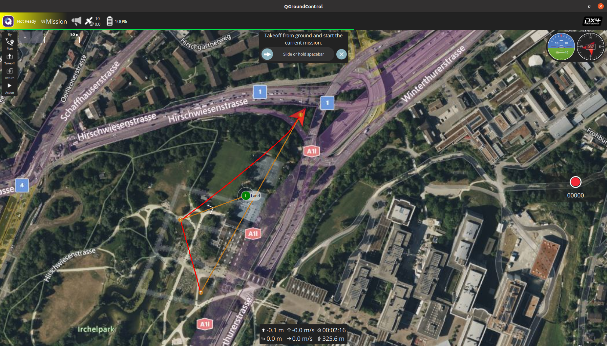
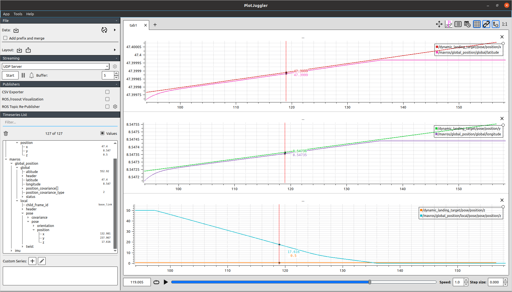
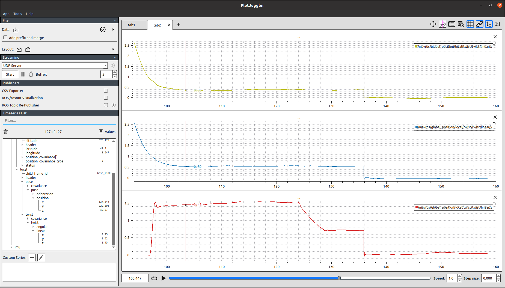
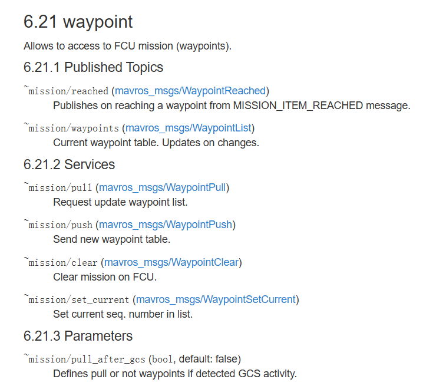

# PX4 降落移动平台

2025.06.21

## 目的

探索是否能完全依赖 PX4 飞控原生功能，实现移动平台异地起降。

## 结论

就四旋翼仿真实验而言，PX4 飞控支持上位机通过 MAVROS 协议实时更新降落点位置，能跟踪以 0.6-0.8 m/s （接近实际情况）速度运动的移动平台并降落。

不足之处，该方案高度依赖：1. 平台报告的经纬度精度及报告频率；2. 飞机自身的经纬度精度；特别是平台的报告频率。就仿真而言，降落误差为米级。

## 细节

仿真采用PX4自带的 iris 四旋翼无人机模型，用 QGC 地面站预先规划航迹：起飞（黄色T点）——途经（2号点）——降落（绿色L点）。我们假设L点为移动平台初始位置，并假设平台以经纬度均为0.000005 度/秒的速度移动（约0.6-0.8 m/s），实际运行效果如下所示：

{.img-center width=100%}

下图分别是：降落时经度期望值与反馈值（单位：度）；纬度期望值与反馈值（单位：度）；高度期望值与反馈值（单位：米）。

{.img-center width=100%}

其中，x, y 方向降落过程中的误差值均为 0.5 m 左右。

下图分别是 x,y,z 三个方向降落时的速度（单位：米/秒）

{.img-center width=100%}

跟随降落过程中，四旋翼水平方向移动速度约为 0.63 m/s 。

## 附录-实现方法

主要利用了 mavros 的如下内容：

{.img-center width=100%}

订阅 mavros/mission/waypoints 话题，以获得 mavros_msgs:: WaypointList 类型消息，该消息按顺序存储了当前任务的航点数据。

通过 mavros/mission/push 服务，修改航点列表中的最后一个点的数据，并将其推送给飞控。

```cpp
#include <geometry_msgs/PoseStamped.h>
#include <mavros_msgs/WaypointList.h>
#include <mavros_msgs/WaypointPush.h>

ros::ServiceClient wp_push_client;
mavros_msgs::WaypointList current_wps;

void targetCallback(const geometry_msgs::PoseStamped::ConstPtr& msg)
{
	if (current_wps.waypoints.empty()) {
		return;
	}
	
	auto& land_wp = current_wps.waypoints.back();
	land_wp.x_lat = msg->pose.position.x;
	land_wp.y_long = msg->pose.position.y;
	land_wp.z_alt = msg->pose.position.z;
	
	mavros_msgs::WaypointPush push_srv;
	push_srv.request.waypoints = current_wps.waypoints;
	if (wp_push_client.call(push_srv)) {
		ROS_INFO("Landing point updated to (%.6f, %.6f, %.2f)", 
			land_wp.x_lat, land_wp.y_long, land_wp.z_alt);
	} else {
		ROS_ERROR("Waypoint update failed");
	}
}

void wpListCallback(const mavros_msgs::WaypointList::Constptr& msg)
{
	current_wps = *msg;
}

int main(int argc, char** argv)
{
	ros::init(argc, argv, "dynamic_landing_node");
	ros::NodeHandle nh;
	
	wp_push_client = nh.serviceClient<mavros_msgs::WaypointPush>("mavros/mission/push");
	
	ros::Subscriber wp_list_sub = nh.subscribe("mavros/mission/waypoints", 1, wpListCallback);
	ros::Subscriber target_sub = nh.subscribe("/dynamic_landing_target", 10, targetCallback);
	
	ros::spin();
	return 0;
}
```
