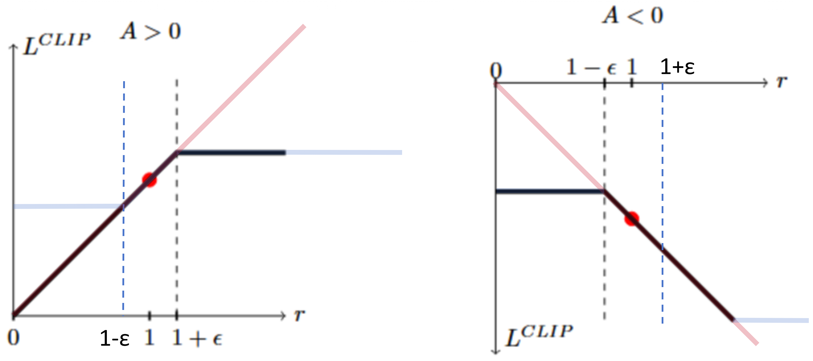

# PPO

## Overview

TRPO 算法的问题是太复杂了，求解效率不高。

而 OpenAI 团队提出的 PPO (proximal polical optimization，近端策略优化) 基于 TRPO 的思想，算法实现简单得多，效果和 TRPO 能一样好，加上各种代码层面的优化后，效果比 TRPO 要好得多，因此成为了非常流行的强化学习算法。

> TRPO 和 PPO 的第一作者是同一个人，John Schulman，加州伯克利大学毕业后进入 OpenAI 工作。PPO 算法的原论文是 Proximal Policy Optimization Algorithms .

!!! note

    TRPO 和 PPO 都是同策略（on-policy）算法。虽然优化目标中有重要性采样，但因为它们只用到了上一轮策略的数据，并且用于采样的行为策略 $\pi_{\theta_{old}}$ 和待更新的目标策略 $\pi_\theta$ 非常接近，所以它们仍然是同策略算法。

### PPO-clip

TRPO 算法最终可以写成以下优化问题：

$$\begin{aligned}
\max_{\theta}\ &\mathbb{E}_{s\sim\nu^{\pi_{\theta_{old}}}(s),a\sim\pi_{\theta_{old}}}\left[\frac{\pi_{\theta}(a|s)}{\pi_{\theta_{\rm{old}}}(a|s)}A^{\pi}(s,a)\right]\\
\text{subject to }&\mathbb{E}_{s\sim\nu^{\pi_{\theta_{old}}}}[\mathrm{KL}[\pi_{\theta_{\rm{old}}}(\cdot|s),\pi_{\theta}(\cdot|s)]]\le\delta
\end{aligned}$$

PPO 算法无需计算 KL 散度。其要最大化的目标函数为：

$$\begin{aligned}
\mathbb{E}_{s\sim\nu^{\pi_{\theta_{old}}}(s),a\sim\pi_{\theta_{old}}}&\left[\min\left(r_t(\theta)A,\mathrm{clip}\left(r_t(\theta),1-\epsilon,1+\epsilon\right)A\right)\right],\ \rm{where}\\
r_t(\theta)=&\frac{\pi_{\theta}(a_t|s_t)}{\pi_{\theta_{old}}(a_t|s_t)},\ A = A^{\pi}(s_t,a_t)
\end{aligned}$$

$\mathrm{clip(f,min,max)}$ 的意思是，若第一项 $\mathrm{f}$ 小于第二项 $\min$ ，则输出 $\min$ ；若大于第三项 $\max$ ，则输出 $\max$ ；若都不满足，则输出自身 $\mathrm{f}$ .

下图为 PPO 算法目标函数 $L^{CLIP}(\theta)$ 关于 $r_t(\theta)$ 的变化图像。

> 在 PPO 原论文中，作者用 $L^{CLIP}(\theta)$ 表示目标函数。

{.img-center width=50%}

其中，红线部分代表 $r_t(\theta)A$ ，即 TRPO 算法目标函数；蓝线部分代表 $\mathrm{clip}(\dots)A$ ，取 $\min$ 后的结果就是黑线部分。

这个式子看着复杂，实际简单。其核心思路是限制 $\pi_{\theta_{old}}$ 和 $\pi_{\theta}$ 的分布差距。我们主要比较黑线（PPO算法）和红线（TRPO算法）。

- 若 $A^{\pi}(s_t,a_t) > 0$ ，我们希望增大这个状态-动作对的概率，也就是让 $\pi_{\theta}(a_t|s_t)$ 越大越好。加上截断之后，我们限制 $\dfrac{\pi_{\theta}(a_t|s_t)}{\pi_{\theta_{old}}(a_t|s_t)}$ 的最大值为 $1+\epsilon$ ，从而限制了 $\pi_{\theta_{old}}$ 与 $\pi_{\theta}$ 的距离。
- 若 $A^{\pi}(s_t,a_t) < 0$ ，我们希望减小这个状态-动作对的概率，也就是 $\pi_{\theta}(a_t|s_t)$ 越小越好。加上截断之后，我们限制$\dfrac{\pi_{\theta}(a_t|s_t)}{\pi_{\theta_{old}}(a_t|s_t)}$ 的最小值为 $1-\epsilon$ ，从而限制了 $\pi_{\theta_{old}}$ 与 $\pi_{\theta}$ 的距离。

PPO 算法是一个非常主流的强化学习算法，在各种情况下都能表现出良好的性能。

## GAE（Generalized Advantage Estimation）

PPO 原论文介绍了一种训练方法：**每个并行 actor 只跑固定长度 T 步，然后就更新一次**。这样做的好处是：

- 可以并行采样；
- 不用等整条 episode 结束
- 一批数据可以反复做多个 epoch 的优化

现在的问题是，episode 如果没有结束，该如何计算这 T 步里每个时刻的 advantage 呢？

作者给出的最直接的方法，截断蒙特卡洛回报减去状态价值：

$$\hat{A}_t=-V(s_t)+r_t+\gamma r_{t+1}+\cdots+\gamma^{T-t+1}r_{T-1}+\gamma^{T-t}V(s_T)$$

这个方法最主要的问题是用一整段未来奖励 $r_t+\gamma r_{t+1}+\cdots$ 来估计，想估计得准，必须得有大量类似轨迹才行，光靠单条轨迹，随机性太大，方差太大，太不稳定。参见[时序差分算法](./时序差分算法.md) 里类似的分析。

那么，另一种方法也就呼之欲出了，也就是 TD 方法，即

$$\hat{A}_t = -V(s_t)+r_t+\gamma V(s_{t+1})$$

这种方法的问题是一段 T 步的 episode ，只利用了其中的一步 $r_t$ ，利用率太低，前期算出来的结果误差太大。

Generalized Advantage Estimation 介于两种方法之间：

$$\begin{aligned}
\hat{A}_t&=\delta_t+(\gamma\lambda)\delta_{t+1}+(\gamma\lambda)^2\delta_{t+2}+\cdots\\
\delta_t&=r_t+\gamma V(s_{t+1})-V(s_t)
\end{aligned}$$

如果 $\lambda = 0$ ，它就是 TD 方法；如果 $\lambda = 1$ ，它就是截断蒙特卡洛方法。

这玩意的意思是，我每一步都估计一下，采取了某动作的实际回报和我估计的状态价值有多少出入，累积起来，就是在初始状态采取特定动作的优势函数。

## 实现细节（待完善）

Implementation matters in deep policy gradients : a case study on PPO and TRPO, ICLR 2020.

这篇论文以 PPO 和 TRPO 为研究对象，通过一系列细致的消融实验，发现 PPO 带来的奖励提升更多来自于各种代码实现上的 trick 。

[The 37 Implementation Details of Proximal Policy Optimization](https://iclr-blog-track.github.io/2022/03/25/ppo-implementation-details/)，ICLR Blog，2022.3.25

这篇文章详细介绍了 PPO 的实现细节。该团队还提供了代码库 cleanrl 以供参考。

### 1 Vectorized architecture

PPO 使用向量化的环境 `envs` ，利用多进程按顺序或并行运行 N 个环境。`envs` 提供接口，能输出来自 N 个环境的一批 N 个观测值，并接收一批 N 个动作来遍历 N 个环境。

PPO 算法在采样阶段，同时对 N 个环境进行动作采样，并持续执行固定数量的 M 步。如果某个环境在 M 步之内的某回合结束了，就在下一回合重置。并且，下一回合的 `done=1` .  

PPO学习的是**部分轨迹片段**，每次M步。即使一个episode持续10万步，PPO可以第1-100步学习一次，第101-200步再学习一次... 这样**不需要等待episode终止**就能持续训练。

同时，这样能保证训练用数据的内存大小是固定的，长度都是 $N\times M$ 。
