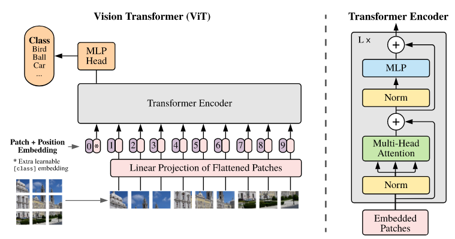

# CNN and ViT

> 原始 slides 中的插图相当直观、精美，强烈建议配合阅读。

## CNN

基础神经网络：f = 激活函数(Wx+b) （全连接层+非线性激活函数）的重复。但是对于图像任务，把图像转化成一个向量丢失了图像的二维结构信息。

CNN最重要的两个东西：1. 卷积层；2. 池化层。

卷积层：举个例子，输入是一个 `3*32*32` 的张量，初始随机化 `10` 个 `3*5*5` 的模板去进行卷积运算，那么我们就能得到结果尺寸为 `10*28*28` 的一个张量。

> 这里的 3 是图像的通道数。卷积运算时，对应像素，3 个通道对应相乘并求和。
> 这里的 28 是卷积运算的滑动过程导致的。
> 举个例子，用长度为 2 的一维向量分别和长度为 3、5 的一维向量做卷积，长度为 2 的向量分别需要滑动 1 次、3 次，分别共计算 2 次、4 次，结果长度分别为 2、4 .
> 也就是说，公式为 `m-n+1` .

这里有两个 trick。

一是随着卷积运算，张量的尺寸缩小了，这似乎不太好，人类工程师喜欢让输入张量的尺寸经过卷积核后保持不变。为了解决这一问题，我们可以在张量四周加几行/列 0 （We call it pad）. 

!!! note "疑惑"

    Is pad practical ? 为什么张量的尺寸随着卷积运算缩小是一件不好的事呢？

二是新张量中的元素对应于原始张量中一块 `5*5` 区域的元素，但是有重叠部分。从计算效率的角度上来说，这个重叠部分是应该避免的。也就是说，在做卷积运算时，要有一定的步长（stride）。

---

【15分钟认识ViT！【视觉Transformer】】 https://www.bilibili.com/video/BV1gnWdzSEzY/?share_source=copy_web&vd_source=553a4a70226ce4e6e971d05487040eb7

CNN 的**归纳偏置**：假设图像具有**局部性**和**平移不变性**，仅适用于图像分割、物体识别等任务

CNN 的缺陷：
1. **感受野限制** / **缺乏全局建模能力**：过分关注甚至仅关注局部图像信息/相近像素关系，难以获知全局图像信息。要获得全局信息的知识，就需要多层卷积、池化，一来计算效率低，二来信息可能在多层传递中丢失/失真。
2. 难以扩展至超大模型
	1. 架构高度异质且分阶段，不同阶段参数需要人工精心构建，模型深度与模型性能关系复杂，不是简单的线性关系
	2. 模型加深后，优化十分困难
3. 可迁移性弱：针对单个任务训练后，难以简单迁移至其他任务  

## ViT (Vision Transformer)

2020 Google 论文 An Image is Worth `16*16` Words .

{.img-center width=50%}{.img-center width=50%}

首先，将图像切割成为 `p*p*c` 的 patch 。举个例子，考虑一张尺寸为 `256*256*3` 的三通道图片，patch 尺寸一般是 `16*16*3` . 那么我们就有 `N = 196` 个 patch 。

下一步是 Linear Projection（线性投影），目的是将 patch 转化为 Transformer 能理解的词向量。我们将 patch 展平成一个向量，通过一个可学习的全连接层（称为“线性投射层”）将其映射成一个固定长度 `D` 的向量。

> 由于我们的 patch 是固定大小的（如 `16*16*3` ），所以输入向量长度确定为 `p*p*c = 768`，所以全连接层的输入维度是 768，输出维度是 `D` 。所以最终输出的是一个 `196*D` 的矩阵。

完成所有 patch 投影后，有一个 BERT 模型的设计——在序列最前面加一个特殊的、可学习向量 CLS (class 的缩写) Token，作为全局信息聚合器。这个 token 是个长度为 `D` 的向量。至此，我们获得一个 `(N+1)*D` 的矩阵。

> 这个 BERT 模型不知道是什么。

接下来是 Position Encoding，要编码每个 patch 的原始空间位置信息。创建一个可学习的矩阵，尺寸为 `(N+1)*D` ，每一行就对应一个 patch 的位置编码，第 0 行给 CLS Token 。

我们把位置编码的结果矩阵与加了 CLS Token 的投影结果矩阵直接相加，作为 Transformer Encoder 的输入。相当于是一个序列，序列长度 N+1，序列向量长度是 D .

最后 CLS Token 对应的输出可以直接用于图像分类任务。

