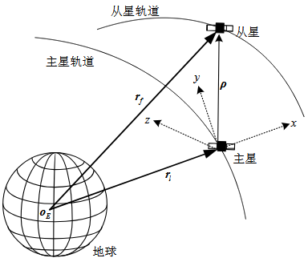

# 航天器相对运动方程

> ”航天器相对运动方程用于描述轨道上两颗近距离飞行的航天器之间的相对运动。为描述问题的方便，一般将其中一个航天器称作**主星**（Leader），另一个航天器称作**从星**（Follower）。
> 
> 以主星的当地水平当地垂直坐标系 （Local-Vertical-Local-Horizontal, LVLH）作为相对运动描述的坐标系。
> 
> LVLH 坐标系的定义如下所示，其原点位于主星的质心，x 轴方向由地球质心沿径向指向主星，z 轴垂直主星轨道面并指向轨道角动量方向，y 轴与另外两轴垂直并完成右手直角坐标系。“
> 
> ——党朝辉《航天器集群边界建模与控制方法研究》

{.img-center width=50%}

## C-W方程

1878年，希尔在研究日、地、月系统中月球的运动时，建立了一组相对运动方程。它是一组非线性微分方程，希尔没有对方程组线性化，而是以时间幂级数的形式给出了一组运动解。

1960年，W. H. Clohessy和R. S. Wiltshire研究交会对接问题时采用了该组方程，并进行了线性化。因此，该方程称为**希尔方程**（Hill Equation），也称为Clohessy - Wiltshire方程（简称C-W方程）：

### 推导

设主星和从星的质量分别为 $m_1,m_2$ ，则其分别受到来自地球的引力为 $-\dfrac{GMm_1}{r_l^3}\mathbf{r}_l$ 和 $-\dfrac{GMm_1}{r_f^3}\mathbf{r}_f$ . 其中 $G$ 为万有引力常数，$M$ 为地球质量。记 $\mu=GM$ 为地球引力常数。

设从星所受的其它外力（推力、扰动力等）为 $\mathbf{F}$，根据牛顿第二定律，有

$$\begin{aligned}
\mathbf{F}-\dfrac{\mu m_2}{r_f^3}\mathbf{r}_f &= m_2\ddot{\mathbf{r}}_f\\
\ddot{\mathbf{r}}_f+\frac{\mu}{r_f^3}\mathbf{r}_f&=\mathbf{f}\\
\text{同理：}\ddot{\mathbf{r}}_l+\frac{\mu}{r_l^3}\mathbf{r}_l&=0.
\end{aligned}$$

其中，$\mathbf{f} = \dfrac{\mathbf{F}}{m_2}$ 是从星单位质量所受的其它外力。

!!! Note

    C-W 方程假设主星绕地球做标准的匀速圆周运动。可据此推导主星的轨道角速度 $\omega$ ：

    $$\begin{aligned}\frac{\mu m_1}{r_l^2}=m_1\omega^2r_l\\\omega=\sqrt{\frac{\mu}{r_l^3}}\end{aligned}.$$

从星相对于主星的运动为：

$$\begin{aligned}
\boldsymbol{\rho} &= \mathbf{r}_f-\mathbf{r}_l\\
\ddot{\boldsymbol{\rho}} &= \ddot{\mathbf{r}}_f-\ddot{\mathbf{r}}_l=\frac{\mu}{r_l^3}\mathbf{r}_l-\frac{\mu}{r_f^3}\mathbf{r}_f+\mathbf{f}. 
\end{aligned}\tag{1}$$

接下来，我们从另一个角度推导 $\ddot{\boldsymbol{\rho}}$ 的表达式。由于主星绕地球旋转，因此有

$$\ddot{\boldsymbol{\rho}}=\ddot{\boldsymbol{\rho}}_B+2\boldsymbol{\omega}\times\dot{\boldsymbol{\rho}}_B+\dot{\boldsymbol{\omega}}\times\boldsymbol{\rho}+\boldsymbol{\omega}\times(\boldsymbol{\omega}\times\boldsymbol{\rho}).\tag{2}$$

其中，下标 $B$ 代表在 $B$ 系下求导。用 $\mathbf{i},\mathbf{j},\mathbf{k}$ 分别表示 LVLH 系的一组正交基向量，其方向分别与 x,y,z 轴重合。设在 LVLH 系中，$\boldsymbol{\rho}=x\mathbf{i}+y\mathbf{j}+z\mathbf{k}$ ，则 $\dot{\boldsymbol{\rho}}_B=\dot{x}\mathbf{i}+\dot{y}\mathbf{j}+\dot{z}\mathbf{k}$ . 

把 $\boldsymbol{\rho}=x\mathbf{i}+y\mathbf{j}+z\mathbf{k}$ 和 $\boldsymbol\omega = \omega \mathbf{k}$ 代入上式，有

$$\begin{aligned}
\boldsymbol\omega\times(\boldsymbol\omega\times\boldsymbol{\rho})&=\omega\mathbf{k}\times(\omega x\mathbf{j}-\omega y\mathbf{i})\\
&= -\omega^2(x\mathbf{i}+y\mathbf{j})\\
\dot{\boldsymbol{\omega}}\times\boldsymbol{\rho}&=\dot{\omega} x\mathbf{j}-\dot{\omega} y\mathbf{i}\\
\boldsymbol{\omega}\times\dot{\boldsymbol{\rho}}_B&= \omega \dot{x}\mathbf{j}-\omega \dot{y}\mathbf{i}.
\end{aligned}$$

因此（2）式最终改写为：

$$\begin{aligned}
\ddot{\boldsymbol{\rho}}&=\ddot{x}\mathbf{i}+\ddot{y}\mathbf{j}+\ddot{z}\mathbf{k}+2(\omega \dot{x}\mathbf{j}-\omega \dot{y}\mathbf{i})+\dot{\omega} x\mathbf{j}-\dot{\omega} y\mathbf{i}-\omega^2x\mathbf{i}-\omega^2y\mathbf{j}\\
&= (\ddot{x}-2\omega\dot{y}-\dot{\omega}y-\omega^2x)\mathbf{i}+(\ddot{y}+2\omega\dot{x}+\dot{\omega}x-\omega^2y)\mathbf{j}+\ddot{z}\mathbf{k}.
\end{aligned}\tag{3}$$

回顾（1）式，注意到 $\mathbf{r}_l = r_l\mathbf{i}$ 和 $\mathbf{r}_f = \mathbf{r}_l+\boldsymbol{\rho} = (x+r_l)\mathbf{i}+y\mathbf{j}+z\mathbf{k}$ ，因此有：

$$\begin{aligned}
\frac{\mu}{r_l^3}\mathbf{r}_l-\frac{\mu}{r_f^3}\mathbf{r}_f
&=\mu r_l^{-3}\mathbf{r}_l-\mu\left[(x+r_l)^2+y^2+z^2\right]^{-\frac{3}{2}}(\mathbf{r}_l+\boldsymbol\rho)\\
&=\mu r_l^{-3}\mathbf{r}_l-\mu\left[\rho^2+2xr_l+r_l^2\right]^{-\frac{3}{2}}(\mathbf{r}_l+\boldsymbol\rho)\\
&=\mu r_l^{-3}\left[\mathbf{r}_l-\left(1+2\frac{x}{r_l}+\frac{\rho^2}{r_l^2}\right)^{-\frac{3}{2}}(\mathbf{r}_l+\boldsymbol\rho)\right].
\end{aligned}$$

考虑对其中最主要的非线性项 $\left(1+2\dfrac{x}{r_l}+\dfrac{\rho^2}{r_l^2}\right)^{-\frac{3}{2}}$ 做近似处理。由于 $\rho=\sqrt{x^2+y^2+z^2} \ll r_l$ ，所以可以忽略 $\dfrac{\rho}{r_l}$ 的二阶及以上小项，从而将非线性项近似为 $\left(1+2\dfrac{x}{r_l}\right)^{-\frac{3}{2}}$ . 由于 $x\ll r_l$ ，因此 $2\dfrac{x}{r_l}<1$ ，考虑在 $2\dfrac{x}{r_l}=0$ 处使用泰勒展开：

$$(1+\alpha)^{-\frac{3}{2}}=1-\frac{3}{2}x+\frac{15}{8}x^2+\cdots.$$

!!! Note "泰勒展开"

    $$f(x)=f(x_0)+\frac{f'(x_0)}{1!}(x-x_0)+\frac{f''(x_0)}{2!}(x-x_0)^2+\cdots+\frac{f^{(n)}(x_0)}{n!}(x-x_0)^n.$$

从而，

$$\begin{aligned}
\frac{\mu}{r_l^3}\mathbf{r}_l-\frac{\mu}{r_f^3}\mathbf{r}_f
&=\mu r_l^{-3}\left[\mathbf{r}_l-\left(1-\frac{3x}{r_l}\right)(\mathbf{r}_l+\boldsymbol{\rho})\right]\\
&=\mu r_l^{-3}\left[\frac{3x}{r_l}r_l\mathbf{i}+\left(\frac{3x}{r_l}-1\right)(x\mathbf{i}+y\mathbf{j}+z\mathbf{k})\right]\\
&= \mu r_l^{-3}\left[\left(3x+\frac{3x^2}{r_l}-x\right)\mathbf{i}+\left(\frac{3xy}{r_l}-y\right)\mathbf{j}+\left(\frac{3xz}{r_l}-z\right)\mathbf{k}\right].
\end{aligned}$$

其中的 $\dfrac{3x^2}{r_l}, \dfrac{3xy}{r_l}, \dfrac{3xz}{r_l}$ 都是高阶小量，我们直接忽略，因此得到

$$\frac{\mu}{r_l^3}\mathbf{r}_l-\frac{\mu}{r_f^3}\mathbf{r}_f=\mu r_l^{-3}(2x\mathbf{i}-y\mathbf{j}-z\mathbf{k}).$$

再将 $\mathbf{f}$ 在 LVLH 系中分解为 $\mathbf{f}=f_x\mathbf{i}+f_y\mathbf{j}+f_z\mathbf{k}$ ，结合（1）式和（3）式，得到

$$\begin{cases}
f_x=\ddot{x}-2\omega\dot{y}-\dot{\omega}y-(\omega^2+2\mu r_l^{-3})x\\
f_y=\ddot{y}+2\omega\dot{x}+\dot{\omega}x+(\mu r_l^{-3}-\omega^2)y\\
f_z=\ddot{z}+\mu r_l^{-3}z
\end{cases}$$

把 $\omega=\sqrt{\dfrac{\mu}{r_l^3}}$ 代入，有

$$\begin{cases}
\ddot{x}=f_x+2\omega\dot{y}+3\omega^2x\\
\ddot{y}=f_y-2\omega\dot{x}\\
\ddot{z}=f_z-\omega^2z.
\end{cases} \tag{C-W方程}$$

> （C-W方程有显式的解析解）To be continued...
