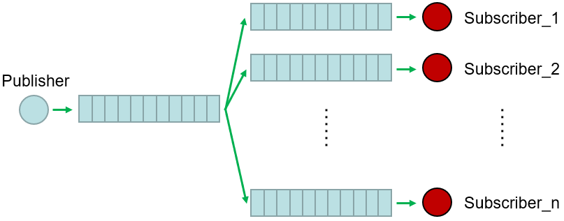

# 实例—PX4降落移动平台

实例背景及来源参见 [PX4降落移动平台](../../机器人&飞机/飞控相关/PX4降落移动平台.md)

## 一、ROS 与 MAVROS 基础概念

### ROS 节点（Node）

ROS 中的基本执行单元。每一个运行的可执行程序都称作一个节点。节点通过 ROS Master 注册并发现彼此，可以进行消息通信、服务调用等。

需要在程序入口处调用 `ros::init(argc, argv, "node_name")` 来初始化节点，并创建一个或多个 `ros::NodeHandle` 作为与 ROS 系统交互的句柄。

### 消息（Message）与话题（Topic）

各节点通过“发布（publish）/订阅（subscribe）”机制进行异步、一对多或多对一的数据传递。消息类型由 `.msg` 定义，对应 C++ 中的结构体类型。

订阅者通过 `nh.subscribe(topic_name, queue_size, callback)` 注册回调；发布者通过 `nh.advertise<MsgType>(topic_name, queue_size)` 创建发布者，再调用 `.publish(msg)` 发送。

{width=80%}

> Q：这里的 `queue_size` 是什么？
>
> A：订阅者/发布者消息队列的大小。
>
> Q：为什么存在这两个队列？设计目的是什么？
>
> A：首先，这两个队列都是用来存放消息的，先进先出，满了之后接收新的放弃旧的。简而言之，**队列可实现消息发布与接收的解耦**。通过发布者队列，ROS 系统能实现异步通信、一对多的消息发布，防止接收方接收速度过慢造成消息阻塞。订阅者队列作用类似，可以降低订阅者从发布者队列中读取消息的时间开销的影响。

### 服务（Service）与客户端（ServiceClient）

参见 [服务（Service）](服务（Service）.md)

### 回调函数 （Callback）

当有新消息到达订阅的话题时，ROS 库会自动在后台线程或事件循环中调用用户提供的回调函数，传入消息指针。

回调签名通常是 `void callback(const MsgType::ConstPtr& msg)` 或者 `void callback(const boost::shared_ptr<const MsgType>& msg)`。

### ROS 信息打印

参见 [日志宏](日志宏.md)

### MAVROS

 MAVROS 是 ROS 与飞控（例如 PX4、ArduPilot）之间的桥梁，提供主题与服务接口操作无人机的飞行模式、任务(waypoint)管理、姿态/位置信息等。

本代码中使用的 MAVROS 消息类型：

1. `mavros_msgs::WaypointList`：包含当前上传到飞控的航点列表，其成员通常包括 `.waypoints`，是一个 `std::vector<mavros_msgs::Waypoint>`。
2. `mavros_msgs::WaypointPush`：用于将一组航点上传(push)到飞控。Service 类型，包含 `request.waypoints` 和 `response...` 等字段。

### 注意事项 ：保持节点运行

在 `main` 函数订阅、创建服务客户端等后，必须让程序保持运行状态才能响应回调，通常通过 `ros::spin()` 或循环 + `ros::spinOnce()`。如果缺失，程序会立即退出，无法处理消息/服务。

> `ros::spin()` 的功能是进入一个无限循环，线程被阻塞，不会返回；在循环内不断检查并处理 callback queue 中的待处理回调，直到节点被关闭。
> `ros::spinOnce()` 的功能是处理一次当前 callback queue 中的所有待处理回调，然后立即返回，不阻塞等待新回调。

---

## 二、逐行/逐块代码解析

下面按代码顺序，一行行说明。为了易于阅读，先贴原代码，然后分段注释。

```cpp
#include <geometry_msgs/PoseStamped.h>
#include <mavros_msgs/WaypointList.h>
#include <mavros_msgs/WaypointPush.h>

ros::ServiceClient wp_push_client;
mavros_msgs::WaypointList current_wps;

void targetCallback(const geometry_msgs::PoseStamped::ConstPtr& msg)
{
	if (current_wps.waypoints.empty()) {
		return;
	}
	
	auto& land_wp = current_wps.waypoints.back();
	land_wp.x_lat = msg->pose.position.x();
	land_wp.y_long = msg->pose.position.y();
	land_wp.z_alt = msg->pose.position.z();
	
	mavros_msgs::WaypointPush push_srv;
	push_srv.request.waypoints = current_wps.waypoints;
	if (wp_push_client.call(push_srv)) {
		ROS_INFO("Landing point updated to (%.6f, %.6f, %.2f)", 
			land_wp.x_lat, land_wp.y_long, land_wp.z_alt);
	} else {
		ROS_ERROR("Waypoint update failed");
	}
}

void wpListCallback(const mavros_msgs::WaypointList::ConstPtr& msg)
{
	current_wps = *msg;
}

int main(int argc, char** argv)
{
	ros::init(argc, argv, "dynamic_landing_node");
	ros::NodeHandler nh;
	
	wp_push_client = nh.serviceClient<mavros_msgs::WaypointPush>("mavros/mission/push");
	
	ros::Subscriber wp_list_sub = nh.subscribe("mavros/mission/waypoints", 1, wpListCallback);
	ros::Subscriber target_sub = nh.subscribe("/dynamic_landing_target", 10, targetCallback);
	
	ros::spin();
	return 0;
}
```

### 1. 头文件包含

```cpp
#include <geometry_msgs/PoseStamped.h>
#include <mavros_msgs/WaypointList.h>
#include <mavros_msgs/WaypointPush.h>
```

引入 ROS 中定义的消息类型 `geometry_msgs::PoseStamped`。该消息包含一个 `std_msgs/Header header`（包括时间戳、坐标系帧ID等）和一个 `geometry_msgs::Pose pose`（包括位置 position 和姿态 orientation）。适用于发布或接收带时间戳和坐标系标识的位姿（position+orientation）消息。

引入了 MAVROS 中用于表示航点列表的消息类型 `mavros_msgs::WaypointList`。主要成员通常有：`std::vector<mavros_msgs::Waypoint> waypoints;` 。订阅 `mavros/mission/waypoints` 话题可以获取当前飞控上存储的所有航点。

引入了 MAVROS 中表示“将一组航点上传(push)到飞控”的 Service 类型。Service 名称是 `mavros/mission/push`。

### 2. 全局变量

```cpp
ros::ServiceClient wp_push_client;
mavros_msgs::WaypointList current_wps;
```

声明了一个全局 ServiceClient 变量，用于后面在 `main` 中初始化：`wp_push_client = nh.serviceClient<mavros_msgs::WaypointPush>("mavros/mission/push");`

> 之所以作为全局，是为了回调 `targetCallback` 中也能访问到，直接调用服务上传更新后的航点列表。

`mavros_msgs::WaypointList current_wps;`  存储当前从飞控获取到的航点列表。由回调 `wpListCallback` 更新。初始时默认空。只有当收到订阅的话题消息后，`current_wps.waypoints` 才会被赋值。

### 3. targetCallback 函数

```cpp
void targetCallback(const geometry_msgs::PoseStamped::ConstPtr& msg)
{
	if (current_wps.waypoints.empty()) {
		return;
	}
	
	auto& land_wp = current_wps.waypoints.back();
	land_wp.x_lat = msg->pose.position.x;
	land_wp.y_long = msg->pose.position.y;
	land_wp.z_alt = msg->pose.position.z;
	
	mavros_msgs::WaypointPush push_srv;
	push_srv.request.waypoints = current_wps.waypoints;
	if (wp_push_client.call(push_srv)) {
		ROS_INFO("Landing point updated to (%.6f, %.6f, %.2f)", 
			land_wp.x_lat, land_wp.y_long, land_wp.z_alt);
	} else {
		ROS_ERROR("Waypoint update failed");
	}
}
```

`ConstPtr` 是 ROS C++ 中对共享指针(`boost::shared_ptr<const MsgType>`)的简写，可避免复制且保证只读。

`msg` 指向发布方发送的位姿消息，包含 `msg->header`（时间戳 `msg->header.stamp`，坐标系 `msg->header.frame_id`）和 `msg->pose`（包括 `msg->pose.position.{x,y,z}` 以及 `msg->pose.orientation.{x,y,z,w}`）。

`auto& land_wp = current_wps.waypoints.back();` 用 `auto&` 获取对该最后航点对象的引用，以便修改其字段。假设最后一个航点是“着陆点”，所以后续将其坐标替换为动态目标坐标。

### 4. wpListCallback 函数

```cpp
void wpListCallback(const mavros_msgs::WaypointList::ConstPtr& msg)
{
	current_wps = *msg;
}
```

 该回调用于订阅来自 MAVROS 的航点列表消息，主题名在 main 中为 `"mavros/mission/waypoints"`。

 签名 `const mavros_msgs::WaypointList::ConstPtr& msg`，表示收到的消息指针。

`current_wps = *msg;`：将接收到的 `WaypointList` 整体拷贝给全局 `current_wps`，以便后续在 `targetCallback` 中使用最新列表。

 注意：如果航点列表很大且更新频繁，复制可能成本较高，但通常航点数目有限（几十个）。如有性能需求，可考虑只拷贝必要字段或使用指针/引用（但要注意生命周期）。

### 5. main 函数

```cpp
int main(int argc, char** argv)
{
	ros::init(argc, argv, "dynamic_landing_node");
	ros::NodeHandle nh;
	
	wp_push_client = nh.serviceClient<mavros_msgs::WaypointPush>("mavros/mission/push");
	
	ros::Subscriber wp_list_sub = nh.subscribe("mavros/mission/waypoints", 1, wpListCallback);
	ros::Subscriber target_sub = nh.subscribe("/dynamic_landing_target", 10, targetCallback);

	ros::spin();
	return 0;
}
```

`int main(int argc, char** argv)` 是 C++ 程序入口。ROS 要求在 main 中先调用 `ros::init`。

`ros::init(argc, argv, "dynamic_landing_node");` 用于初始化 ROS 节点，参数 `argc, argv` 传递命令行参数，第三个参数是节点名称 `"dynamic_landing_node"`。调用后，ROS Master 知道有一个名为 dynamic_landing_node 的节点启动，后续可用 NodeHandle 与 ROS 进行通信。

`ros::NodeHandle nh;` 用于创建一个 NodeHandle 对象 `nh`。NodeHandle 是与 ROS 系统交互的主要接口，又被称为句柄。通过它可以创建 Publisher、Subscriber、ServiceClient、ServiceServer、Timer 等，并访问参数服务器（get/set param）。

`wp_push_client = nh.serviceClient<mavros_msgs::WaypointPush>("mavros/mission/push");` 用于初始化全局 `wp_push_client`，让它引用名为 `"mavros/mission/push"` 的服务，该服务由 MAVROS 提供，用于向飞控上传新的航点列表。

> 模板参数是 Service 类型 `mavros_msgs::WaypointPush`。
> `"mavros/mission/push"`：具体服务名需与 MAVROS 中 remap 或实际启动时提供的名称一致。

`ros::Subscriber wp_list_sub = nh.subscribe("mavros/mission/waypoints", 1, wpListCallback);` 用于订阅 MAVROS 发布的航点列表主题 `"mavros/mission/waypoints"`，消息类型由订阅回调签名推断为 `mavros_msgs::WaypointList`。

> 第二个参数 `1` 是队列大小（queue_size）：在回调处理较慢或消息来得快时，可缓存最多 1 条消息，丢弃旧的。
> 第三个参数是回调函数 `wpListCallback`，当收到新消息时调用。

`ros::Subscriber target_sub = nh.subscribe("/dynamic_landing_target", 10, targetCallback);` 用于订阅自定义话题 `/dynamic_landing_target`，队列大小为 10 ，最多保留 10 条未处理消息，消息类型为 `geometry_msgs::PoseStamped`（由回调签名决定）。

---

## 四、总结

该代码的核心目的是：当收到新的“动态着陆目标”位姿时，将原航点列表中最后一个航点（假定是着陆点）的经纬度/高度修改为新目标，并通过 MAVROS 的 WaypointPush 服务上传至飞控，使无人机能动态调整着陆位置。

关键流程：

1. 订阅并保存当前飞控的航点列表 (`mavros/mission/waypoints` -> `wpListCallback`)。
2. 订阅动态目标位姿 (`/dynamic_landing_target` -> `targetCallback`)。
3. 在目标回调中，检查已有航点列表，修改最后一个航点字段，并调用服务上传新列表 (`mavros/mission/push`)。
