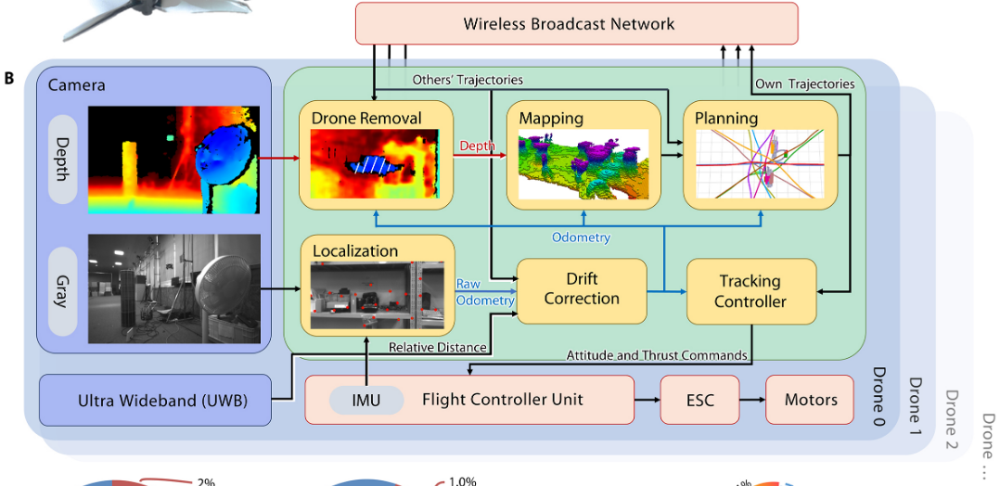
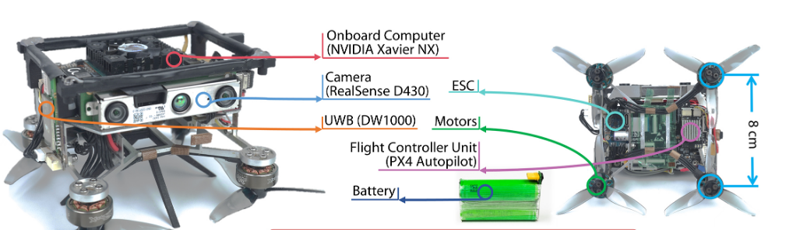

# 材料与方法

## 系统架构

遵循单机到集群的方法，我们构建了一个自然的去中心化方案，每架无人机都有完全的自主性，以实现最好的导航效果。系统架构如下图所示。轨迹广播网络是个体之间唯一的通信连接。因此，该系统比以前的工作（33）耦合度更低，后者需要稳定的链式连接。建图模块基于概率建图，鲁棒性和效率较好。无人机移除模块（Drone removal module）可以消除视野中其他无人机的像素，防止其干扰建图。基于视觉惯性里程计（VIO）的定位模块与所提出的漂移校正算法一起计算六自由度的无人机状态。控制器模块命令无人机精确跟踪规划的轨迹。生成高质量轨迹的规划模块（Planning）是实现 TEEM（轨迹最优性、可扩展性、计算经济性、微型化）的核心，因此将在“轨迹表示”到“动态避障”部分以及补充材料中进一步详细说明。硬件模块在“手掌大小的无人机硬件”部分介绍。无人机移除模块利用其他无人机的轨迹确定三维边界框作为信任区域，详见补充材料第 S8 节。

{.img-center width=50%}{.img-center width=50%}

## 轨迹表示
在这里，时空轨迹规划是通过一种新开发的名为 MINCO（最小控制）的轨迹表示方法实现的，该方法专为像多旋翼飞行器这样的微分平坦系统设计。MINCO 最先进的地方在于它为用户解耦了轨迹的空间和时间参数，并在此基础上设计了线性时间复杂度的操作以方便进行时空变形。一段 MINCO 分段轨迹的参数是：(i) 每一段的时间持续时间 $\mathbf{T} \in \mathbb{R}^M$；以及 (ii) 每对连接段之间的相邻航点 $\mathbf{q} \in \mathbb{R}^{3 \times (M-1)}$，其中 $M$ 是分段数量。那么，MINCO 轨迹上时间 $t$ 处的三维点 $p(t) \in \mathbb{R}^3$ 由操作 $\mathcal{M}$ 定义：

$$

p(t) = \mathcal{M}_{\mathbf{q},\mathbf{T}}(t) \tag{1}

$$

根据文献（56）中的“最优性条件”部分，对于 $s$-积分器链动力学（本工作中 $s=3$），MINCO 轨迹默认是一条 $2s-1$ 阶的 $C^{s-1}$ 多项式样条，具有固定的边界并在给定 $\{\mathbf{q}, \mathbf{T}\}$ 的情况下具有最小控制量（control effort）。其控制量优化如下给出：

$$

\min_{p(t)} \int_{t_0}^{t_M} \|p^{(s)}(t)\|_2^2 \mathrm{d}t \tag{2}

$$

其中 $t \in [t_0, t_M]$ 是当前轨迹的定义域。注意，我们通过控制量最小化来实现平滑度（snoothness）最大化，因为我们使用的是加加速度（jerk）控制系统模型。

此外，MINCO 的改进之处在于它能以线性复杂度 $O(M)$ 将给定的参数 $\{\mathbf{q}, \mathbf{T}\}$ 转换为多项式系数 $\mathbf{c}$ 和时间分布 $\mathbf{T}_p$。更具体的对应关系可以表示为：

$$

\mathbf{M}(\mathbf{T})\mathbf{c} = \mathbf{b}(\mathbf{q}), \mathbf{T}_p = \mathbf{T} \tag{3}

$$

其中 $\mathbf{b}(\mathbf{q}) \in \mathbb{R}^{2Ms \times 3}$，而 $\mathbf{M}(\mathbf{T}) \in \mathbb{R}^{2Ms \times 2Ms}$ 是一个对于任意 $\mathbf{T} \succ 0$ 均非奇异的带状矩阵，如文献（56）所示。利用带状 PLU 分解，生成轨迹的过程具有线性复杂度。多项式系数的梯度也以线性时间传播到 MINCO 参数。这意味着一旦获得目标函数关于 $\{\mathbf{c}, \mathbf{T}_p\}$ 的偏导数，它们可以被高效地传播到 $\{\mathbf{q}, \mathbf{T}\}$ 上，然后可以直接对 MINCO 应用优化。$\mathbf{M}, \mathbf{b}$ 的细节及 MINCO 的更多特性在补充材料中给出。具体来说，用台式计算机通过公式 3 从给定 $\{\mathbf{q}, \mathbf{T}\}$ 计算 $\{\mathbf{c}, \mathbf{T}_p\}$ ，每个多项式分段大约需要 1 $\mu s$。

## 约束转化 (Constraints transcription)

多旋翼飞行器的微分平坦性意味着它们的运动规划可以在低维平滑轨迹（如 MINCO）上执行。为了实现平滑运动和高效飞行，我们分别定义了平滑度和时间的两个指标，然后最小化它们的加权和。决策变量是 MINCO 参数 $\mathbf{q}$ 和 $\mathbf{T}$。起始和终止状态是固定的，以确保连续性。一条可行的轨迹，必须满足飞行器的动力学约束并避开障碍物。微分平坦性使得通过限制轨迹速度、加速度和加加速度（jerk）的幅度来强制满足动力学约束成为可能。而避障是通过改变轨迹形状来实现的。

沿轨迹的连续时间约束包含无限多个不等式。为了处理这一难题，我们提出了一个两步走的约束转化算法。首先，受文献（40）启发，约束可以等价于具有足够大惩罚权重的惩罚函数的积分。其次，每个积分通过沿时间轴的等间距样本的有限和来近似。问题最终变成了一个可以更高效求解的无约束问题（57）。对于在时间 $t \in [t_0, t_M], t_M - t_0 = \text{sum}(\mathbf{T})$ 内，在等式约束 $\mathcal{H}$ 和不等式约束 $\mathcal{G}$ 下的时间相关目标 $J$ 的优化，这两步转换可以写为：

$$

\min_{\mathbf{q},\mathbf{T}} \int_{t_0}^{t_M} J(\mathbf{q},\mathbf{T},t) \mathrm{d}t \tag{4}

$$

$$

\text{s.t. } \mathcal{H}(\mathbf{q},\mathbf{T},t) = 0, \mathcal{G}(\mathbf{q},\mathbf{T},t) \le 0 \tag{5}

$$

$$

\Downarrow

$$

$$

\min_{\mathbf{q},\mathbf{T}} \left( \int_{t_0}^{t_M} J \mathrm{d}t + \int_{t_0}^{t_M} \|\chi_\mathcal{H} \cdot \mathcal{H}\|_2^2 + \max(\chi_\mathcal{G} \cdot \mathcal{G}, 0)^3 \mathrm{d}t \right) \tag{6}

$$

$$

\Downarrow

$$

$$

\min_{\mathbf{q},\mathbf{T}} \sum_{i=0}^{\kappa} \omega_i \cdot \left( J(t_i) + \|\chi_\mathcal{H} \cdot \mathcal{H}(t_i)\|_2^2 + \max(\chi_\mathcal{G} \cdot \mathcal{G}(t_i), 0)^3 \right) \tag{7}

$$

为简单起见，我们在公式 6 和 7 中省略了参数 $\mathbf{q}, \mathbf{T}$ 和 $t$。在这些方程中，$\chi_\mathcal{H}$ 和 $\chi_\mathcal{G}$ 是足够大的用户自定义权重。$t_i = t_0 + (t_M - t_0)i/\kappa$ 表示有限数量的采样时刻，其中 $\kappa + 1$ 等于样本数量，$\omega_i$ 是用于近似积分的区间值。如果 $J$ 中的任何积分（如平滑度和总时间）具有闭式解，则应使用解析结果。公式 7 可以写成一种简洁的形式：

$$

\min_{\mathbf{q},\mathbf{T}} \sum_{x} \lambda_x J_x \tag{8}

$$

其中 $J_x$ 是各种惩罚项，即任务要求，$\lambda_x$ 是相对权重。下标 $x = \{s, t, d, o, w\}$ 分别表示平滑度 (s)、总时间 (t)、动力学可行性 (d)、避障 (o)、集群避撞 (w) 等。

如果使用原始的分段多项式轨迹，求解公式 7 会面临高复杂度，因为密集的矩阵求逆是不可避免的。相比之下，MINCO 在“轨迹表示”部分的线性复杂度操作大大减少了每次迭代中的计算开销。加上紧凑的参数表示，总收敛速度提高了几个数量级。另一方面，由于约束被转换为目标，可行性通过“分层安全保障”部分描述的后检查来保证。

## 轨迹规划流程

所提出的轨迹规划器运行如下：

**步骤 1.** 用户或软件给出一个全局目标位置。

**步骤 2.** 规划器在预定义的局部规划距离内沿通向目标的方​​向选择一个局部目标，然后以初始猜测轨迹开始迭代。

**步骤 3.** 在每次迭代中，求解器返回热启动优化的解轨迹。

**步骤 4.** 计算总惩罚 $J$ 和梯度，然后发送回求解器，并在返回步骤 3 之前完成。

**步骤 5.** 返回并执行从当前位置到满足任务要求的局部目标的局部轨迹。

**步骤 6.** 在给定的一段时间后（通常是一秒或几秒）或每当轨迹与新感知的障碍物发生碰撞时，通过返回步骤 2 重新激活规划。

重复此过程直到无人机到达目标。在这项工作中，我们使用开源的 L-BFGS 求解器（58），它属于拟牛顿法优化类，用于下一次迭代的候选轨迹。

## 通用惩罚项 (General purpose penalties)

**最大化平滑度 (Maximizing smoothness)**

根据公式 2，平滑度惩罚 $J_s$ 定义为平方 $s$ 阶导数的积分，即：

$$

J_s = \int_{t_0}^{t_M} \|p^{(s)}(t)\|_2^2 dt \tag{9}

$$

根据公式 3，MINCO 轨迹可以表示为分段多项式，因此该积分可以算出解析解。

**最小化总时间 (Minimizing total time)**

在大多数情况下，飞行时间越短越好，因此我们也最小化加权的总飞行时间，其总时间惩罚 $J_t$ 为：

$$

J_t = \text{sum}(\mathbf{T}) \tag{10}

$$

**动力学可行性 (Dynamical feasibility)**

对于微分平坦的多旋翼飞行器，通过限制轨迹导数的幅度来保证动力学可行性。在我们的工作中，当速度、加速度和加加速度（jerk）的幅度超过阈值时，我们添加对应的惩罚项，如下所示：

$$

J_{d,v} = \sum_{i=0}^{\kappa} \max \{ (\dot{p}(t_i)^2 - v_m^2), 0 \}^3 \tag{11}

$$

$$

J_{d,a} = \sum_{i=0}^{\kappa} \max \{ (\ddot{p}(t_i)^2 - a_m^2), 0 \}^3 \tag{12}

$$

$$

J_{d,j} = \sum_{i=0}^{\kappa} \max \{ (\dddot{p}(t_i)^2 - j_m^2), 0 \}^3 \tag{13}

$$

$$

J_d = J_{d,v} + J_{d,a} + J_{d,j} \tag{14}

$$

其中 $v_m, a_m$ 和 $j_m$ 分别是允许的最大速度、加速度和加加速度幅度；这里的 $t_i$ 以及后续部分遵循公式 7 中的相同定义。我们直接对 $J_{d,v}, J_{d,a}$ 和 $J_{d,j}$ 求和，因为尽管单位不同，它们具有相似的数量级。

**避障 (Obstacle avoidance)**

避障是在从杂乱的现实世界构建的无序障碍物地图上执行的。在我们的工作中，我们将障碍物建模为平面 $(\mathbf{x} - \mathbf{s})^T \mathbf{v} = 0, \mathbf{x} \in \mathbb{R}^3$，其中我们将平面的障碍物一侧视为被占据的（occupied），另一侧视为空的（free）。这里，$\mathbf{s} \in \mathbb{R}^3$ 是平面上的一点，$\mathbf{v} \in \mathbb{R}^3$ 是指向空闲一侧的法向量。那么，对于任意点 $\mathbf{p} \in \mathbb{R}^3$，其到障碍物的距离 $d_o$ 定义为：

$$

d_o = (\mathbf{p} - \mathbf{s})^T \mathbf{v} \tag{15}

$$

这是一个高度简化的障碍物表示，但在我们之前的单机导航工作中，该方法能很好地平衡障碍物表示的保真度和计算开销。关于 $\{\mathbf{s}, \mathbf{v}\}$ 生成的详细描述在补充材料里。具体来说，在台式计算机上生成一个障碍物平面通常需要 0.1 毫秒，因此足以在机载执行。根据 $d_o$ 的定义，如果 $d_o < C_o$（其中 $C_o > 0$ 为障碍物安全距离），我们进行惩罚。那么，避障惩罚 $J_o$ 公式化为：

$$

J_o = \sum_{i=0}^{\kappa} \max \{ (C_o - d_o(p(t_i))), 0 \}^3 \tag{16}

$$

其中 $d_o$ 是 $p(t)$ 的函数，因此 $J_o$ 是 MINCO 轨迹的函数。

**从单机到集群 (From single to swarm)**

集群飞行进一步要求个体之间不发生碰撞。在实际使用中，我们假设机器人可以使用带宽受限的无线通信。因此，MINCO 的参数在无线网络中广播。通过了解邻居的轨迹，规划器可以准确评估短时间内（通常为几秒钟）任意时刻集群的分布和相对速度。这个持续时间足以保证飞行安全了，因为无人机总是在当前轨迹结束之前重新规划新轨迹。相互避让约束也被设定为惩罚项 $J_w$，当两架无人机太近时产生很大的惩罚。因此，对于包含 $U$ 架无人机的集群中的第 $u$ 架无人机，$J_w$ 定义为：

$$

J_w = \sum_{k=1, k \neq u}^{U} \sum_{i=0}^{\kappa} {}^k J_w(t_i) \tag{17}

$$

$$

{}^k J_w(t_i) = \max \{ C_w^2 - {}^k d_w(t_i)^2, 0 \}^3 \tag{18}

$$

$$

{}^k d_w(t_i) = {}^k d_w({}^u p(t_i), {}^k p(\tau)) = \| \mathbf{E}^{1/2} ({}^u p(t_i) - {}^k p(\tau)) \| \tag{19}

$$

其中 ${}^u p(t_i)$ 和 ${}^k p(\tau)$ 分别是第 $u$ 架和第 $k$ 架无人机的轨迹。$t_i$ 和 $\tau$ 之间的偏移量将它们对齐到相同的全局时间。$C_w$，即”集群安全距离“，是两架无人机之间的最小安全距离。矩阵 $\mathbf{E} := \text{diag}(1, 1, 1/c)$ 其中 $c > 1$，将欧几里得距离转换为椭球距离，短轴在 $z$ 轴上，以减少出现两架无人机叠飞，旋翼下洗气流（downwash）干扰的风险。接着，优化问题无约束，因此可以高效求解。

**编队期望 (Formation expectation)**

编队队形定义为局部坐标系 $\mathcal{F}$ 中的若干个固定点，这些固定点和局部坐标系一起，相对于世界坐标系移动和旋转。为了保持编队，分配了顶点的每架无人机根据从其他无人机轨迹计算出的运动来规划其轨迹。当集群收到一个长远的目标，开始飞行时，编队被要求严格沿连接当前位置和目标的直线 $l$ 移动。$\mathcal{F}$ 的 $x$ 轴平行于 $l$。然后，用当前的集群分布拟合编队形状，确定坐标系原点。这种编队推断方法可以得到短时间后的编队位置，从而为每架无人机的轨迹规划模块提供一个引导路径 $g(t)$。然后，编队惩罚 $J_f$ 定义为：

$$

J_f = \sum_{i=0}^{\kappa} \| p(t_i) - g(t_i) \|_2^2 \tag{20}

$$

为了保证连续性，我们假设超出轨迹定义域的部分为匀速运动。

**多视角跟踪与拍摄 (Multiview tracking and videoing)**

为了在避开障碍物的同时拍摄某个对象，RGB 相机必须指向该对象，而深度相机指向无人机飞行的方向。为了避开障碍物，我们将深度相机与无人机速度对齐。因此，调整深度相机视角的约束定义为：(i) 将轨迹速度 $\dot{p}(t)$ 与预测的对象速度 $v_p$ 对齐，即：

$$

{}^v J_v(t) = \| \dot{p}(t) - v_p \|_2^2 \tag{21}

$$

为了使对象以适当的大小保持在画面中，我们 (ii) 强制无人机在对象坐标系 $\mathcal{S}$ 中的位置为一个定好的位置 ${}^S P_{\text{prf}}$，即：

$$

{}^p J_v(t) = \| p(t) - T_{\mathcal{S}} {}^S P_{\text{prf}} \|_2^2 \tag{22}

$$

其中 $T_{\mathcal{S}}$ 是将 ${}^S P_{\text{prf}}$ 变换到世界坐标系的变换矩阵。组合上述部分，我们就得到了多视角跟踪惩罚：

$$

J_v = \sum_{t_i} ({}^v J_v(t_i) + {}^p J_v(t_i)) \tag{23}

$$

其中 ${}^v J_v$ 和 ${}^p J_v$ 是直接相加的，原因与公式 10 相同。在我们的实验中，我们使用匀速模型来预测参与者的移动。

通过 CSI（相机串行接口）连接的 RGB 相机的视频使用由 OpenCV 实现的 JPEG 进行压缩并存储在流中。目标检测依赖于 YOLOv5 神经网络，模型深度倍数设置为 0.33，层通道倍数设置为 0.50，以及其他默认参数。它使用 NVIDIA TensorRT 进行加速。所有上述软件都需要大量的计算资源和高带宽输入输出。目标相机坐标系上的 $z$ 轴是使用预先知道的目标高度估计的，其全局位置通过卡尔曼滤波器进一步过滤。

**动态避障 (Dynamic obstacle avoidance)**

从去中心化轨迹规划的角度来看，具有预测轨迹的动态障碍物与作为其他移动无人机的处理方式相同。因此，除了根据障碍物形状和体积采用不同的 $\mathbf{E}$ 和 $C_w$ 值外，避开动态障碍物仍然遵循“从单机到集群”部分提出的公式。

**定位与漂移校正 (Localization and drift correction)**

由于现实世界总是希望高精度和高鲁棒性，我们使用 VIO 获得精确和高频的状态估计。然而，没有外部定位设施，累积漂移是不可避免的，这可能导致在长距离紧凑飞行期间发生机器人间的碰撞。为了分别估计和纠正定位漂移，我们利用相互之间的相对距离测量值以及从接收到的轨迹计算出的位置。相对距离由机载 UWB 传感器测量。对于包含 $U$ 架无人机的集群中的第 $u$ 架无人机，其到位置 $p_k$ 处的第 $k$ 架无人机的距离测量为 $r_{u,k}$，然后我们最小化总距离测量误差：

$$

\min_{p_u} \left( \| p_u - p_{u0} \|_2^2 + \sum_{k=1, k \neq u}^{U} (\| p_u - p_k \|_2^2 - r_{u,k}^2)^2 \right) \tag{24}

$$

以获取第 $u$ 架无人机的位置 $p_u$，其中 $p_{u0}$ 是由最后一次漂移估计校正的 VIO 测量得到的最新位置。注意，我们添加了 $p_{u0}$ 的正则化项，以避免非唯一或不稳定的解，例如，当 $U=2$ 时，整个球面都满足最小化。该问题使用数值优化求解，并且 $p_{u0}$ 也作为初始值。为了在提高精度的同时进一步平滑里程计，我们估计缓慢变化的漂移并对其应用低通滤波器，而不是直接使用优化的 $p_u$。然后将漂移添加到 VIO 的最新里程计中以产生校正后的定位。

此外，能给出地面真实位置的固定设备也可以纳入优化中，以确保“密集相互避让评估”部分中的全局一致性。注意，初始状态下，各设备的全局坐标系需要大致相同；否则，非线性优化缺乏可靠的初始化。除了提高定位精度外，这种方法几乎不带来额外的通信负担，因为其他无人机的位置是从轨迹计算出来的，并且 UWB 与轨迹广播网络共享不同的无线电频率。在我们的系统解决方案中，我们使用 VINS（视觉惯性导航系统）作为 VIO，并使用 Ceres Solver 进行优化。我们真实世界实验的有效性评估和相应的框图在补充材料中给出。

**分层安全保障 (Hierarchical safety guarantee)**

由于安全约束被转移为惩罚项，求解器输出的轨迹可能仍然不可行，因此需要在轨迹规划后进行后检查。如果违反了安全约束，规划器会增加其权重，然后再次尝试以提高找到满意解的可能性。如果多次尝试后仍然不可行，则终止当前规划，规划器在激活下一次重新规划前等待 10 毫秒。然而，每次规划后的后检查仅保证那个时间点的可行性，因为地图是变化的，所以一个安全检查进程在后台持续检查碰撞。一旦检测到不安全，该进程立即激活重新规划。如果这次尝试失败，并且预测的碰撞时间低于阈值，则生成紧急停止轨迹。停止后，规划尝试再次启动。这种回退机制保证了最严重情况下的安全性，并随后恢复任务。

**手掌大小的无人机硬件 (Palm-sized drone hardware)**

所有实验均在我们设计、组装并发布的 114 毫米轴距微型平台上进行，硬件列表如下。平台总重量小于 300 克，包括提供 11 分钟飞行时间的 100 克电池。无人机由以下五个子系统组成，如下图所示。

{.img-center width=50%}{.img-center width=50%}
1) **动力和运动套件**。两块容量为 3000-mAh、电压为 7.4-V 的锂聚合物电池串联连接，使用四个 6000-kv 无刷电机（型号 1404）搭配 3 英寸三叶螺旋桨，推重比为 2.4。使用了最大电流为 15-A 的四合一电子调速器。螺旋桨安装在机身底部，因此强烈的下洗气流不会直接吹到机身上。根据我们的实验，这种设计提高了飞行时间，悬停时的平均功耗约为 120 W。
2) **底层控制单元**。构建了一个尺寸为 16 mm x 32 mm x 8 mm、运行 PX4 Autopilot 的纳米级飞行控制单元（FCU）。遵循 PX4 标准的硬件由 STM32 H7 MCU 和 BMI088 IMU 组成，并带有一张用于记录的 8-GB 存储卡。这里，我们要省略除 IMU 以外的所有传感器，因为我们使用 VIO 进行定位，而不是依赖气压计、磁力计或 GPS。该单元负责底层角度控制并将 IMU 数据发送到高层导航单元。
3) **高层导航单元**。该单元运行所有的定位、规划、高层控制和其他特定任务的代码，因此需要足够的计算性能。在我们的平台中，我们使用 NVIDIA Xavier NX，这是一款用于嵌入式和边缘系统的强大计算机，配备六核 CPU、384 核 GPU 和 8 GB RAM。在我们的实验中，除了多视角视频录制外，CPU 和 GPU 的使用率均低于 40%，这为额外的潜在用途预留了可观的计算储备。
4) **传感器**。我们解决了基本的传感器设置问题，以在保持高精度的同时缩小无人机尺寸。我们使用了灰度和深度相机 Intel Realsense D430 和来自 FCU 的 IMU。D430 相机输出用于建图的深度图像和用于定位的立体灰度图像。UWB 模块是 Nooploop LTPS，内部带有 DW1000 无线电芯片。
5) **无线通信模块**。我们测试并实现了两种拓扑结构：(i) 使用带有 EDIMAX EW-7822UCL USB WiFi 适配器的单接入点 TP-LINK TL-XVR6000L 路由器的星形结构；以及 (ii) 使用 AzureWave AW-CB375NF 通过 PCIe（外设组件互连快速）接口的去中心化点对点 Ad Hoc 网络。第一种结构显示出更高的带宽，而第二种结构更适合大规模集群，如补充材料中所评估的那样。